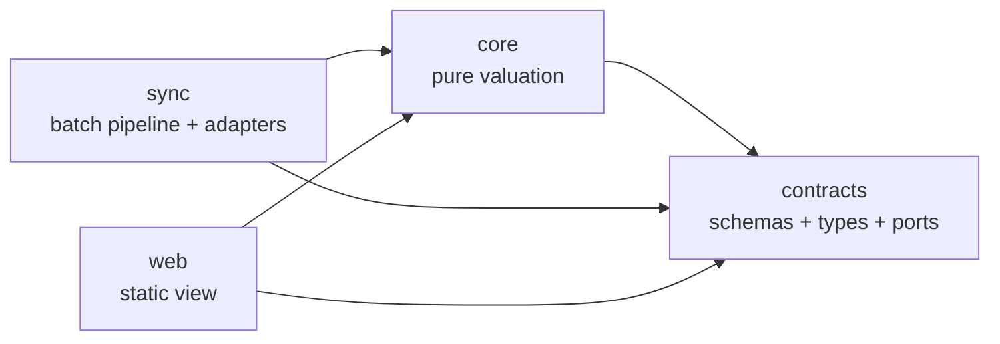
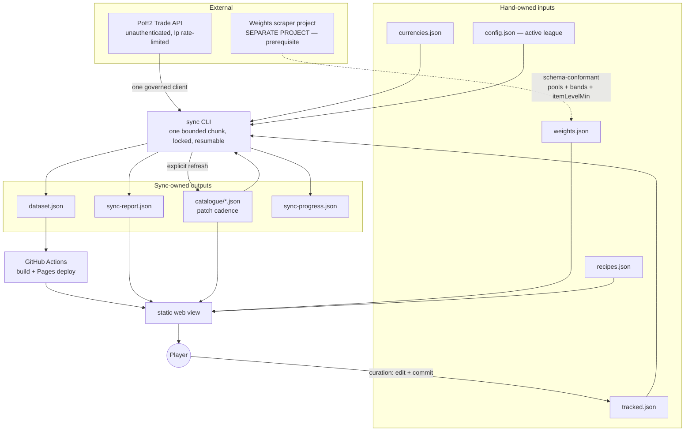
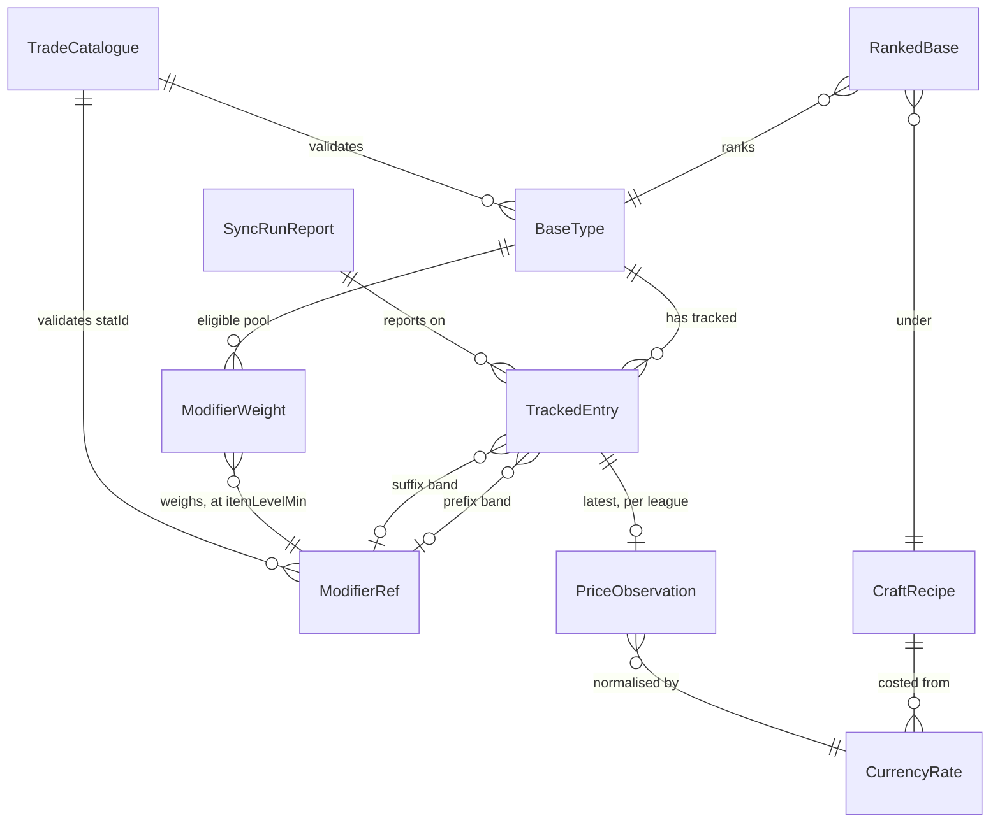

# Architecture Spine — PoE2 Crafting Base Price Checker

> **Revision 2.** Absorbs the three blocking questions PRD §10 raised against the inherited valuation model — BQ-1 (a floor-spanning probability priced at its lowest tier), BQ-2 (an eligible pool with no item-level dimension), BQ-3 (unmeasured pool coverage) — together with the `itemLevelMin` amendment PRD §9 OQ-1 routed here under AD-22. It also removes RePoE as a data dependency: the trade API's own catalogue endpoints (AD-25) supply identity and validation, and the weights file supplies everything else. AD ids are stable; AD-5, AD-6, AD-8, AD-11, AD-12, AD-16, AD-17, AD-18, AD-21 and AD-24 are amended in place, and AD-25 to AD-27 are new.

## Design Paradigm

**Functional core / imperative shell, with ports-and-adapters at the edges.**

All valuation — price estimation, probability, threshold-truncated expected value, craft cost, provenance propagation — is pure functions over plain data in `core`. Everything that touches the outside world (trade API, filesystem, git, clock) is an adapter behind a named port, invoked only from `sync` or `web`.

| Paradigm role | Package | May import |
| --- | --- | --- |
| Contract | `contracts` | nothing |
| Functional core | `core` | `contracts` |
| Imperative shell (write side) | `sync` | `contracts`, `core` |
| Imperative shell (read side) | `web` | `contracts`, `core` |



No other edge is permitted. `core` never imports `sync` or `web`; `sync` and `web` never import each other.

## Invariants & Rules

### AD-1 — Valuation is pure; the outside world is a port

- **Binds:** `core`, `sync`, `web`
- **Prevents:** I/O leaking into the ranking logic, making the one part that must be provably right impossible to test offline or reason about.
- **Rule:** No module in `core` may perform I/O, read the clock, generate randomness, or read environment/config directly. Every external effect — HTTP, filesystem, git, time — is declared as a port interface in `contracts` and implemented as an adapter in `sync` or `web`. Time and any nondeterminism are passed in as values.

### AD-2 — Dependency direction is one-way and mechanically enforced

- **Binds:** all
- **Prevents:** the package graph rotting into mutual imports, which would end worktree-parallel development and make `core` untestable in isolation.
- **Rule:** The edges in the paradigm diagram are the complete set. A violation fails CI via `dependency-cruiser`, not review. Shared code goes *down* into `contracts` or `core`; it is never imported sideways.

### AD-3 — Sync and web communicate only through schema-pinned published artifacts

- **Binds:** `sync`, `web`, `contracts`
- **Prevents:** the producer and the consumer drifting on a data shape — the largest divergence risk in a two-component system built by independent agents — and a second, unversioned side channel appearing without anyone deciding to create one.
- **Rule:** `sync` communicates **sync state** to `web` through exactly two artifacts, `dataset.json` and `sync-report.json`, and nothing else. `sync-progress.json` is internal to `sync` and is read by nothing else. Adding a third state-bearing artifact requires amending this AD.

  Two other classes of file cross the same boundary and are **not** a sync→web channel, because neither carries sync state:

  | Class | Files | Written by | Why it is not a channel |
  | --- | --- | --- | --- |
  | Hand-owned inputs | `tracked.json`, `currencies.json`, `recipes.json`, `config.json`, `weights.json` | the player / the scraper project | Authored upstream of `sync`; `web` reads the same file `sync` does. |
  | Cached external facts | `catalogue/*.json` (AD-25) | `sync`, on an explicit command | A verbatim mirror of GGG's catalogue at a patch. `sync` is its fetcher, not its author, and it says nothing about any run. |

  Every artifact named anywhere above has a Zod schema in `contracts` and carries `schemaVersion`. Static types are derived from those schemas via `z.infer`, never declared in parallel. `sync` validates before writing; `web` validates on load and refuses to render an invalid artifact rather than degrading. Adding a third artifact requires amending this AD.

### AD-4 — Ranking is computed at read time, never precomputed

- **Binds:** `core`, `web`, `sync`
- **Prevents:** the user-facing payout threshold reordering nothing until the next sync — which would make the product's central control a lie.
- **Rule:** Published artifacts carry observations (prices, weights, costs), never rankings or scores. The ranked list is the pure function of AD-17 evaluated in the browser on every change to any input. `sync` must not write a rank, a score, or an ordering. The ranking function lives in `core`; `web` may not compute any ranking term itself, only render what `core` returns.

### AD-5 — Canonical modifier identity is the trade stat id plus a bounded value band

- **Binds:** all
- **Prevents:** the tracked list, the weights file and the trade query each carrying a different notion of "a modifier", which silently mismatches instead of failing — and, since revision 2, a probability covering two tiers being multiplied by one tier's price (AD-17, AD-18).
- **Rule:** A modifier reference is `(statId, valueMin, valueMax)` — a stat id plus an **inclusive, closed band** over the rolled value. The trade API has no tier concept; a "tier" exists only as a band.

  **`valueMax` is required, everywhere, with no open-top form.** An omitted ceiling is a floor by another name, and a floor is exactly what BQ-1 removed: it spans tiers again, so AD-18 sums two tiers' weight while AD-16's ascending sort prices the cheaper one. Worse, the defect would be *unvalidatable* — `sync` checks `tracked.json` but the band edges it would need to check against live in `weights.json`. Every game modifier has a maximum roll, so a closed band is always expressible; a curator wanting "T1 and everything above" writes the real ceiling, not a blank. A tracked entry is `(baseTypeId, itemLevelMin, prefix?, suffix?)` where each affix is a modifier reference or **absent** — an entry with both absent is a raw base (this is how white ilvl-82 bases are represented). `baseTypeId` is the trade API's base type `type` string exactly as `data/items` spells it. No component may introduce a second modifier identity.

  **Why a band, not a floor.** Under a floor, a reference at the T2 edge covers T1 and T2 together, so AD-18 summed both tiers' weight while AD-16 — sorting ascending — priced essentially T2. The jackpot was not understated but *deleted*: if the T2 price fell below the payout threshold, the whole entry truncated to zero and took its T1 probability mass with it, destroying the jackpot isolation that threshold-truncated EV exists to provide. Bands make tiers disjoint, so each carries its own price and AD-17's partition holds with both tracked.

  **`itemLevelMin` is declared, never inferred.** It is authored by hand as part of curation; neither `sync` nor `core` derives or adjusts it. Choosing the accepted tier and choosing the band are one authoring act, and the item level that choice implies is recorded next to it.

### AD-6 — An unresolvable stat id is a loud failure with a dataset representation

- **Binds:** `sync`, `contracts`, `web`
- **Prevents:** a tracked combination silently disappearing from the rankings after a game patch, with no symptom the player would ever notice — and, equally, a patched-out modifier continuing to rank on its last-good price forever.
- **Rule:** If a tracked entry references a stat id or base type the trade API no longer exposes, `sync` writes that entry's price state as `unresolvable` (AD-9) **and** records it in `sync-report.json`. It is never skipped, never defaulted, never left at its previous value. `core` excludes `unresolvable` entries from valuation; `web` must surface their existence rather than only omitting them.

  **Detection is by catalogue validation, not by inference.** Two checks, with distinct owners, because the two files are read in different places:

  | Check | Owner | Surfaced as |
  | --- | --- | --- |
  | every `statId` / `baseTypeId` in `data/tracked.json` exists in the catalogue | `sync`, before issuing any request | the entry's `unresolvable` state + `sync-report.json` |
  | every `statId` / `baseTypeId` in `data/weights.json` exists in the catalogue | `sync`, reading the file (it is a **reader**, not its writer — AD-21 governs writers) | `sync-report.json` only; the file is never rewritten |

  `sync` owns both because it is the only component holding the full catalogue: AD-24 deliberately keeps `catalogue/items.json` out of `web`'s fetch set, so `core` cannot perform a base-type cross-check at load and must not pretend to. `core` still validates the weights file's **shape and pool rules** at load (AD-1: loading is an adapter's job, validating is pure). Splitting it this way is what stops a mistyped base key from silently vanishing from the product with nothing anywhere reporting it.

  An empty result set means `no-listings` (AD-9) and never `unresolvable`: conflating the two would report a patch-out every time a combination simply had no sellers.

### AD-7 — Sync is a bounded, resumable, single-instance chunk runner

- **Binds:** `sync`
- **Prevents:** a host's wall-clock ceiling becoming a correctness problem, two builders assuming different restart semantics, and two overlapping runs corrupting shared progress.
- **Rule:** The syncer is a CLI that performs **one chunk — bounded by whichever runs out first: the remaining search allowance, the remaining fetch allowance, or the unprocessed remainder of the workload** — then exits. Progress is a schema-pinned `sync-progress.json` committed alongside the dataset; a killed run loses at most the requests in flight. A run acquires an exclusive on-disk lock and, if another holds it, logs that fact and **exits 0** — a busy lock is a normal outcome for a repeatedly-invoked job, and a non-zero exit would make every scheduler treat routine overlap as a failure. Concurrent runs are forbidden, not merely discouraged. The syncer makes no assumption about what invokes it, how often, or where it runs — Task Scheduler, cron, a VPS and a CI runner must all be valid invokers with no code change.

### AD-8 — All outbound trade traffic passes through one governed client

- **Binds:** `sync`
- **Prevents:** two call sites pacing independently, blowing a shared rate-limit budget and risking the API access the whole product depends on.
- **Rule:** Exactly one adapter issues requests to the trade API — searches, fetches **and catalogue refreshes (AD-25) alike**. It reads `X-Rate-Limit-Rules` to learn the active rule names, then parses, for each named rule, the header `X-Rate-Limit-` + that rule name (the policy) and the same name suffixed `-State` (consumption) — unauthenticated the rule is `Ip`, giving `X-Rate-Limit-Ip` and `X-Rate-Limit-Ip-State`. **Rule names are read at runtime, never enumerated in code** — GGG documents others (`Client` among them) that an authenticated or future caller would see, so an adapter that recognises only `Ip` would silently stop pacing the day the set changes. `X-Rate-Limit-Policy` names the active policy and distinguishes the search bucket from the fetch bucket. It paces against the tightest unsatisfied bucket. **No rate is hardcoded**; the measured values below are the expected shape, not a constant to compile in. On 429 it honours `Retry-After` and yields the chunk rather than retrying tightly. It sends a descriptive `User-Agent` identifying the tool and a contact address, as GGG asks of third-party tools.

  **Recorded risk: `trade2` is undocumented.** GGG's developer documentation covers the OAuth API Reference and makes no mention of the trade or `trade2` endpoints, so every endpoint this product depends on — search, fetch, and all four catalogue endpoints (AD-25) — is *unsupported surface that happens to work*. It may change or close without notice or deprecation. Nothing in the architecture can prevent that; what the architecture does instead is make a break loud and cheap: one governed client (this AD), committed fixtures whose re-record diff exposes a reshape (AD-13), a committed catalogue whose refresh diff exposes a rename (AD-25), and no user-facing path that calls the API live (AD-15). This is recorded so it is not rediscovered as a surprise.

  Measured 2026-09-12, unauthenticated, rule `Ip`:

  | Policy | Buckets (`hits:seconds:penalty`) | Effective |
  | --- | --- | --- |
  | `trade-search-request-limit` | `5:10:60, 15:60:300, 30:300:1800, 600:21600:3600` | 600 searches / 6h |
  | `trade-fetch-request-limit` | `12:4:10, 16:12:300, 50:300:300, 1000:21600:1800` | 1000 fetches / 6h |

### AD-9 — Price is four-state; absence is never zero or null

- **Binds:** `contracts`, `core`, `web`
- **Prevents:** "no listings" being conflated with "worthless" — which would drop exactly the plausible jackpots the addendum identifies as unresolved — and an unresolvable entry having nowhere to live.
- **Rule:** Every tracked entry's price is exactly one of `priced` (with a value and an `observedAt`), `no-listings`, `not-yet-synced`, or `unresolvable`. `core` excludes every non-`priced` state from the expected-value sum rather than contributing zero, and reports each separately so the view can show them outside the ranking. No component may represent absence as `0`, `null`, or a missing key.

  **Every entry also carries `lastAttemptedAt`, in all four states.** `observedAt` exists only where there is an observation; `lastAttemptedAt` records when `sync` last worked on the entry regardless of outcome. The two are distinct and neither substitutes for the other: without `lastAttemptedAt`, AD-26's rotation would re-select every `no-listings` entry forever — they never acquire an observation time — and AD-6's bounded retry would have no state to count against. `web` reports age from `observedAt` where one exists and from `lastAttemptedAt` otherwise, labelled as what it is.

### AD-10 — Provenance and freshness ride on every derived value and propagate upward

- **Binds:** `contracts`, `core`, `web`
- **Prevents:** a uniform-prior placeholder being quietly trusted months later with nothing on screen to reveal it — and a partially refreshed dataset reading as a current one.
- **Rule:** Every probability carries its source (`measured` | `uniform-prior` | `absent`) and every price carries its observation timestamp and league. `core` propagates the **weakest provenance and the oldest timestamp** of every input into each derived figure, so a base's ranking states what it rests on. `web` must render a figure resting on `uniform-prior` or `absent` visibly differently from one resting on `measured`, and must surface per-row age — not merely a single dataset-level timestamp, because AD-7 guarantees rows refresh at different times.

### AD-11 — Weights are a consumed file; normalisation and recipe effects live in core

- **Binds:** `core`, `contracts`, weights producers
- **Prevents:** every weight producer having to understand crafting recipes, two consumers normalising raw weights into probabilities differently, and the app growing a scraper of its own.
- **Rule:** The app consumes a weights file conforming to `WEIGHTS-FILE-SCHEMA.md` and never produces one. The file carries **raw game spawn weights, banded by rolled value and by item level**, per base type and affix slot — `(statId, valueMin, valueMax?, itemLevelMin, weight)`. Conversion to probabilities is AD-18 and happens only in `core`. Craft-recipe effects on the tier distribution are modelled in `core` and are never baked into the weights file. The producer of the file is irrelevant to the app.

  **The file is a prerequisite, not a convenience.** The trade API exposes no pool membership, no tier, no item-level availability and no spawn weight (AD-25), so nothing in this system can derive what the file carries. Until a conforming file exists, every base is unrankable by AD-18 — which is the honest outcome, not a degradation to engineer around.

  **v1 depends on the external scraper project for this file**, decided rather than assumed: it supplies pool membership, band edges, `itemLevelMin` and weights. A uniform-prior file remains a valid *weighting* shortcut (every `weight: 1`) but never a *sourcing* one, because the two fields it cannot fake are the two the trade API cannot supply. **RePoE is a last-resort fallback only**, since it carries modifier metadata but not spawn weights and was never the authority for the field that matters.

### AD-12 — The workload is declared, and the search budget is the ceiling

- **Binds:** `sync`, `contracts`, curation workflow
- **Prevents:** an unbounded, unreviewable request budget; curation becoming a mutable-store feature that forces a server into a static architecture; and an unenumerated second workload silently consuming the same bucket.
- **Rule:** Exactly **four** sources generate a request, and nothing else does. Two are the recurring workload, both schema-pinned committed files; two are fixed overheads:

  | Source | Cadence | Cost |
  | --- | --- | --- |
  | `data/tracked.json` — combinations to price | every chunk | one search + one fetch per entry |
  | `data/currencies.json` — currencies to price for AD-20 | every chunk, **first** (AD-26) | small, fixed |
  | League validation against the live leagues endpoint (AD-19) | once per run | one request |
  | Catalogue refresh (AD-25) | explicit command, patch cadence, never on the chunk path | four requests |

  Neither workload file is written at runtime; curation is an edit and a commit. `sync-report.json` must report requests consumed **per source** against the live bucket, so budget drift is observable per cause. A fifth source is an amendment to this AD, not an implementation detail.

  **The ceiling is denominated in searches, not entries.** Against the measured 2,400 searches/day, a full refresh is held to **~1,500 searches**, leaving headroom for retries, the currency set, the catalogue refresh, the per-run leagues check (AD-19) and a second recipe. One tracked entry always costs one search; what changes under AD-5's bands is **how many entries a curator needs**. Isolating a jackpot tier means tracking two entries where one stood, and that second band spends from the same ceiling. Stating the budget in searches is what keeps that trade-off visible at the moment a curator makes it, instead of surfacing months later as a refresh cycle that quietly stopped completing. This supersedes the addendum's ~2,000 figure, which rested on a throughput assumption ~7× too optimistic.

### AD-13 — The test path has zero network

- **Binds:** all
- **Prevents:** any automated test depending on a live, rate-limited third party — which would end unattended agent development, the brief's hardest requirement.
- **Rule:** No test, at any level, may make a real network call; MSW runs in `onUnhandledRequest: "error"` mode so an unfixtured request fails loudly rather than escaping. External responses are real captured trade-API payloads committed as fixtures. Re-recording is a separate, explicitly-invoked command that is never part of a test run; the resulting fixture diff is the mechanism by which GGG's changes become visible.

### AD-14 — The dataset holds the current snapshot; git is the history

- **Binds:** `sync`, `contracts`, `web`
- **Prevents:** page weight growing without bound, a retention policy nobody maintains, and a history feature v1 never asked for.
- **Rule:** `dataset.json` contains only the latest observation per tracked entry, each stamped with the league it was observed in. It is **not** filtered on write — league filtering is AD-19's job and happens once, in `core`, so a league change does not require rewriting the dataset and does not blank the site while a re-sync runs. Historical prices are recovered from the git log of sync commits; no component may depend on in-file history. A chunked partial refresh publishes normally — per-row freshness (AD-10) is what makes that honest.

### AD-15 — The browser writes nothing; there is no backend

- **Binds:** `web`
- **Prevents:** an agent quietly introducing a server, an account, or per-user persistence — each of which contradicts the single-user, static, zero-upkeep premise.
- **Rule:** `web` is a static bundle. It performs no authenticated request, stores no server-side state, and has no write path to anything but the viewer's own browser storage (for the threshold dial and view preferences). Any requirement that appears to need a backend is escalated, not implemented.

  *Confirmed 2026-09-12 by live unauthenticated calls: `trade2` leagues, search and fetch all return 200 with no session cookie. This premise is measured, not assumed.*

### AD-16 — The price estimate is the cheapest live instant-buyout listings

- **Binds:** `sync`, `core`, `contracts`
- **Prevents:** the single most load-bearing definition in the product being left to whichever agent writes the syncer — the brief calls this section "the product; everything else is presentation."
- **Rule:** For each tracked entry, `sync` issues one search and one fetch of the **cheapest 10 result ids**. The search is built from the entry alone, using these filter ids, verified present in `data/filters` on 2026-09-12:

  | Query field | Value |
  | --- | --- |
  | `query.type` (top level, **not** a filter) | the entry's `baseTypeId`, verbatim |
  | `type_filters.rarity` | `magic` for an entry carrying affixes, `normal` for a raw base (AD-5) |
  | `type_filters.ilvl` | `min` = the entry's `itemLevelMin` (AD-5) |
  | stat filters | one per modifier reference, carrying **both `min` and `max`** from the band (AD-5) |
  | `trade_filters.sale_type` | the option labelled **"Buyout or Fixed Price"**, whose `id` is JSON `null` |
  | sort | price **ascending** |

  Three traps, each verified against the live payloads on 2026-09-12 and each costly to discover in code:

  - **The base type is `query.type`, not `type_filters.category`.** `category` takes taxonomy ids (`weapon.bow`, `accessory.amulet`), not base type names, and no committed artifact maps a base type to its leaf category — `data/items` groups only ten coarse labels. `sync` must not attempt that mapping; the base type alone is sufficient and exact.
  - **`priced_with_info` is not instant buyout.** Its live label is *"Price with Note"*. The option this product needs is *"Buyout or Fixed Price"*, and its `id` is `null` — a value a serialiser will silently drop unless the field is emitted explicitly. Getting this wrong does not error; it silently widens the result set to unpriced listings and corrupts every estimate.
  - **Passing the band's `max` as well as its `min`** is what makes the priced population the same population AD-18 computes a probability for. A min-only filter returns every higher tier too and prices the band at its floor — the BQ-1 defect, reintroduced at the adapter.

  The `PriceObservation` is the **median of those listings' prices after normalisation to divine** (AD-20), recorded with the sample size actually returned. The API's ascending sort is per listing currency, so when a result set spans currencies the median is taken over normalised values and the sample may not be the globally cheapest ten; that is accepted and recorded, not corrected by extra requests. Fewer than 10 results is valid and records the true count; zero results is `no-listings` (AD-9), never a price. Ascending sort is what keeps stale overpriced listings out of the estimate; instant-buyout-only is what removes listings priced below market, which would already have been bought.

### AD-17 — The ranking formula, its threshold, and its unit

- **Binds:** `core`, `web`, `contracts`
- **Prevents:** three mutually satisfying readings of "threshold-truncated expected value" producing three different orderings from identical data — and a view whose dial is denominated differently from the value it filters.
- **Rule:** For a `(baseTypeId, recipe)` pair where the base is **crafted** (its tracked entries carry affixes):

  ```
  EV = ( Σ  P(combo) × price(combo) )  −  craftCost(recipe)
        combo ∈ tracked(base), state = priced, price(combo) ≥ threshold
  ```

  The threshold compares against a combination's **gross price**, not its net of craft cost. Craft cost is subtracted **once** from the summed expected payout, not per combination — it is paid on every attempt including failures, which is already what dividing through by attempts expresses. **Threshold, all prices, and craft cost are denominated in divine** (AD-20); no other unit may cross a package boundary. `web` supplies the threshold as a value and renders the result; it computes no term.

  **Summands must be mutually exclusive.** The sum is over a partition, not a list. Two tracked entries for one base whose outcome sets overlap would double-count, inflating `ΣP` past 1 for that base alone and handing it the top of the ranking. Overlap is a **validation error on `data/tracked.json`**, rejected at load, not a case `core` reconciles.

  Overlap is defined by a predicate, not an enumeration — an enumerated list of shapes has twice been found to miss a case:

  ```
  overlap(a, b)  ⇔  slotOverlap(a.prefix, b.prefix) ∧ slotOverlap(a.suffix, b.suffix)

  slotOverlap(x, y) =  true                      if x is absent or y is absent
                       x.statId == y.statId ∧ bands intersect    otherwise
  ```

  An absent affix means *any roll in that slot*, so it overlaps everything — which is why the conjunction is over **both** slots. Three consequences worth naming, the third of which the earlier enumeration missed:

  - Adjacent tiers of one `statId` in one slot are disjoint and may both be tracked. That is the point of AD-5's bands. Bands that *intersect* still overlap and are still rejected.
  - A partial-affix entry subsumes a fuller one: leaving a slot absent covers every roll in it.
  - **A prefix-only entry and a suffix-only entry on one base overlap each other.** Neither subsumes the other, and no two bands intersect — yet an item carrying both named modifiers satisfies both entries, so it is counted twice. The predicate catches this; a list of shapes did not.

  Separately, **the crafted entries on one `baseTypeId` must share an `itemLevelMin`.** Two entries with identical affixes at floors 75 and 82 are *nested, not disjoint*, since every ilvl-82 item also matches the ilvl-75 search.

  Rule 3 has a second, independent reason to hold: `EV` is an expectation over **one crafting act on one item population**. Entries at different floors describe crafts on differently-levelled bases, and their `P` terms are normalised against differently-scoped pools (AD-18). Summing them is not an expectation over anything. A base therefore has exactly one crafted item level floor, and the tracked list is validated for it.

  **Rule 3 binds summands only, so a raw base is exempt.** A raw entry is never a summand — it ranks on the separate branch below — so its floor cannot break a partition it does not enter. A white base pinned at exactly ilvl 82 may therefore coexist with crafted entries on the same `baseTypeId` at a lower floor. Without this exemption the rule would reject the very configuration the brief asks for, since white bases are tracked at 82 and magic ones well below it.

  **Raw bases rank on a separate branch.** A `TrackedEntry` with both affixes absent (AD-5) is never a summand — at `P = 1` it would enter at certainty and swamp every crafted outcome. Its `EV` is its observed price, with zero craft cost, ranked in the same list and labelled as an uncrafted base.

### AD-18 — Weight aggregation and normalisation

- **Binds:** `core`
- **Prevents:** two builders deriving different probabilities from the same weights file — a divergence that silently reorders the entire ranked list rather than failing.
- **Rule:** A modifier reference `(statId, valueMin, valueMax?)` is a **bounded band**, so its weight is the **sum of the weights of every weights-file band with that `statId` that lies wholly inside it** — `band.valueMin >= ref.valueMin` and `band.valueMax <= ref.valueMax` (an omitted `ref.valueMax` is unbounded above). Whole bands only. A weights-file band that straddles a tracked band edge is a **validation error**, not a pro-rata split: the producer must emit bands whose edges align to the ones in use, because a straddling band describes a population the trade filter does not match (AD-16 filters on rolled value) and no arithmetic in `core` can recover the difference.

  **The pool is scoped by item level before anything is summed, and the same scope applies to both halves of the ratio.** Let `L = entry.itemLevelMin` and

  ```
  scoped(base, slot, L) = { band ∈ pool(base, slot) : band.itemLevelMin <= L }

                       Σ { band.weight : band ∈ scoped(base, slot, L) ∧ band ⊆ ref }
  P(ref | base, slot, L) = ─────────────────────────────────────────────────────────
                          Σ { band.weight : band ∈ scoped(base, slot, L) }
  ```

  **Numerator and denominator are drawn from the same scoped set.** Scoping only the denominator — the reading the earlier wording permitted — leaves a numerator counting bands that cannot roll at `L`, which inflates that modifier's probability without touching any other, and so reorders the list. `ModifierRef` itself carries no item level; the scope comes from the *entry's* floor and the *weights band's* `itemLevelMin`, and no third source.

  A tracked reference whose containment set is empty under the scope — every band it covers requires a higher item level than the entry's floor — is a **validation error**, not a `P = 0`. It means the curator is tracking a tier that cannot roll on the item they are crafting, and silently contributing zero would hide that.

  Without this scoping the denominator includes bands that cannot roll on the items the search returns, so every probability on that base is wrong by a factor that varies per base — which *reorders the ranked list* rather than shifting it uniformly. That is why the item-level dimension is required in the weights file (AD-11) and not approximated.

  *Stated assumption:* the crafting act is modelled as occurring on a base at **exactly** the entry's item level floor. The `ilvl >= floor` search returns a superset, so the priced population skews slightly higher-level than the modelled one. This is accepted and recorded rather than corrected — correcting it would need an exact-item-level filter the trade API does not offer.

  `P(combination)` treats prefix and suffix as **independent draws**: `P(prefix) × P(suffix)`, with `P = 1` for an absent affix.

  **A base whose pool is not `complete` is not ranked — and its probabilities are stamped.** Partial coverage shrinks the denominator and inflates every probability for that base by `1/coverage` — it *reorders the list*, and a provenance label does not change a sort. `core` therefore excludes such bases from the ordering entirely and returns them in a separate unrankable group with the reason. **Both halves apply:** the base leaves the ordering, *and* every probability derived from a `partial` pool carries provenance `absent` (AD-10), because it is an upper bound rather than an estimate — so the unrankable group renders those figures as unknowns instead of as numbers that merely failed to sort. `absent` arises here and nowhere else. A base absent from the weights file is likewise unrankable; `core` has no other pool source and must not invent one.

  *Stated assumption:* independence holds because a transmute rolls one affix and an augment adds the other, so under an even slot choice the ordering term cancels exactly. Mod-group exclusion makes the second draw weakly conditional on the first; that refinement is deferred, not overlooked.

  **Recipe has no distribution term in v1.** AD-17 ranks per `(base, recipe)`, but the mechanics numbers do not exist (see Open Questions), so `CraftRecipe` contributes **only a cost offset** and the distribution transform is identity. Ordering is therefore recipe-invariant in v1 and differs only by the subtracted cost. This is a stated limitation, not a formula with an empty slot for `core` to fill by invention.

### AD-19 — League is part of every observation's identity

- **Binds:** all
- **Prevents:** the brief's "central threat to the one-year horizon" — a league reset wiping prices while AD-14's "latest observation per entry" silently serves last league's numbers as current.
- **Rule:** The active league id is configuration (`data/config.json`), and every `PriceObservation` records the league it was observed in. `core` refuses to value any observation whose league differs from the active one, treating it as `not-yet-synced` rather than stale-but-usable. A league change is therefore a config edit plus a natural re-sync, with the ranking honestly empty until data arrives — never quietly wrong. `sync` validates the configured league against the live leagues endpoint at the start of each run and fails loudly on a mismatch.

### AD-20 — One currency unit crosses every boundary

- **Binds:** `sync`, `core`, `contracts`
- **Prevents:** a moving denominator silently corrupting the payout term, the craft-cost term and the user's threshold at once — the most under-detectable class of error in the system.
- **Rule:** All prices are normalised to **divine** at the adapter boundary in `sync`. Raw listing currency never enters `core`. Every normalised price records the exchange observation used (rate, source, timestamp), and that observation participates in provenance and freshness propagation (AD-10) exactly like any other input. **Currency rates are synced before any priced entry in the same chunk**; if a listing's currency has no current rate, the entry is written `not-yet-synced` (AD-9) rather than stored unnormalised — there is no "priced but not yet convertible" state, because a half-normalised dataset is one where the ranking is silently wrong rather than visibly empty. Exchange rates for the currencies in `data/currencies.json` are synced as part of the declared workload (AD-12).

### AD-21 — One writer, one entity, one commit path

- **Binds:** `sync`, curation workflow
- **Prevents:** two owners for one artifact, and a sync run sweeping an in-progress curation edit into an automated commit.
- **Rule:** Every shared file has exactly one writer:

  | File | Written by | Read by |
  | --- | --- | --- |
  | `data/tracked.json`, `data/currencies.json`, `data/config.json` | the player, by hand | `sync`, `web` |
  | `data/weights.json` | an external producer (the scraper project) | `core` via `web` |
  | `data/catalogue/*.json` | `sync`, on an explicit refresh command only (AD-25) | `sync`, `core` via `web` |
  | `data/dataset.json`, `data/sync-report.json` | `sync` only | `web` |
  | `data/sync-progress.json` | `sync` only | `sync` only — internal |

  `sync` commits **only the files it owns**, by explicit path — never `git add -A`. A dirty working tree elsewhere does not block a sync and is never included in its commit.

### AD-22 — Every shared concept is defined once, in `contracts`

- **Binds:** all
- **Prevents:** `contracts` becoming an unowned dumping ground, and entities like `CraftRecipe` existing in two packages' heads with no file.
- **Rule:** Every concept crossing a package boundary — `BaseType`, `TrackedEntry`, `ModifierRef`, `PriceObservation`, `ModifierWeight`, `CraftRecipe`, `CurrencyRate`, `SyncRunReport`, `RankedBase`, `TradeCatalogue` — has exactly one Zod schema in `contracts` and no parallel definition anywhere. `CraftRecipe` (currency composition and its distribution effect) is a `contracts` schema populated from `data/recipes.json`; its *cost* is computed in `core` from synced rates, and `sync` never computes a craft cost. Changes to `contracts` are landed alone and first (see `AGENT-WORKFLOW.md`).

### AD-23 — Curation is a deliberate, reviewed act

- **Binds:** curation workflow, `web`
- **Prevents:** the addendum's named unsolved risk — *"a stale top five that the user trusts is worse than no tool"* — quietly becoming the product's steady state because nothing ever prompts a review.
- **Rule:** The system cannot discover what it is not told to watch; this is recorded, not solved. `TrackedEntry` carries an explicit `status` of `active` | `pinned` | `pruned` in its `contracts` schema — these are schema members, not conventions. `pinned` means *refreshed every chunk, exempt from rotation*. `pruned` is a **tombstone**: it carries its reason so the same combination is not re-added and re-learned each league, and it is excluded from `sync`'s workload (AD-12) **and** from `tracked(base)` in AD-17's sum — pruning that left the last-good price contributing would be a no-op on the ranking, which is the opposite of its purpose. `sync-report.json` records the date of the last tracked-list edit, and `web` surfaces the tracked list's age so a list running unattended is visible as such. Every price in the system is an asking price; no sale is ever observed, and the view must not present an estimate as a realised value.

### AD-24 — Dataset delivery and the read-time budget

- **Binds:** `web`, `core`
- **Prevents:** two builders choosing differently between bundling and fetching the dataset — which changes cache behaviour, staleness and deploy semantics — and a read-time ranking that AD-4 mandates but nobody sized.
- **Rule:** `web` **fetches** exactly eight artifacts at runtime as separate cache-busted requests — `dataset.json`, `sync-report.json`, `weights.json`, `recipes.json`, `tracked.json`, `config.json`, `catalogue/stats.json` and `catalogue/static.json` — and never `sync-progress.json`, which is internal to `sync`, nor `catalogue/items.json` and `catalogue/filters.json`, which only `sync` needs. The two catalogue files are what let `web` render a stat id as its human text and a currency as its icon **without a runtime call to pathofexile.com**, which AD-15 forbids. They are never bundled into the JS, so a sync commit updates data without rebuilding the app. Each carries `schemaVersion` and is validated on load (AD-3); `web` renders from a single consistent set and does not mix artifacts across a refresh. Ranking the full tracked list must complete **under 100 ms** on a mid-range machine and re-run synchronously on a threshold change; if it cannot, the fix is memoising the pure function, not precomputing in `sync` (AD-4). Distinctions AD-10 requires must not be carried by colour alone.

### AD-25 — The trade catalogue is a committed artifact, refreshed on command

- **Binds:** `sync`, `contracts`, `web`, `core`
- **Prevents:** a GGG catalogue change landing as a silent behaviour change instead of a reviewable diff — and an agent reaching for an external modifier catalogue because the app has no authority of its own for what a stat id means.
- **Rule:** The four trade data endpoints are fetched through the governed client (AD-8), validated, and committed as sync-owned artifacts under `data/catalogue/`:

  | Artifact | Endpoint | Carries | Consumed for |
  | --- | --- | --- | --- |
  | `items.json` | `/api/trade2/data/items` | base types by category | `baseTypeId` validation (AD-6), curation |
  | `stats.json` | `/api/trade2/data/stats` | stat ids + display text | `statId` validation (AD-6), modifier text in `web` |
  | `static.json` | `/api/trade2/data/static` | currency ids + icons | `data/currencies.json` ids, icons in `web` |
  | `filters.json` | `/api/trade2/data/filters` | filter ids + options | search construction (AD-16) |

  The refresh is an **explicit command at GGG patch cadence**, never part of a chunk (AD-7) and never on a view path. Its four requests are a declared source under AD-12. The resulting diff is how a renamed stat id or a new base type becomes visible — the same mechanism AD-13 uses for fixtures.

  **The catalogue is an identity and validation authority, never a pool authority.** Verified 2026-09-12: `/data/stats` is a flat global list of 3,108 explicit stat ids, each `{id, text, type}` and nothing more. It carries no per-base association, no tier, no item-level availability and no spawn weight. Every one of those lives in the weights file (AD-11), and no component may attempt to derive them from the catalogue or from search results.

### AD-26 — Refresh rotation is a defined, deterministic order

- **Binds:** `sync`, `contracts`, `web`
- **Prevents:** two builders implementing "which entries does this chunk refresh?" differently — one round-robin, one oldest-first — which would silently change how stale any given row is while every artifact stayed schema-valid. AD-23 already depends on the word *rotation*; before this AD, nothing defined it.
- **Rule:** Within a chunk (AD-7), `sync` selects entries in exactly this order, and stops when any bound in AD-7 is reached:

  0. **currency rates first**, always, before any priced entry in the same chunk — AD-20 requires it, and a rotation that omitted it would produce a chunk of `not-yet-synced` entries by construction;
  1. then every `pinned` entry, each chunk, without exception — this is what `pinned` means. The pinned set is **capped at 25% of AD-12's search ceiling**, as a `tracked.json` validation error rather than a convention: an oversized pinned set consumes every chunk, starving both its own tail and the `active` rotation below it, and the symptom is indistinguishable from a slow refresh;
  2. then `active` entries by **oldest `lastAttemptedAt` first** (AD-9), with `not-yet-synced` treated as infinitely old so a new entry is picked up before any refresh. Ordering on `lastAttemptedAt` rather than on the observation time is what keeps a permanently `no-listings` entry in the rotation without letting it monopolise it;
  3. then `unresolvable` entries (AD-6) on a **bounded retry schedule** — at most one attempt per entry per 24h, measured from that entry's `lastAttemptedAt`, so a patched-out modifier neither vanishes nor consumes the budget every chunk;
  4. never `pruned` entries, which are excluded from the workload entirely (AD-23).

  Ties break on the canonical entry key (Consistency Conventions) so a run is reproducible and a resumed run is explainable. The order is a pure function of the tracked list, the dataset and a passed-in clock value — `sync` computes it through `core`, so it is testable with literal inputs and identical between a dry run and a real one.

  **A resumed chunk recomputes the order rather than replaying a frozen plan.** `sync-progress.json` records which entries a chunk has *completed*, not which it intended to visit. Freezing a plan would make a resumed run act on a stale view of the dataset — re-pricing entries a concurrent-but-earlier run already refreshed — and would add a second, divergent notion of what the rotation is.

### AD-27 — Pool coverage is measured before the view is built

- **Binds:** build sequence, `web`, `core`
- **Prevents:** the view being designed around a full ranked list that the weights file cannot populate — discovered after the layout is committed rather than before, when it is still free to change.
- **Rule:** AD-18 excludes any base whose pool is not `complete` from the ordering, so the size of the ranked list is a direct function of the weights file's coverage, and that fraction is **unmeasured until someone measures it**. Before any view work, measure:

  ```
  coverage = |{ baseTypeId ∈ tracked.json : both slots are poolCoverage "complete" }|
             ────────────────────────────────────────────────────────────────────
             |{ distinct baseTypeId ∈ tracked.json }|
  ```

  The denominator is **the tracked list**, not the catalogue — the question is how much of what the curator wants ranked can be ranked, and a base nobody tracks cannot affect the product. Both slots must be `complete`, since one `partial` slot is enough to make the base unrankable under AD-18. The result binds:

  | Coverage | Consequence |
  | --- | --- |
  | **≥ 80%** | Proceed as specified. |
  | **50–80%** | Proceed, but the unrankable group is a **first-class surface** in `web`, not a footer — at this coverage it is a large share of the catalogue and hiding it misrepresents the product. |
  | **< 50%** | The ranking premise fails. Escalate rather than ship: either the producer improves coverage, or the spine is amended to rank `partial` pools under explicit upper-bound semantics. Do not resolve this inside `core`. |

  The rule is **source-agnostic** — it binds whatever produces the weights file, and survives a change of producer untouched.

## Consistency Conventions

| Concern | Convention |
| --- | --- |
| Naming — entities | `BaseType`, `TrackedEntry`, `ModifierRef`, `PriceObservation`, `ModifierWeight`, `CraftRecipe`, `CurrencyRate`, `RankedBase`, `SyncRunReport`, `TradeCatalogue`. Singular, PascalCase, defined once in `contracts` (AD-22). |
| Naming — files & modules | kebab-case files; one exported concept per file in `core`; adapters named `<port>-<impl>` (e.g. `trade-client-http`, `trade-client-fixture`). |
| Naming — ports | Interface `<Thing>Port` in `contracts`; every port ships a fake alongside the real adapter. |
| Ids | `statId` and `baseTypeId` are the trade API's own identifiers, never re-encoded — `baseTypeId` is the `type` string exactly as `data/items` spells it (e.g. `"Guardian Bow"`). Internal ids are forbidden (AD-5), and every id is validated against the committed catalogue (AD-25). |
| Bands | A modifier band is `(statId, valueMin, valueMax)` with **inclusive, always-present** edges (AD-5). Bands sharing a `statId` never intersect, in the weights file or the tracked list. |
| Entity keys | A `TrackedEntry`'s canonical key is `(baseTypeId, itemLevelMin, prefixBand, suffixBand)` with an absent affix encoded as the literal `null`, serialised in that field order. Every artifact keying entries uses this one encoding — internal surrogate ids are forbidden (AD-5), so the key is the identity and two components must not spell it differently. |
| Item level | `itemLevelMin` is a declared floor, uniform across a base's tracked entries (AD-17) and present on every weights band (AD-11). Never inferred, never adjusted by code. |
| Dates & time | ISO-8601 UTC strings in all persisted data. Time enters `core` only as a passed-in value (AD-1). |
| Units | Divine for all currency (AD-20). Band edges and item levels are raw game numbers. No unit is implied by a field name alone — schemas name the unit. |
| Numeric precision | Persisted divine prices are numbers rounded to 4 decimal places at the point of normalisation; weights are non-negative numbers used only in ratios. Rounding happens once, in `sync`; `core` never re-rounds, so two readers of one artifact cannot disagree on a value. |
| Encoding | All files UTF-8 without BOM, LF line endings, JSON with stable key order and a trailing newline — so a sync commit's diff shows changed data, not reserialisation noise. |
| Error shape | `core` returns typed results and never throws for expected conditions (no listings, missing weight, unresolvable stat). `sync` throws only for unrecoverable run failures; everything else lands in `sync-report.json`. |
| Validation | Zod schemas in `contracts` are the single source of truth; types are `z.infer`red. Validate at every trust boundary: API response, before artifact write, on artifact load. |
| Schema versioning | Every published artifact and input file carries `schemaVersion`. A consumer refuses an unknown major rather than guessing. |
| Logging | `sync` emits structured records into `sync-report.json`, not free-text console output. The report is data the view reads. |
| Config | No runtime environment lookups in `core`. `sync` reads `data/config.json` plus a small env overlay for the contact `User-Agent`. |
| Tests | Vitest everywhere. `core` tested as pure functions with literal inputs; `sync` tested against recorded fixtures through ports; `web` tested with MSW-served artifacts. |

## Stack

| Name | Version |
| --- | --- |
| Node.js | 24.21.0 (Krypton LTS) |
| TypeScript | 6.0.3 |
| pnpm (workspaces) | 12.4.1 |
| React | 19.3.0 |
| Vite | 8.3.0 |
| Mantine (`@mantine/core`, `@mantine/hooks`) | 9.6.1 |
| Zod | 4.6.2 |
| Vitest | 5.0.0 |
| MSW | 2.15.0 |
| ESLint + typescript-eslint | 10.10.0 + 8.70.0 |
| dependency-cruiser | 18.2.0 |
| Hosting | GitHub Pages via Actions build workflow |
| Sync invoker | Windows Task Scheduler (host-agnostic per AD-7) |

**Upgrade trigger — TypeScript 7.** TS 7.0.2 is current, but **two** dependencies block it, and both must clear:

| Blocker | Constraint (verified 2026-09-12) |
| --- | --- |
| `typescript-eslint` | every published line — latest `8.70.0`, canary `8.70.1-alpha.0` — peer-caps `typescript` at `<6.1.0` |
| `dependency-cruiser` 18.2.0 | declares `supportedTranspilers.typescript: ">=2.0.0 <7.0.0"` |

`dependency-cruiser` is the more consequential of the two: it is what mechanically enforces AD-2's dependency direction, so moving to TS 7 before it supports the compiler would not merely degrade lint, it would remove the boundary enforcement the whole parallel-worktree workflow rests on. Move to TS 7 only when both publish a range including 7.

## Structural Seed

### System view



### Core entities



`RankedBase` is derived in the browser and never persisted (AD-4). A `TrackedEntry` with both affixes absent is a raw base (AD-5). `ModifierRef` is a bounded band, and every entry on one `BaseType` shares its `itemLevelMin` (AD-17). `TradeCatalogue` is the committed trade catalogue (AD-25) — an identity authority only; it contributes nothing to the eligible pool.

### Deployment & environments

One environment. The syncer runs on the player's machine under Task Scheduler, invoked repeatedly; each run takes the lock, does one bounded chunk, commits the files it owns, and exits. That push triggers a **GitHub Actions workflow** that builds the Vite bundle and deploys to Pages — branch-published Pages runs Jekyll and cannot build this app, so the workflow is required, not optional. There is no staging environment, no secret material (the trade API is used unauthenticated, confirmed), and nothing to patch on a server. Local development is `pnpm dev` against committed fixtures with no network.

Two recurring maintenance dependencies, both on GGG patch cadence: the weights file (AD-11), owned by the separate scraper project, and the trade catalogue (AD-25), refreshed by an explicit command in this repo. Neither is on the chunk path. A stale weights file degrades provenance; a stale catalogue degrades id validation and display text. Neither breaks the app, and both surface as a reviewable diff rather than as behaviour.

### Source tree

```text
poe-crafting-base-price-checker/
  packages/
    contracts/      # Zod schemas, derived types, port interfaces — depends on nothing
    core/           # pure: price estimation, weights, EV, provenance, craft cost
    sync/           # trade client, rate governor, chunk runner, lock, writers
    web/            # static Mantine view, read-time ranking via core
  data/
    tracked.json    # curated combinations — the request budget (AD-12)
    currencies.json # currencies to price for normalisation + craft cost (AD-12, AD-20)
    recipes.json    # CraftRecipe definitions (AD-22)
    config.json     # active league (AD-19)
    weights.json    # consumed weights file — external producer (AD-11)
    catalogue/      # sync-owned trade catalogue, patch cadence (AD-25)
      items.json
      stats.json
      static.json
      filters.json
    dataset.json    # published snapshot — sync-owned (AD-14, AD-21)
    sync-report.json
    sync-progress.json
  fixtures/         # recorded real trade-API responses (AD-13)
  .github/workflows/deploy.yml
  docs/
```

## Brief Scope → Architecture Map

| Brief scope item | Lives in | Governed by |
| --- | --- | --- |
| Ranked base list with chase modifiers | `web` + `core` | AD-4, AD-17, AD-10 |
| Expandable full combination list | `web` | AD-3, AD-9 |
| Player-set payout threshold | `web` + `core` | AD-17, AD-4, AD-15 |
| Price estimation from listings | `sync` + `core` | AD-16, AD-20 |
| Background sync, rate-limit aware | `sync` | AD-7, AD-8, AD-12 |
| Curation: prune, pin | `data/tracked.json` | AD-12, AD-21, AD-23 |
| Weights schema (the contract) | `contracts` | AD-11, AD-18 |
| Weights file (the data) | external scraper project — **not this repo** | AD-11, AD-27 |
| Trade catalogue: base types, stat ids, currencies | `sync` + `contracts` | AD-25, AD-6 |
| Magic bases, one prefix + one suffix | `contracts` | AD-5 |
| White ilvl-82 bases | `contracts` + `core` | AD-5 (both affixes absent), AD-17 |
| Craft cost from currency prices | `sync` + `core` | AD-20, AD-22 |
| Surviving league resets | `core` + config | AD-19 |

## Deferred

- **Repository split.** The weights schema stays in this repo until it stops moving; extraction is then mechanical (addendum's explicit instruction).
- **Weights production.** The scraper is a separate project and a **prerequisite**, not an optional enrichment (AD-11). The app is indifferent to which producer satisfies the contract. A uniform-prior file remains a valid bootstrap for the weighting, but not for pool membership or item level, which it must still source honestly.
- **`itemLevelMin` as a ranking key.** AD-17 requires one item level floor per base. Ranking `(baseTypeId, itemLevelMin, recipe)` as distinct rows would be strictly more expressive — the same base at two floors is genuinely two crafting propositions — and remains sound, since each key is its own partition over its own scoped pool. Deferred because it multiplies rows, spends from AD-12's search ceiling, and contradicts the PRD's per-Base-Type floor. **Revisit if** a curator finds the uniformity rule forces a real choice between two floors worth tracking; relaxing a validation rule is backward-compatible, so nothing is foreclosed.
- **Per-band conditional item level.** AD-18 scopes the pool at the entry's floor and models the craft as occurring at exactly that level, accepting that the `ilvl >=` search returns a slightly higher-level superset. Revisit only if the trade API gains an exact-item-level filter.
- **Mod-group conditional probability.** AD-18 assumes independent affix draws; group exclusion makes the second draw weakly conditional. Revisit when measured weights land and the error becomes estimable.
- **Authenticated sync.** Would move the rate-limit rule off `Ip` to a higher bucket and is now a *quantified* lever. Revisit if the tracked list must exceed ~1,500; it reintroduces a rotting credential.
- **Migration to a hosted syncer.** AD-7 makes this config, not a rewrite. Revisit if a day-stale dataset becomes intolerable.
- **Price history features.** Git carries the data (AD-14); no feature reads it in v1.
- **Coarser fallback pricing** for zero-listing combinations. Held as the named option if the unknown bucket proves unusable; AD-9 keeps unknowns segregated meanwhile.
- **Market scanning as candidate generation.** Rejected in the addendum on both shallowness and cost; not revisited without a new API capability.
- **Re-seeding from community sources** (build popularity for demand) — the addendum's most promising answer to cold start and meta blindness. Out of v1 by AD-23, which records the problem rather than solving it.
- **RePoE as anything but a last resort.** It carries modifier metadata but no spawn weights, so it was never the authority for the load-bearing field. Identity now comes from the catalogue (AD-25) and weights from the file (AD-11); RePoE fills gaps in `itemLevelMin` or pool membership only where nothing better exists, and what it fills is stamped `uniform-prior`, never `measured`.
- **Loot filter export, rare items, augment advice, accounts.** Out of v1 by the brief; AD-15 keeps the last of these from creeping in.
- **Observability beyond the run report.** A committed structured report is the whole story; no metrics stack.

## Open Questions

- **Recipe distribution mechanics.** AD-11 and AD-22 give `CraftRecipe` a home and a cost, but nothing in the inputs supplies the actual numbers for how perfect vs greater transmute/augment shift the tier distribution. v1 ships a single recipe under a documented assumption (AD-18); ranking per `(base, recipe)` as the brief describes needs this resolved. *Carried; PRD OQ-5 defers it to v2.*
- **Per-tier item level availability at the producer.** AD-11 requires `itemLevelMin` on every weights band, and the trade API cannot supply it (AD-25). Where the scraper project sources it is the producer's problem by AD-11 — but if no source exists, the field is filled by hand or by RePoE and stamped `uniform-prior`, which AD-27's coverage gate then measures. **Owner: the weights scraper project.**

**Closed by revision 2:**

- ~~Endgame item-level floor~~ — the premise of a single global floor was the error. Resolved into a per-entry declared `itemLevelMin` (AD-5), uniform per base (AD-17), scoping the eligible pool (AD-18).
- ~~Uniform-prior pool completeness~~ — promoted from an open question to a binding gate with thresholds and consequences (AD-27), and made source-agnostic so it survives the removal of RePoE.
