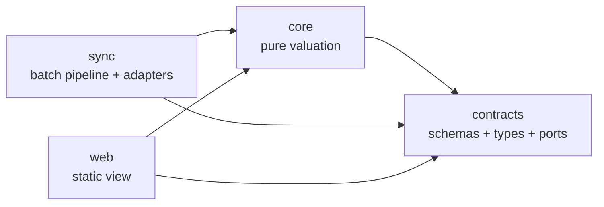
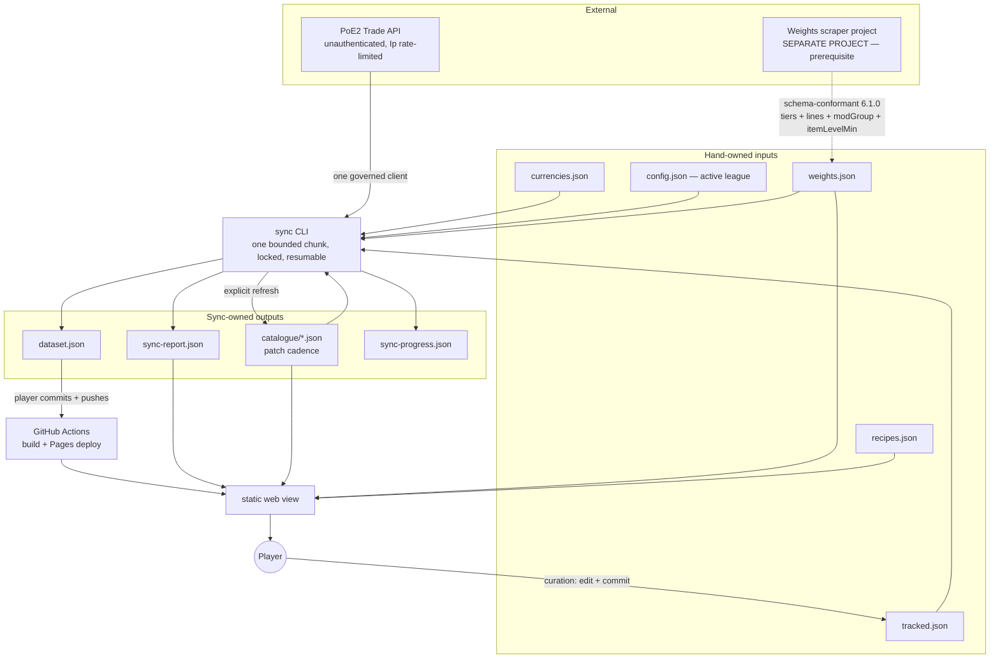
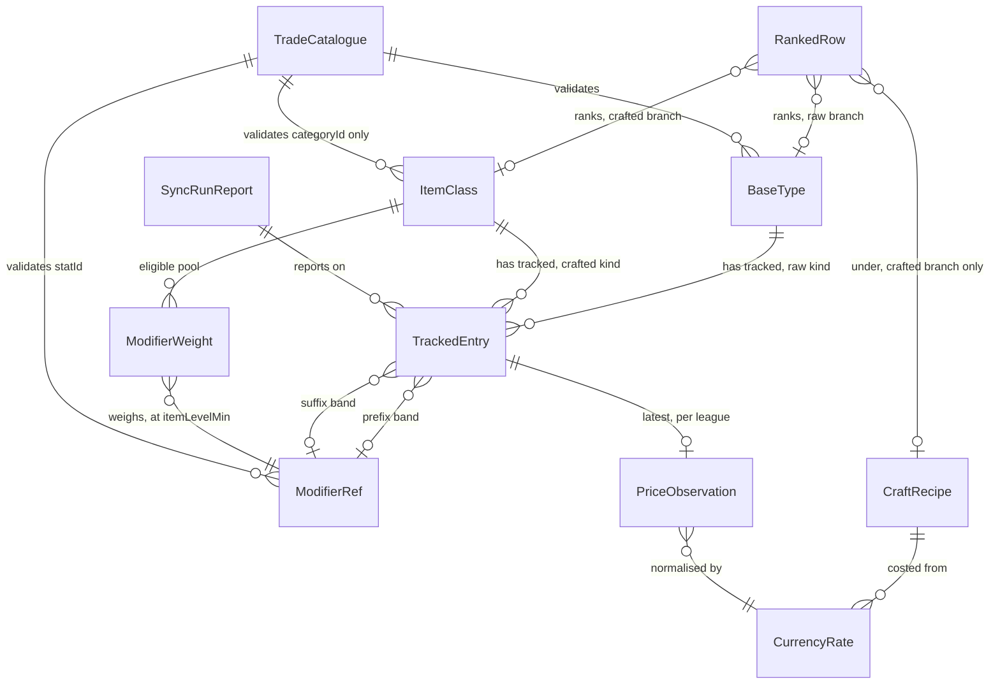

# Architecture Spine — PoE2 Crafting Base Price Checker

> **Revision 18 takes `sync` off the git write path entirely.** AD-3 had the syncer commit its own
> files and push on every run, which AD-7's repeatedly-invoked chunk runner multiplies into
> thousands of commits a day. The sync-owned files are now **git-tracked and written in place**, and
> **committing and pushing is the player's act** — the same act UJ-5 and UJ-6 already describe for
> curation and league changes. The git port narrows to read-only, carrying only AD-12's
> last-commit-date read. The whole non-fast-forward reconciliation path (pull, retry, the
> prohibition on force-push and rebase) is **withdrawn rather than relocated**, because an automated
> push is what made it necessary. GitHub Actions and Pages are unchanged; only the push's author
> moves, and *Deployment & environments* now says so. The cost is that the site ages behind the
> working tree when the player does not push, which AD-10's per-row freshness already makes visible.
>
> **Revision 17 moves the crafted branch one rung finer, to item-class altitude**, following
> `prd.md` revision 18 — which overruled revision 17's *Item Category* on a product argument
> the vocabulary argument does not outrank: expected value varies sharply between the classes
> inside one category, so a blended category row lets a low-value class drag a high-value one
> down and hides both. **The ranked crafted unit is now the `ItemClass`**, and `ItemCategory`
> is retired as an entity name after one revision. **AD-5's crafted key does not change** —
> it was already `(categoryId, className, …)`, so the PRD has adopted the finer half of a
> pair the spine already carried, and AD-5 now states that relationship where the key is
> settled rather than leaving a reader to infer it.
>
> **OQ-25 closes on its second candidate, and the premise revision 16 recorded was wrong.**
> That question accepted a spread it called unmeasured and its mitigation *incidental*; both
> readings are withdrawn. A class **is** reachable on the existing search, by its **defence
> signature** — the classes of one broad kind differ in which defences their bases carry, so
> `equipment_filters` admits one class and excludes its siblings **without naming a class**.
> Measured here against `data/weights.json` (`5.0.0`, patch `0.5.5`), that signature is a
> **complete** discriminator in five of the six fan-out categories, not a usually-sufficient
> one: the armour classes of a family are exactly the distinct non-empty subsets of
> {armour, evasion, energy shield}, so no sibling shares a triple. The sixth is `jewel`,
> whose eight classes carry no defences and are isolated by `query.type` instead. **The
> crafted branch still spends one search per tracked entry**, so the closure costs no budget,
> and the spread OQ-25 described is **eliminated rather than accepted**.
>
> **AD-16 therefore gains the class discriminator, and `sync` derives it from `className`.**
> That is a real decision with a real cost, taken by the player on 2026-09-20 over the
> alternative of having the curator or the producer declare it: `sync` owns search
> construction, and a trade-API concern does not belong in a file that knows nothing about
> the trade API. The cost is that **`className` stops being an opaque producer string on the
> crafted branch** — so `WEIGHTS-FILE-SCHEMA.md` raises its grammar to a normative rule
> (contract **`5.1.0`**, additive), which is what turns a parse of a foreign identifier into
> a read of a contracted key. Two guards keep the failure loud rather than silent: a
> `className` that satisfies no arm of the grammar is a **load error**, never a fallback to
> a category-wide search, and the jewel arm's derived base type is **catalogue-validated**
> (AD-25). **AD-17 gains a fifth cross-file check** — *class discriminability* — so a class
> that needs a discriminator and cannot yield one is caught before budget is spent.
> `IMPLEMENTATION-NOTES.md` gains **§10** for the derivation and **§2.6** for the check.
>
> **The field spelling is evidence, not assumption.** A second live body captured by the
> player on 2026-09-20 (§5.1) carries `equipment_filters.filters` with `ar`, `ev` and `es`,
> which settles the path and the spelling on the request side the same way the first capture
> settled `status` and `price`. **AD-27 and §3 count tracked classes**; the `covered(base)`
> finding and the withdrawn coverage bands are untouched, and the denominator stays in the
> same order of magnitude, so revision 14's reasoning needs no re-deciding.
>
> **Revision 16 moved the crafted branch to item-category altitude**, following `prd.md`
> revision 17 rather than leading it — the change is player-visible, so the PRD settled what
> the player gets before this document settled how. **AD-5's tracked entry becomes a
> discriminated union**: a `crafted` entry keys on `(categoryId, className, itemLevelMin,
> prefix?, suffix?)`, a `raw` entry on `(baseTypeId, itemLevelMin)`, and **the kind is what
> the entry names rather than an inference from absent affixes**. That one change closes
> **OQ-23 by withdrawing its premise** — a crafted entry now names its pool's own key, so the
> `baseTypeId → className` mapping it hunted is needed by nothing, and none of its three
> candidates was adopted. Nothing was added to carry one: no field, no `baseTypes: []`, no
> mapping artifact, and **no change to `WEIGHTS-FILE-SCHEMA.md`'s shape**.
>
> **AD-16 gains a second query shape** — `type_filters.category` for a crafted entry,
> `query.type` for a raw one, exactly one emitted — which turns `IMPLEMENTATION-NOTES.md`
> §5.2 trap 1 from a prohibition into a branch rule, and makes §5.1's captured category
> browse evidence for the crafted envelope instead of a non-example. **AD-17 ranks two units
> in one list** and `RankedBase` is renamed **`RankedRow`** for it; `ItemCategory` joins the
> entity set (renamed to `ItemClass` by revision 17). **AD-27 loses its coverage bands**: FR-4 withdrew them in `prd.md` revision 17
> rather than re-fit them to a denominator that fell from hundreds of bases to dozens of
> categories, and a layout rule with no product decision behind it comes out with them. The
> measurement, its sequencing, its denominator and the absent-file carve-out all survive
> untouched. AD-27's denominator carve-out for *bases that need a pool* is withdrawn as
> vacuous; its `pruned` half stays. **`AGENT-WORKFLOW.md` step 2 now cites AD-27 instead of
> restating it**, which is the second time that restatement had gone stale.
>
> **One new open question, raised by this change and not by the PRD: OQ-25.** `className →
> categoryId` is many-to-one, so where a category fans out the crafted search cannot isolate
> the entry's own class — measured on the conforming file, **6 of 29 categories fan out,
> covering 36 of 59 classes**. Stat filters usually exclude the siblings incidentally; a
> combination of class-agnostic affixes is not excluded at all. This is *beneath* the
> category spread FR-1 accepts, is unmeasured, and blocks nothing.
>
> **Revision 15** closes **OQ-24** on the player's answer and amends **AD-16** with the field
> it left unaccounted for. `trade_filters.filters.price` takes the **filter** reading: it
> restricts the result set to listings denominated in exalted or divine, and AD-16 **always
> emits** `{"option": "exalted_divine"}`. The reason is AD-20's: without it a result set
> carries vaal, chaos and every other denomination, each of which would need a hand-maintained
> rate before the median could be taken. The price paid is a **narrower priced population** —
> a listing asking another currency is invisible to this product — and that narrowing is now
> the one in AD-16 that is a choice rather than a limitation, recorded as such beside the
> three effects it already accepts. AD-20 gains the consequence: listing-side normalisation
> needs exactly one sourced rate. No AD is added or retired, and nothing routes to `prd.md` —
> the estimate is still *the cheapest live instant-buyout listings*, which is the capability
> the PRD owns.
>
> **Revision 14** answers six open questions from the player's own game and capture
> knowledge, **retiring five of them and adding one**. Two are decision changes rather than
> blanks filled. **AD-20 stops fetching currency rates**: `trade2` publishes no exchange
> surface (OQ-22 closed by its premise vanishing), so rates become hand-maintained committed
> data in `data/currencies.json`, each carrying its **own `league` and `asOf`** which `sync`
> copies through rather than stamping — stamping a hand-typed rate with the active league
> would relabel last league's number as current on the first run after a reset, which is
> AD-19's central threat re-entering through the currency path. Staleness needs no new
> mechanism: AD-10 already propagates the oldest timestamp. The step leaves AD-7's rotation,
> `data/currencies.json` leaves AD-12's request sources (**three**, not four), and
> `currencyStepSearches` leaves `IMPLEMENTATION-NOTES.md` §6's cap and its record.
> **AD-17 gains a real distribution term**: a `CraftRecipe` declares a `modifierLevelMin` —
> the game's *Minimum Modifier Level*, 44 for greater orbs and 70 for perfect — and the pool
> truncates below it and renormalises (new §9). Weights already carry the matching quantity
> as `itemLevelMin`, so the transform needs no number the inputs lack, and the two bounds are
> **one axis**, not two. Ordering is no longer recipe-invariant, which is player-visible and
> **routed a scope item to `prd.md`** (§9 of this list, FR/§ cited there). **That routing has
> landed**: `prd.md` revision 16 lifted the second recipe out of v2, so nothing is outstanding
> against the PRD from this revision.
>
> The other four close cleanly. `query.status` is `{"option": "securable"}`, always emitted,
> and **`trade_filters.sale_type` is dropped** — the player's minimum request body carries no
> such field, so OQ-20's duplication half closes by removal and AD-16's trap count falls to
> **three**. The search response's identifier is **`id`**. A stat line carries at most **two**
> `#`, now enforced as a `WEIGHTS-FILE-SCHEMA.md` hard error so a future patch fails at the
> file rather than as unsatisfiable edge alignment. `itemLevelMin` is present on every
> producer tier. That body also settles one edge of **OQ-12** — a non-integer `min` is
> accepted, so AD-16's no-rounding rule is satisfiable — and raises **OQ-24**, the
> unaccounted-for `trade_filters.filters.price` the live site sends.
>
> **Revision 13** takes the two items `prd.md` revision 14 routed here, and adds no AD.
> AD-5 gains the missing half of its own subject — *who* derives the declared `itemLevelMin`,
> and from what — pointing at the new `IMPLEMENTATION-NOTES.md` §8, which states the curator's
> derivation in full and corrects it to read the affix **band** rather than the display-only
> `acceptedTier` label. `AGENT-WORKFLOW.md` step 2 gains AD-27's absent-file carve-out and the
> day-one path, so the build order no longer instructs an escalation for a failure AD-27 says
> does not exist. With §8 in place, `prd.md` FR-22 can drop the one of its three
> `*(PRD-owned)*` markers that sits over a computation — and **must** also drop the label as
> that computation's input, which FR-22 still names and §8 corrects away from. Until it does,
> one derivation has two owners and two different inputs. The gate also turned up a seam
> neither routed item named: **OQ-23** records that modifier pools are published per **item
> class** while a tracked entry is keyed on `baseTypeId`, and `WEIGHTS-FILE-SCHEMA.md`'s three
> surviving per-base statements are corrected to match the two-level key they contradicted.
>
> **Revision 12** absorbs the PM's Phase 1 handoff so that `prd.md` rev 13 can cite this
> document by stable id instead of restating mechanism. Sixteen one-to-three-sentence
> absorptions, no AD added or retired: OQ-21 and AD-11 now carry **both** escaping shapes
> (flush and **floor** intrusion); an absent `weights.json` makes every **crafted** base
> unrankable while raw bases still rank (AD-11, AD-24, AD-27); AD-19 admits
> `schemaVersion` on `config.json`; AD-12 derives the tracked-list edit date from git and
> records a cross-file gate failure in the report; AD-7 acknowledges the *not-reached*
> record; AD-17 applies the threshold to a raw base and gives `web`'s consequence on a
> cross-file failure; AD-3 states that `recipes.json` is a list; AD-27 reports coverage with
> its denominator; AD-10's FR-11 raise-back is closed; OQ-12 gains the `valueless` wire
> shape. `IMPLEMENTATION-NOTES.md` §2.1 names the overlap error payload, §3 the reported
> denominator and §6 all six pinned-starvation identifiers; `WEIGHTS-FILE-SCHEMA.md` states
> both halves of pool completeness.
>
> **Revision 11** closes the nine critical findings of the 2026-09-19 validation gate. It
> fixes the currency contract's sourcing method and its orientation (AD-20), gives the sync
> lock contents, a staleness threshold and a report record (AD-7), names every delegated
> companion section by number so AD-0's *delegation* limb carries it rather than its weaker
> *silence* limb — every delegation in this document now carries a section number (AD-7,
> AD-8, AD-11, AD-16, AD-17, AD-20, AD-27 and the Conventions table) — makes `core` return
> each ranked base's ordered summands so
> FR-2 has a legal implementation (AD-17), and decides `web`'s behaviour on an **absent**
> artifact as distinct from an invalid one (AD-24). `IMPLEMENTATION-NOTES.md` §2.4's edge
> alignment was requantified over the contained entries' own-`statId` lines; the previous
> statement broke every band over a hybrid modifier.
>
> **Revision 10** did two things. It absorbed the approved sprint change proposal of
> 2026-09-19, which raises the weights contract to **`5.0.0`**: the producer reports
> poe2db's tier weights and stat ranges as published, the value-cell decomposition is
> withdrawn, and **whole-tier containment** is the consumer-side rule that replaces it.
> It also carried a **simplification pass**, taken while no code exists. **Ten ADs merged
> into their neighbours and their ids retired** (see *Retired AD map*), leaving **19 of the
> original 29 plus the new AD-0**; the revision history moved to `.memlog.md` and git, and
> the low-level arithmetic moved to `IMPLEMENTATION-NOTES.md`. **This document states what
> must not diverge. It no longer argues for itself, and it no longer carries formulas a
> builder executes** — but under **AD-0** the companion it delegates to binds exactly as the
> AD that cites it, so nothing was downgraded to advice by being moved.
>
> **AD ids 1–29 no longer all resolve**, and the *Retired AD map* gives every old id its new
> home. `prd.md` rev 11 completed its pass: **verified 2026-09-19, it carries 17 retired-id
> occurrences across 5 lines, every one a deliberately annotated historical record in §0 and
> §10, where substituting an id would falsify what was decided at the time.** The story spec
> and UX set this revision flagged as carrying stale retired-AD citations have since been
> cleaned up: the story spec no longer exists in the repo and `DESIGN.md`/`EXPERIENCE.md`
> carry zero such citations as of revision 17 — checked, not assumed.

## Design Paradigm

**Functional core / imperative shell, with ports-and-adapters at the edges.**

All valuation is pure functions over plain data in `core` — price estimation,
probability, threshold-truncated expected value, craft cost, provenance propagation.
Everything that touches the outside world sits behind a named port as an adapter, and
only `sync` or `web` invokes an adapter. The outside world is the trade API, the
filesystem, git, and the clock.

| Paradigm role | Package | May import |
| --- | --- | --- |
| Contract | `contracts` | nothing |
| Functional core | `core` | `contracts` |
| Imperative shell (write side) | `sync` | `contracts`, `core` |
| Imperative shell (read side) | `web` | `contracts`, `core` |



No other edge is permitted. `core` never imports `sync` or `web`. `sync` and `web`
never import each other.

## Invariants & Rules

### AD-0 — A cited companion section binds exactly as the AD that cites it

- **Binds:** all
- **Prevents:** the simplification pass silently downgrading a rule. Revision 10 moved the
  arithmetic out of the ADs and into `IMPLEMENTATION-NOTES.md`; without this rule a builder
  reads *"…is in `IMPLEMENTATION-NOTES.md`"* as a pointer to advice, implements the obvious
  thing instead, and two conforming implementations return different numbers from the same
  files while every artifact stays schema-valid.
- **Rule:** `IMPLEMENTATION-NOTES.md` is **binding**. Where an AD delegates a computation,
  an encoding or a threshold to a named section of that file, the section carries the full
  force of the delegating AD, and a deviation is a violation of that AD and not a style
  choice. The same holds for `WEIGHTS-FILE-SCHEMA.md`, which is the weights contract itself.

  **Precedence.** Where a companion **contradicts** this spine, the spine wins and the
  companion is the defect. Where this spine is **silent** and a companion is not, the
  companion governs — silence is not permission.

  This rule does **not** extend to `AGENT-WORKFLOW.md`, which is process guidance carrying
  no invariant of its own, nor to anything under `reviews/` or `.memlog.md`, which are
  records of what was decided and when.

### AD-1 — Valuation is pure, the outside world is a port, and dependencies run one way

- **Binds:** all
- **Prevents:** I/O leaking into the ranking logic, and the package graph rotting into
  mutual imports. Either one ends offline testing and worktree-parallel development.
- **Rule:** No module in `core` performs I/O, reads the clock, generates randomness, or
  reads environment or config. `contracts` declares every external effect — HTTP, the
  filesystem, git, time — as a port interface, and `sync` or `web` implements it as an
  adapter. The caller passes time and any nondeterminism in as values.

  The edges in the paradigm diagram are the complete set. `dependency-cruiser` fails CI
  on a violation, and review does not carry that job. Shared code moves **down** into
  `contracts` or `core`; no component imports shared code sideways.

### AD-3 — One channel, one writer, one schema

- **Binds:** all
- **Prevents:** the producer and the consumer drifting on a data shape; a second,
  unversioned side channel appearing without anyone deciding to create one; two owners
  for one artifact; an entity existing in two packages' heads with no file.
- **Rule:** `sync` communicates **sync state** to `web` through exactly two artifacts,
  `dataset.json` and `sync-report.json`, and through nothing else. `sync-progress.json`
  is internal to `sync`. A third state-bearing artifact is an amendment to this AD.

  Hand-owned inputs (`tracked.json`, `currencies.json`, `recipes.json`, `config.json`,
  `weights.json`) and cached external facts (`catalogue/*.json`, AD-25) also cross the
  boundary and are **not** a sync→web channel, because neither class carries sync state.

  **"By hand" names a writer outside the app, not a typist.** The table binds components:
  no component of the product writes a hand-owned file. A development agent that edits one
  on the player's behalf writes as the player's hand, and the agent-side rule for that is
  `AGENT-WORKFLOW.md`'s.

  Every shared file has exactly one writer:

  | File | Written by | Read by |
  | --- | --- | --- |
  | `data/tracked.json`, `data/config.json` | the player, by hand | `sync`, `web` |
  | `data/currencies.json` | the player, by hand | `sync` **only** (AD-24 does not fetch it) |
  | `data/recipes.json` | the player, by hand | `web` |
  | `data/weights.json` | an external producer | **`sync` in full** — id validation (AD-9), the cross-file gate (AD-17) and the coverage figure (AD-27) — and `core` via `web` |
  | `data/catalogue/*.json` | `sync`, on an explicit refresh command (AD-25) | `sync`; `core` via `web` for `stats.json` only (AD-24) |
  | `data/dataset.json`, `data/sync-report.json` | `sync` only | `web` |
  | `data/sync-progress.json` | `sync` only | `sync` only — internal |

  **`sync` makes no git write of any kind** — it does not add, commit, push, pull, or tag. It
  writes the files it owns to the working tree, by explicit path, and exits. Those files are
  **git-tracked and updated in place**, so a chunk's output is an ordinary working-tree change.

  **Publishing is a human act.** The player commits and pushes the sync-owned files at whatever
  cadence he chooses, and that push is what deploys (*Deployment & environments*). The rule exists
  because AD-7 makes `sync` a bounded chunk invoked repeatedly: an automated commit-and-push per
  run produces thousands of commits a day, which buries the curation history the audit trail
  depends on (AD-19) and puts an unattended job on the write path of a shared remote. With no
  automated push, a non-fast-forward remote cannot arise from this product at all.

  **The git port is therefore read-only** (AD-1) and carries exactly one operation: the author date
  of the last commit touching a path (AD-12). A component that needs a git write is an amendment to
  this AD.

  The one-writer table above still binds: it governs **who writes a file**, and it is unaffected by
  who commits it.

  Every concept that crosses a package boundary has exactly one Zod schema in
  `contracts` and no parallel definition anywhere: `BaseType`, `TrackedEntry`,
  `ItemClass`, `ModifierRef`, `PriceObservation`, `ModifierWeight`, `CraftRecipe`,
  `CurrencyRate`, `SyncRunReport`, `RankedRow`, `TradeCatalogue`. Static types are `z.infer`red from
  those schemas. `CraftRecipe` covers currency composition and the recipe's distribution
  effect — **its currency quantities and its `modifierLevelMin`** (AD-17) — and is
  populated from `data/recipes.json`, **an object carrying `schemaVersion`
  and a `recipes` list of `CraftRecipe` entries, each with a unique `id`** — an object and
  not a bare array, because a bare array has nowhere to carry the `schemaVersion` every file
  must. **Adding a recipe is a data edit and needs no code change**, because AD-17 ranks the
  **cross product** of every crafted item class with every recipe in the list — a recipe applies
  to any base, and the file declares no per-base pairing. **`modifierLevelMin` is required
  and is `0` for a recipe that imposes no floor**, so the absence of a floor is written
  rather than inferred from a missing field; an optional field would let one builder read
  absent as *no floor* and another as *unknown*. The `id` is
  what AD-17's outer tie-break compares. **`core` computes a recipe's *cost*
  from synced rates, and `sync` never computes a craft cost** — AD-4 permits an artifact to
  carry an observed *rate*, and a craft cost is a derived valuation term, not an
  observation. Every artifact carries `schemaVersion`. `sync` validates before writing;
  `web` validates on load and **refuses to render an invalid artifact** rather than
  degrading. Changes to `contracts` land alone and first (`AGENT-WORKFLOW.md`).

### AD-4 — Ranking is computed at read time, never precomputed

- **Binds:** `core`, `web`, `sync`
- **Prevents:** the user-facing payout threshold reordering nothing until the next sync,
  which would make the product's central control a lie.
- **Rule:** Published artifacts carry observations — prices, weights, costs — and never
  rankings or scores. The ranked list is AD-17's pure function, evaluated in the browser
  on every change to any input. `sync` must not write a rank, a score, or an ordering.
  `web` may not compute any ranking term itself, and only renders what `core` returns.

  **The pass spans the cross product AD-17 orders**, not only the active recipe's pairs —
  which is what makes a recipe switch a filter over an ordering already computed rather
  than a second pass. NFR-6's read-time budget is therefore measured **against the cross
  product**, and it is a threshold change, not a recipe switch, that has to come in under
  it. Computing the inactive recipe's pairs inside that pure pass is **not** the
  precomputation this AD forbids: what is forbidden is a rank, a score or an ordering
  persisted into an artifact.

### AD-5 — Canonical modifier identity is the trade stat id plus a bounded value band

- **Binds:** all
- **Prevents:** the tracked list, the weights file and the trade query each carrying a
  different notion of "a modifier", which would mismatch silently instead of failing.
- **Rule:** A modifier reference is one of exactly two kinds, discriminated by the schema:

  | Kind | Shape | For |
  | --- | --- | --- |
  | `banded` | `(statId, valueMin, valueMax)` — an **inclusive, closed band** over the value the trade filter compares | every modifier that rolls a number |
  | `valueless` | `(statId)`, no edges at all | a modifier that rolls no number — *"Loads an additional bolt"* |

  A valueless reference is **not** a degenerate band, and no component may give it
  sentinel edges. It still carries pool membership and still counts toward completeness.

  **`valueMax` is required, everywhere, with no open-top form.** An omitted ceiling is a
  floor, and a floor spans tiers: AD-17 would sum two tiers' weight while AD-16 prices
  the cheaper one. Every game modifier has a maximum roll, so a closed band is always
  expressible. Presence alone is not sufficient — AD-17's edge-alignment check is what
  closes the sentinel loophole.

  **A tracked entry is one of exactly two kinds, and the kind is what the entry names —
  never an inference from what it omits:**

  | Kind | Key | For |
  | --- | --- | --- |
  | `crafted` | `(categoryId, className, itemLevelMin, prefix?, suffix?)`, at least one affix present | the modifier combinations the product ranks |
  | `raw` | `(baseTypeId, itemLevelMin)`, no affix members at all | a white ilvl-82 base, priced as it comes |

  Until revision 16 both kinds shared one key on `baseTypeId` and craftedness was read off
  *both affixes absent*. Two things were wrong with that. A crafted entry described a
  modifier pool while naming something that does not have one — pools are published per item
  class, so a base could not reach its own pool and OQ-23 went hunting for a mapping that
  never needed to exist. And an inferred discriminator makes *raw* the degenerate case of
  *crafted*, so a schema could not tell them apart and neither could a reader. **The
  `raw` arm carries no affix members**, which is a stronger guarantee than two nulls.

  **One item class is one pool, and its name is the pair.** `prd.md` §3's **Item Class** is
  this spine's `(categoryId, className)` pair — **not `className` alone** — and it is the
  same key `WEIGHTS-FILE-SCHEMA.md` uses for `bases`. A reader of both documents must not
  have to infer which of the two the PRD means, so this AD states it where the key is
  settled: the PRD names the unit the player reads, this spine keys it, and the key has two
  rungs because the unit is reached two different ways. Revision 16 argued the PRD's noun
  should be *category* on the grounds that the unit a player reads and the unit a search
  sends are both the trade site's; `prd.md` revision 18 overruled that on a product
  argument — **expected value varies sharply between the classes inside one category**, so a
  category row averages two things the player treats differently and is not a ranking of a
  decision he makes. The vocabulary problem that argument identified is real, did not
  vanish with it, and lands here as a display question rather than a modelling one
  (`EXPERIENCE.md` owns the treatment). `prd.md` §3's `[ASSUMPTION]` that a class's own name
  is already what the player calls it **holds** — the `className` differs from the player's
  name by its underscores, which `web` trims at render time. The identity stays verbatim
  (Consistency Conventions); only the label is trimmed.

  Neither rung suffices alone and the spine states why, because a builder will otherwise
  drop one:

  - **`categoryId` alone cannot identify a pool.** `className → categoryId` is many-to-one,
    and measured against the conforming file of 2026-09-19, **6 of 29 categories carry more
    than one class** — `armour.chest` carries seven, `jewel` eight.
  - **`className` alone cannot produce a search**, because it is never a value the trade API
    accepts, and reaching `categoryId` through the weights file would make pricing depend on
    a file AD-12 guarantees pricing never needs. That guarantee is load-bearing precisely
    when the weights file is absent, which AD-24 makes the product's day-one state.

  **`className` is still never sent, and since revision 17 it is still read.** AD-16 derives
  a **class discriminator** from it — a defence signature, or a base type for `jewel` — and
  emits *that*, never the name itself. The derivation is **local to the one `className`**,
  which is what preserves the guarantee above: a crafted search is still built from the
  tracked entry and the catalogue alone, and consults `weights.json` for nothing. `sync`
  owns it because `sync` owns search construction (`IMPLEMENTATION-NOTES.md` §10, binding
  under AD-0).

  `baseTypeId` is the trade API's base type `type` string exactly as `data/items` spells it;
  `categoryId` is spelled exactly as the trade category filter list spells it (AD-25). **No
  component derives `baseTypeId` and `categoryId` from each other** — that prohibition is
  untouched and is the load-bearing half of `IMPLEMENTATION-NOTES.md` §5.2 trap 1 — and no
  component may introduce a second modifier identity. **The one derivation that now exists
  runs `className → discriminator` and in no other direction**, it is governed by a grammar
  `WEIGHTS-FILE-SCHEMA.md` makes normative rather than by a guess at a foreign string's
  shape, and its `jewel` arm's output is checked against the catalogue before it is sent.

  **A reference names a stat line, not a game modifier.** One modifier may publish
  several `statId`s that always roll together (AD-11). A `statId` identifies what the
  trade filter can ask for; it does not identify the thing the game draws.

  **`itemLevelMin` and `acceptedTier` are declared, never inferred.** A present modifier
  reference may carry an **`acceptedTier`** label beside its band — optional on both arms
  of the union, and unused on the `valueless` arm. `contracts` types it as an **optional
  free string**. The label is **display-only**, and four prohibitions ride with it:
  `core` and `sync` never read it; no component validates it against a band; **no
  component validates its spelling**; and it is **never part of a tracked entry's
  canonical key**. A missing label is a curation gap that `web` renders as a marked
  fallback, and never a load error.

  **What the declared `itemLevelMin` must equal is a conformance condition on
  `data/tracked.json`, not an instruction to a person.** `IMPLEMENTATION-NOTES.md` §8 states
  the derivation, and it binds under AD-0 as a property the artifact either has or lacks — a
  file whose floors do not satisfy it is a defective file, whoever produced it and whatever
  they intended. **One direction of that property is unchecked and this AD says so:** a floor
  that is too *low* is caught at load by §2.4 and §2.5, and floors that disagree across one
  base by AD-17's shared-floor check, but a floor set *higher* than §8 derives is conforming
  to every mechanical check in the system while scoping a wider pool than the curator chose.
  That is a trust surface, recorded here rather than implied.

  No component performs the derivation — the file states the result and the code reads it.
  The derivation takes the
  **tier an affix band names**, never the `acceptedTier` label: a derivation reading the
  label would be the label-to-weights join the four prohibitions above exist to close.
  What the code does with the declared number is AD-17's — it scopes the pool and it
  enforces one shared crafted floor per **item class**.

### AD-7 — Sync is a bounded, resumable, single-instance chunk runner with a defined rotation

- **Binds:** `sync`, `contracts`, `web`
- **Prevents:** a host's wall-clock ceiling becoming a correctness problem; two
  overlapping runs corrupting shared progress; and two builders implementing "which
  entries does this chunk refresh?" differently — one round-robin, one oldest-first —
  which would silently change how stale any given row is while every artifact stayed
  schema-valid.
- **Rule:** **The chunk is the unit of sync work, and two invokers run it unchanged.**
  `pnpm sync:batch` performs **one chunk, then exits**, for an external scheduler.
  `pnpm sync` is a long-running **session** that runs one chunk per entry: each of its
  chunks is bounded to one entry and takes, uses and releases the lock itself, so the lock
  is never held across a wait and §7 is unchanged. Whichever of
  three bounds runs out first bounds the chunk: the remaining search allowance, the
  remaining fetch allowance, or the unprocessed remainder of the workload — and, under the
  session, a fourth: one entry. Progress lives
  in a schema-pinned `sync-progress.json`, written alongside the dataset and tracked in git
  like it (AD-3). A run
  acquires an exclusive on-disk lock; if another **live** run holds it, a batch run logs that
  fact and **exits 0**, because a busy lock is a normal outcome for a repeatedly-invoked job,
  and the session waits, polling the lock file locally, until it is free or stale by §7.
  **A run inside a trade penalty is the same outcome:** `sync-progress.json` also carries
  AD-8's `notBefore` instant, and a run that takes the lock before that instant releases it,
  sends nothing and exits 0, writing nothing except a `stale-lock-broken` record if it broke
  a lock to get there (`IMPLEMENTATION-NOTES.md` §5.3).
  The batch command makes no assumption about what invokes it, how often, or where it runs.

  **The session waits on local state only, and never on a guessed cadence.** One pacing state
  lives for the process (AD-8), and before each chunk the session pre-waits the spread delay
  of the lanes the next entry spends on — the league gate's when the gate is due — outside
  the lock. There is no startup wait: the first request goes out cold. After each chunk it
  waits by the outcome: until AD-8's `notBefore` after a 429, a penalty, a malformed request
  or a gate `4xx` (a malformed request's wait also ends on an input change); until an input
  file under `data/` changes after a refusal or a league mismatch, with no time bound;
  for the lock after a busy or dispossessed chunk; and until an input change, at most row 3's
  24h interval, when nothing is due. **A request that got no answer backs off**: a yield that
  wrote no `notBefore` and brought no State reading waits a backoff, and a throw that is none
  of the above and wrote no `notBefore` waits for an input change or the backoff, whichever
  ends first. The backoff starts at the tightest known bucket's even interval, doubles per
  consecutive such wait, is capped at §7's staleness threshold, and a State reading resets
  it (formula in `IMPLEMENTATION-NOTES.md` §5.3). A throw never stops the session; the first
  SIGINT or SIGTERM ends a wait at once, or lets the running entry finish, and exits 0.
  The league gate runs on the session's first chunk, on every new pass, and whenever the
  configured league changes. The report's requests-per-source figure covers the session's
  current pass, and its not-reached figure is then the entries left in that pass.

  **The lock is recoverable, and a crash may not wedge the product.** The lock file carries
  the holder's **pid** and its **ISO-8601 start time**, and nothing else. A run that finds a
  lock whose start time is older than a declared staleness threshold **breaks it, proceeds,
  and writes a distinct `stale-lock-broken` record to `sync-report.json`**, which `web`
  surfaces like any other report record. Without this, one crashed run leaves a lock nobody
  clears, every later invocation exits 0 having done nothing, no report is ever written, and
  the dataset stops updating behind a green status on every surface — the failure is
  indistinguishable from a healthy idle system, which is what makes it the worst one
  available.

  Three rules keep the break safe. **Taking a lock is a single atomic operation**, so two runs
  arriving at the staleness boundary together cannot both succeed. **A run writes nothing
  unless it still holds the lock it took** — it re-reads the lock immediately before
  committing and aborts without writing if the contents are no longer its own, because a slow
  run dispossessed at the threshold would otherwise commit over the run that replaced it.
  And **a run releases the lock on every exit path where it still holds it** — including the
  aborts AD-12's run-start gates cause, since a league mismatch is a routine configuration
  error and leaving it to expire would wedge syncing for the whole staleness window behind a
  green surface, the very failure this paragraph exists to prevent. **The ownership condition
  is not a refinement:** a dispossessed run that released unconditionally would delete the
  lock its successor is holding, putting two runs back in the window this rule closes. The threshold
  and the staleness comparison are in `IMPLEMENTATION-NOTES.md` §7, binding under AD-0.

  **Within a chunk, `sync` selects entries in exactly this order**, stopping when any
  bound is reached:

  1. every `pinned` entry (AD-12), **oldest `lastAttemptedAt` first**, subject to the
     cap below. **Under the session, only a stale one**: its `lastAttemptedAt` is absent or
     older than the session's pinned maximum age (`--pinned-max-age <hours>`, default 4), so
     a pinned entry refreshes on that cadence rather than before every entry. The batch
     command keeps every pinned entry in row 1;
  2. then `active` entries by **oldest `lastAttemptedAt` first**, treating an entry that
     **carries no `lastAttemptedAt` at all** as infinitely old. The key is the field's
     absence, and never the `not-yet-synced` price state;
  3. then `unresolvable` entries (AD-9) on a **bounded retry schedule** — at most one
     attempt per entry per 24h, measured from that entry's `lastAttemptedAt`;
  4. never `pruned` entries.

  **An id that resolves again stops being `unresolvable` at that moment**, and rejoins row 2
  as an ordinary `active` entry without waiting for a retry slot. The run-start catalogue
  check (AD-9) is what observes the recovery, and it is offline and free. Without this exit,
  a patch that restores a stat id would leave the whole recovered set refreshing at one
  entry per day forever, with no artifact invalid and nothing reporting it. What row 3
  therefore covers is the narrow residue: an entry whose id **does** resolve but whose
  pricing attempt keeps failing.

  Rows 1, 2 and 4 select on curation status and row 3 on price state, so an entry that is
  `active` *and* `unresolvable` is selected by row 3 alone. Lifting such an entry out of
  row 2 is what makes row 3's bound mean anything, because oldest-first would otherwise
  re-select it every chunk regardless of the bound. Ties break on the canonical
  entry key. The order is a pure function of the tracked list, the dataset and a passed-in
  clock, computed through `core`, so a dry run and a real run produce the same order. **A
  resumed chunk recomputes the order rather than replaying a frozen plan** —
  `sync-progress.json` records which entries a chunk *completed*, never which it intended
  to visit. **`sync-report.json` carries the number of entries this chunk did not
  reach** — a per-chunk **figure**, a single count and never a list, because at a five-minute
  cadence the list is nearly the whole tracked file every chunk. **It counts the entries
  rows 1–3 above made eligible for this chunk that the chunk did not attempt** — never
  `pruned` entries, and never an `unresolvable` entry still inside its retry interval, since
  neither was due. It is a normal rotation
  outcome and never a skip (AD-9), kept distinct from the pinned-starvation **record**
  below, so a partially refreshed dataset is distinguishable from a stalled one. As a
  figure it is overwritten by the next chunk (Consistency Conventions, *Logging*). The
  product owns the requirement (PRD FR-25); the schema acknowledges the field here so
  `contracts` gives it a home.

  **The `pinned` cap is denominated against a chunk, not a full refresh**, and both ends
  enforce it: a load-time inequality that only **`sync`** evaluates, and a runtime
  truncation that records a distinct **pinned-starvation** record in `sync-report.json`
  without changing the exit code. `web` surfaces that record's presence. `web` is
  expressly **not** obliged to evaluate the load-time check and cannot, because
  `data/currencies.json` is not in AD-24's fetch set. The inequality and the cadence
  argument behind it are in `IMPLEMENTATION-NOTES.md` §6, binding under AD-0.

  **`minChunkSearches` is a validation yardstick, and never a chunk bound.** It is a
  declared field of `data/config.json` read at exactly one place — the load-time
  inequality. An implementation that lets it cap, pace or shorten a chunk has violated
  AD-8.

### AD-8 — All outbound trade traffic passes through one governed client

- **Binds:** `sync`
- **Prevents:** two call sites pacing independently, which would blow a shared rate-limit
  budget and risk the API access the whole product depends on.
- **Rule:** Exactly one adapter issues requests to the trade API — searches, fetches
  **and catalogue refreshes (AD-25) alike**. The adapter reads `X-Rate-Limit-Rules` to
  learn the active rule names **at runtime, and never enumerates rule names in code**,
  then parses the policy and `-State` header for each named rule. `X-Rate-Limit-Policy`
  distinguishes the search bucket from the fetch bucket, and the adapter paces against
  the tightest unsatisfied bucket. **No rate is hardcoded.** On a 429 the adapter honours
  `Retry-After` and yields the chunk rather than retrying tightly. **`Retry-After` binds
  across processes, not only within one.** A batch chunk runs once and exits, so a process sees at
  most one refused request on the chunk path, and an in-memory backoff protects nothing: the
  next invocation would spend a request inside the same penalty, and GGG counts every `4xx`
  toward an Invalid Requests Threshold past which a client is restricted from further
  access. A chunk that ends on a refused request therefore persists a **`notBefore`**
  instant in `sync-progress.json`, and AD-7 turns a run started before it into a no-op. A
  429 sets it to now plus the retry delay; AD-9's malformed-request abort sets it to now plus
  `IMPLEMENTATION-NOTES.md` §7's staleness threshold, because a request `sync` built wrong
  will be refused again on the next tick. Both are capped at that threshold, so a malformed
  header cannot wedge syncing (formula in §5.3). The
  in-process threshold is a `sync`-side constant (§5.3), never a `data/config.json` field
  (AD-19). The session honours the same `notBefore` by waiting until it (AD-7).

  **Spread pacing, under the session.** The session paces every request with the **even
  spread**: before a request on a policy it waits the larger of the batch pacer's delay (a
  restriction, or a full bucket's remaining window) and each bucket's remaining capacity
  spread evenly over that bucket's period, so no bucket fills in normal use (formula in
  `IMPLEMENTATION-NOTES.md` §5.3). One pacing state — the ledger and the lane memo — lives
  for the whole process, and every State reading, other traffic on the IP included, replaces
  its values. Each chunk gets a fresh governor seeded with that state; **invalid-request
  counts stay per chunk**, because a shared count would refuse a policy for the rest of the
  session after one `4xx`. The batch command keeps the batch pacer and a cold ledger.

  The adapter sends a
  descriptive `User-Agent` naming the tool and a contact address, as GGG asks of
  third-party tools. Header-parsing detail and the measured 2026-09-12 buckets are in
  `IMPLEMENTATION-NOTES.md` §5.3, binding under AD-0.

  **Recorded risk: `trade2` is undocumented.** GGG's developer documentation covers the
  OAuth API Reference and makes no mention of the trade or `trade2` endpoints, so every
  endpoint this product depends on is unsupported surface that happens to work, and may
  change or close without notice. The architecture cannot prevent that; it makes the
  break loud and cheap — one governed client, committed fixtures whose re-record diff
  exposes a reshape (AD-13), a committed catalogue whose refresh diff exposes a rename
  (AD-25), and no user-facing path that calls the API live (AD-15).

### AD-9 — Price is four-state, absence is never zero or null, and an unresolvable id is loud

- **Binds:** `contracts`, `core`, `sync`, `web`
- **Prevents:** "no listings" being conflated with "worthless", which would drop exactly
  the plausible jackpots; a tracked combination silently disappearing from the rankings
  after a game patch; and a patched-out modifier continuing to rank on its last-good
  price forever.
- **Rule:** Every tracked entry's price is exactly one of four states: `priced` (with a
  value and an `observedAt`), `no-listings`, `not-yet-synced`, or `unresolvable`. `core`
  **excludes** every non-`priced` state from the expected-value sum rather than
  contributing zero, and reports each state separately so the view can show non-`priced`
  entries outside the ranking. No component may represent absence as `0`, as `null`, or
  as a missing key.

  **Unresolvable.** If a tracked entry references a `statId`, `baseTypeId` or `categoryId`
  the trade API
  no longer exposes, `sync` writes that entry's state as `unresolvable` **and** records it
  in `sync-report.json`. `sync` never skips, defaults, or leaves the entry at its previous
  value. `core` excludes `unresolvable` entries from valuation, and `web` must surface
  their existence rather than only omitting them. **An empty result set is `no-listings`,
  never `unresolvable`.**

  **Detection is catalogue validation, owned by the component that holds the catalogue.**
  Both checks are `sync`'s, and they differ in consequence:

  | Check | When | Surfaced as |
  | --- | --- | --- |
  | every `statId` / `baseTypeId` / `categoryId` in `data/tracked.json` exists in the catalogue | before issuing any request | the entry's `unresolvable` state + `sync-report.json` |
  | every `statId` / `categoryId` in `data/weights.json` exists in the catalogue | reading the file (`sync` is a reader, not its writer) | `sync-report.json` only; the file is never rewritten and never refused |

  **A tracked entry's `className` has no row here**, and its absence is the point: no
  catalogue endpoint carries a class axis, so the only artifact that can answer it is
  `weights.json` and the only check that does is AD-12's cross-file gate (AD-5, AD-25).

  A weights line whose `statId` is **`null`** is **skipped** by catalogue validation, not
  failed by it, and `sync` must not report it as an uncatalogued id — the two have
  different causes and different owners. `core` still validates the weights file's shape
  and pool rules at load, but cannot cross-check base types, because AD-24 withholds
  `catalogue/items.json` from `web`.

  **Timestamps.** The schema declares `lastAttemptedAt` on every entry in all four states,
  and the field is **present wherever `sync` issued a request**. Offline work — the
  catalogue check above all — never stamps it. `observedAt` exists only where there is an
  observation. A **never-synced** entry carries neither, and **no component may give it a
  placeholder**: `web` renders it as *never attempted*, and AD-7's rotation treats the
  absence as infinitely old. `web` reports age from `observedAt` where one exists and
  from `lastAttemptedAt` otherwise, labelled as what the reported age is.

  **`lastSearchId` and `lastSearchLeague` sit beside `lastAttemptedAt`, on the entry and
  never on a `PriceObservation`** — an observation exists only where there is an
  observation, and `no-listings` and `unresolvable` are two of the states in which the
  player most wants to open the market themselves. **An attempt that issues a request but
  receives no answer — a 429, a 5xx, a timeout — stamps `lastAttemptedAt` alone and
  leaves the other two exactly as they were.** **The unit is the request, not the attempt:**
  a search that is answered sets `lastSearchId` and `lastSearchLeague` whatever the fetch
  that follows it returns, because the answered identifier is a valid link to the market the
  player wants to open. `lastSearchId` may therefore be older than
  `lastAttemptedAt`, which is harmless because AD-24 tests the identifier's league and not
  its age. **A 4xx other than 429 is not a market fact and is not a price state:** it means
  the request `sync` built is malformed — the `valueless` wire shape of OQ-12 is the live
  candidate — and the same defect will fail every entry, so `sync` stamps `lastAttemptedAt`,
  leaves the entry's **price state** as it was (an answered search still sets its two search
  fields), writes a record to `sync-report.json`, persists AD-8's `notBefore` and **aborts the
  run non-zero** (Consistency Conventions, *Error shape*) rather than spending the rest of
  the chunk on requests it knows are broken. **`core` never reads either field**, and
  neither enters a ranking term.

### AD-10 — Provenance and freshness ride on every derived value and propagate upward

- **Binds:** `contracts`, `core`, `web`
- **Prevents:** a uniform-prior placeholder being quietly trusted months later with
  nothing on screen to reveal it, and a partially refreshed dataset reading as a current
  one.
- **Rule:** Every probability carries its source, and every price carries its observation
  timestamp and league. Provenance is a **three-value total order**, weakest first:

  | Rank | Provenance | Means | Arises from |
  | --- | --- | --- | --- |
  | 0 | `absent` | not an estimate at all — an upper bound | a `partial` pool (AD-17), and nowhere else |
  | 1 | `uniform-prior` | the weight was invented | `weightSource: "absent"` |
  | 2 | `measured` | measured by someone (never ground truth) | `weightSource: "published"` or `"not-in-game"` |

  **The `weightSource` mapping is stated here and in one place**, because
  `"absent"` → `uniform-prior` is correct and `"absent"` → provenance `absent` is the
  reading the shared word invites and is wrong. `absent` is a `core`-side value that must
  never appear in a file, and `web` must never print `weightSource`'s own words on screen.

  **A `"not-in-game"` tier is an input and maps to `measured`.** Its `weight` of `0` is the
  producer's deliberate override from a hand-kept list (`WEIGHTS-FILE-SCHEMA.md` `6.1.0`),
  not a filler, so the weight is known and not invented. Wherever the eligible set holds
  the tier, it is an input like any other entry, so it enters the Provenance fold below and
  never weakens it. The fold must not
  skip it as a non-input, and must not map it to `uniform-prior`. This binds the fold only:
  a formula that skips a weight-0 draw (`IMPLEMENTATION-NOTES.md` §11) is unaffected.

  `core` propagates the **weakest provenance and the oldest timestamp** of every input
  into each derived figure, **with no exception** — the numerator-only exception retired
  with `modelled-split`, whose only source was the withdrawn decomposition.

  **A probability's inputs are exactly the entries its formula sums, numerator and
  denominator alike:** the recipe's eligible set of both slots, `E_P ∪ E_S`
  (`IMPLEMENTATION-NOTES.md` §9, §11), for each tracked entry of the `(itemClass, recipe)`
  pair. The scope is stated here because "every input" has several readings that give
  different labels. A tier below the recipe's floor is not an input, because the figure
  does not rest on it. A `weightSource: "absent"` tier inside the eligible set weakens the
  denominator **in fact** and not merely in label, so the containment-set-only reading
  would understate what the figure rests on. **The consequence is deliberate and is not a
  defect:** one invented tier anywhere in the eligible set makes every probability of that
  pair read `uniform-prior`, so the provenance badge discriminates **between ranked rows**
  rather than within one. The label belongs to the pair, so **two recipes on one Item Class
  may carry different labels**, and a recipe switch may change the mark on a class's row.
  The `absent` rank is not scoped this way: a `partial` pool gives `absent` under every
  recipe, because coverage is read on the unrestricted pool (§9). `web` must render a
  figure resting on anything below `measured` visibly differently from one resting on
  `measured`. **Two render treatments, not three.**

  **An unrankable `(itemClass, recipe)` pair carries no Provenance**, because it has no
  figure to label. The one exception is a `partial` pool, whose probabilities carry
  `absent` (AD-17). Whatever mark the appendix shows beside a reason is a view treatment
  of that reason, owned by UX, and not a Provenance that `core` derives.

  `web` must surface per-row age rather than a single dataset-level timestamp, because
  AD-7 guarantees rows refresh at different times. **The obligation is discharged per row,
  not per surface:** a row at or beyond the freshness cut-off is marked on every surface,
  every row's exact age is reachable in its expansion, and a row younger than the cut-off
  may show none. **The cut-off compares the age the row actually reports** — `observedAt`
  where an observation exists and `lastAttemptedAt` otherwise (AD-9), unconditionally and
  on every surface.

  **This AD binds that a cut-off exists, which clock it reads, and what it may not do. The
  number itself is a view-layer constant whose home is the PRD** — 48 hours, chosen
  against the ~15-hour partial refresh cycle. It is deliberately not a `data/config.json`
  field (AD-19) and not an eighth fetched artifact (AD-24): nothing but `web` reads it and
  no artifact carries it across a boundary, so changing it is a view change and a redeploy.

### AD-11 — Weights are a consumed file of raw tiers, and containment resolves the overlap

- **Binds:** `core`, `contracts`, `sync`, weights producers
- **Prevents:** every weight producer having to understand crafting recipes; two consumers
  normalising raw weights differently; the app growing a scraper of its own; a contract no
  producer can satisfy; a pool denominator that double-counts a multi-stat modifier; and
  the permanent loss of the fact that two stats always roll together, which nobody can
  reconstruct once the source row is split.
- **Rule:** The app consumes a file conforming to `WEIGHTS-FILE-SCHEMA.md` **`6.1.0`**,
  and never produces one. `6.1.0` is additive over `6.0.0`, but a `6.0.0`-only reader
  refuses its `weightSource: "not-in-game"`, so `core` implements `6.1.0`. Any producer
  that satisfies the contract is acceptable, and the app does not depend on which one
  wrote the file.

  **`6.0.0` is breaking, and `core` refuses a `5.x` file as an unknown major** (Consistency
  Conventions). It adds a required **`modGroup`** on every entry — the game's
  mutual-exclusion group, which AD-17 needs to condition the second affix draw — and
  renumbers the display-only `tierLabel` per stat, T1 = highest item level. **The normative
  `className` grammar that `5.1.0` introduced carries forward unchanged**, because AD-16
  derives a class discriminator from that key (`IMPLEMENTATION-NOTES.md` §10). The
  producer-6.1.0 file of 2026-09-27 satisfies the contract (`WEIGHTS-FILE-SCHEMA.md`
  `6.1.0`).

  **One entry is one tier of one modifier, and an entry and a source row are the same
  thing.** An entry carries `sourceModifierId`, `modGroup`, `itemLevelMin`, `weight`, `weightSource`,
  and **`lines[]`** — that tier's stat lines nested inside it, each line carrying its own
  `statId` (or **`null`**, where the producer resolved none) and its `ranges` **verbatim**,
  exactly as the source published them. The tier's weight is carried **once**, on the
  entry. **The producer performs no split, no aggregation, no normalisation and no value
  derivation.** A `null` `statId` is data and never a file error. The producer declares a
  pool's completeness under its own rule (`WEIGHTS-FILE-SCHEMA.md` `6.1.0`), and `core`
  never infers `partial` from a `null` line.

  **All of one entry's lines roll together as a single draw**, because the game draws the
  modifier rather than the line. That fact is the only thing `core` cannot reconstruct
  once it is lost, and it is why the lines are nested rather than flattened. `core` reads
  co-occurrence directly off one entry's `lines` (AD-17). In valuation `core` never reads
  `sourceModifierId` at all; it reads it at load, for the duplicate-entry check. **`core`
  reads `modGroup` for AD-17's exclusion only, and never parses `sourceModifierId` to
  recover it.**

  **Tiers overlap in value space, and the file reports the overlap rather than resolving
  it.** Band non-overlap is withdrawn at every scope. For a modifier whose text carries
  more than one `#`, the value axis does not partition the tier axis — *measured by the
  producer 2026-09-13: 53 of 63 item classes carry such a modifier, up to 36% of a weapon
  class's pool.*

  **A line's filter-comparable interval is derived, and `core` derives it the one way, in
  one place — `IMPLEMENTATION-NOTES.md` §1, binding under AD-0.** The unit is whatever
  quantity the trade stat filter compares, and no other — that is one empirical fact about
  the trade API, not a modelling decision (OQ-12). The derivation must be **exactly
  representable**, because AD-17 compares a curator's declared edge against a derived edge
  for exact equality (OQ-19).

  **Containment is whole-tier.** A tier whose derived interval lies wholly inside a
  tracked band contributes its **whole weight, once**; a tier only **partly** covered
  contributes **nothing** to that band's numerator, and that is not an error. It still
  enters the denominator like any other entry in scope. The `contains` predicate and the
  three rules that ride with it are in `IMPLEMENTATION-NOTES.md` §1 *Containment*, binding
  under AD-0.

  Two alternatives were rejected. **Pro-rating** — computing `P(value ∈ band | tier)` from
  raw `ranges` — is correct arithmetic, but it re-sites the producer's withdrawn model
  inside the browser where nobody can diff it, and it reopens the provenance distinction
  AD-10 just retired; it survives under Deferred. **Whole-tier inclusion** — every
  overlapping tier contributing its full weight — over-counts, inflating that base's `ΣP`
  above 1 and handing it the top of the ranking, which is the same failure the partition
  rule exists to prevent.

  **What whole-tier containment costs, stated rather than implied.** Every affected
  probability is an **understatement**, and the error is **uneven** across base types, so it
  **reorders** rather than shifts. Two things blunt it. AD-16 sorts ascending and takes the
  cheapest ten, while a tier excluded for reaching past the band's ceiling sits at the top of
  the band by construction — so the population dropped from the numerator is largely the
  population the price estimate never sees, and the two errors do not compound. AD-17's edge
  alignment rejects a band whose ceiling reaches into a tier the band does not contain.

  **Neither is a bound, and this AD does not claim one. Two shapes escape, and both
  mitigations are ceiling-side.** Edge alignment compares a band only against its **own
  containment set**, so an excluded tier that is *flush* with a band edge is invisible to
  it: where two tiers share a `statId` and a maximum — T7 `[43, 56.5]` at weight 900 and
  T8 `[50, 56.5]` at weight 100 — the band `[50, 56.5]` aligns perfectly, contains T8,
  silently drops nine tenths of the mass, and is priced on T7's cheap items — a **flush
  intrusion**. A scoped same-`statId` tier whose interval covers the band's `valueMin`
  without being contained and without sharing an edge is a **floor intrusion**, and it is
  the worse case: it sits at the cheap end of the priced sample, which is the end AD-16's
  ascending sort takes ten of, so the band carries the tracked tier's weight while the
  estimate carries the intruder's price, and below AD-17's threshold the summand truncates
  and takes the tracked tier's mass with it. `IMPLEMENTATION-NOTES.md` §2.4's worked
  `56.0 – 80.0` band over T7 `[43.0, 56.5]` / T8 `[56.0, 80.0]` is exactly that shape, and
  edge alignment accepts it. Non-overlap withdrew with the decomposition, so nothing in the
  contract prevents either shape. **How far the understatement can run is therefore
  unmeasured and unbounded (OQ-21).** The residual is carried under Deferred with its
  revisit condition.

  **`gamePatch` is operator-asserted, and no component derives it.** Neither the
  producer's sources nor the trade API states a patch version, so a producer takes it as a
  required run-time input and refuses to run without it rather than emitting a default.
  `core` does not parse it and must not branch on it. `web` surfaces it beside
  `producer.id` and `producer.generatedAt`.

  **The file is a prerequisite, not a convenience.** The trade API exposes no pool
  membership, no tier, no item-level availability and no spawn weight (AD-25), so nothing
  in this system can derive what the file carries. Until a conforming file exists, AD-17
  makes every **crafted item class** unrankable, and that outcome is the honest one; **raw
  entries need no pool and still rank** on AD-17's separate branch, so the Raw Base price list
  survives the file's absence. A uniform-prior file
  (every `weight: 1`, `weightSource: "absent"`) remains a valid *weighting* shortcut, and
  is never a *sourcing* shortcut.

  **What `core` can check, and what it cannot.** `5.0.0` withdrew ten checks, each because
  its subject is gone rather than because the bar dropped. `core` retains the shape rules,
  the duplicate-`sourceModifierId` rule and the pool rules that `WEIGHTS-FILE-SCHEMA.md`
  lists. It has **no arithmetic audit of the producer's work at all**: a dropped tier and a
  dropped stat line now rest entirely on the producer's `poolCoverage` assertion, and the
  quiet case — a second tier publishing one `statId`, so no error fires while a numerator
  deflates — has nothing behind it. That trust surface is wider than `4.x`'s, and this AD
  states it rather than implying it.

### AD-12 — The workload is declared and curated, and the search budget is the ceiling

- **Binds:** `sync`, `contracts`, `web`, curation workflow
- **Prevents:** an unbounded, unreviewable request budget; curation becoming a
  mutable-store feature that forces a server into a static architecture; an unenumerated
  second workload silently consuming the same bucket; and the addendum's named risk — *"a
  stale top five that the user trusts is worse than no tool"* — becoming the steady state
  because nothing ever prompts a review.
- **Rule:** Exactly **three** sources generate a request, and nothing else does:

  | Source | Cadence | Cost |
  | --- | --- | --- |
  | `data/tracked.json` — combinations to price | every chunk | one search + one fetch per entry |
  | League validation against the live leagues endpoint (AD-19) | once per run | one request |
  | Catalogue refresh (AD-25) | explicit command, patch cadence, never on the chunk path | four requests |

  **`data/currencies.json` is not a source.** It was one until revision 14, when AD-20 moved
  currency rates to a hand-maintained committed file; the file is now read, never fetched
  against. A fourth source is an amendment to this AD, not an implementation detail.
  `sync-report.json` must report requests consumed **per source a chunk spends** — the
  tracked list and league validation — so budget drift is observable per cause. **The
  catalogue refresh is not a figure there:** the report describes one chunk, the refresh
  never runs on the chunk path, and a count written by the refresh process would give the
  report a second writer (AD-3) and be overwritten by the next chunk. The refresh command
  prints its own request count when it finishes.

  **Three run-start gates stand in front of the two sources a chunk spends**, and their consequences
  differ by design. `sync` validates every tracked id against the catalogue (AD-9) — a
  per-entry condition, so the entry is marked `unresolvable` and the run continues.
  `sync` runs `core`'s cross-file validation of `data/tracked.json` against the weights
  file — **all five checks** (AD-17) — as one gate. `sync` validates the configured league
  (AD-19). A league mismatch or a cross-file failure invalidates the run's premise, so the
  run **aborts**, and **a cross-file failure is recorded in `sync-report.json`** with the
  failing check's payload (AD-17), so the abort is visible on the surface `web` already
  reads and not only in an exit code nobody watches. **An aborting run still writes
  `sync-report.json`** — that file alone, by AD-3's path, with `dataset.json` and
  `sync-progress.json` untouched — because a run that aborts without recording why leaves
  nothing to diagnose. The report reaches the site on the player's next push, like every other
  sync output (AD-3). The league gate does the same. This rule covers the gate aborts only;
  AD-9's malformed-request abort happens mid-chunk and is not a gate abort.

  **The gates run in cost order, free before costly**, under the lock and in exactly this
  sequence: AD-8's `notBefore` check; the file loads and their load-time validation, including `IMPLEMENTATION-NOTES.md`
  §6's pinned-cap inequality; the cross-file gate, or the `weights-absent` record in its
  place; the catalogue check; the rotation order (AD-7); then the league gate, the only one
  that costs a request; then the rotation. No request precedes an offline check that could
  have aborted the run. Because the order exists before the league request, **a league
  request that gets no answer — a 429, a 5xx, a timeout — is a chunk yield with no entry
  attempted**, not an abort: it publishes the catalogue marks like any yielded chunk, and
  its not-reached figure counts every entry the order made eligible (AD-7). A league
  **mismatch** still aborts and writes the report alone: the catalogue check's marks and
  records are discarded with the dataset write, since the next run that passes the gate
  recomputes them, and the report carries the `league-mismatch` record plus the records it
  carries forward.

  **An absent `weights.json` is not a cross-file failure — there is no cross-file to check.**
  `sync` skips that gate, records the absence in `sync-report.json`, and **runs normally**:
  pricing a tracked entry needs the trade API and the catalogue, never the weights file. The
  distinction is load-bearing, because AD-24 makes an absent weights file the product's
  day-one state; a gate that aborted on it would leave the dataset unpopulatable during
  exactly the phase the product ships in, with `web` rendering an empty ranking it could never
  fill. A weights file that is **present and fails** still aborts. Only the league gate costs a request; the other two exist precisely to
  stop budget being spent on a configuration that cannot be ranked.

  **Curation is an edit and a commit.** No component writes either workload file at
  runtime. `TrackedEntry` carries an explicit `status` of `active`, `pinned` or `pruned`
  as **schema members, not conventions**. `pinned` means *refreshed every chunk, exempt
  from rotation*, subject to AD-7's cap. `pruned` is a **tombstone** carrying its reason:
  `sync` excludes it from the workload **and** AD-17's sum excludes it from `tracked(class)`,
  because pruning that left the last-good price contributing would be a no-op on the
  ranking. `sync-report.json` records the date of the last tracked-list edit, **derived by
  `sync`, never from a hand-maintained field**, because a field the curator must remember to
  update is exactly the kind of memorised number this tool exists to abolish. **Two clocks
  answer, in one fixed order:** first the author date of the last commit touching
  `data/tracked.json`, read through the git port's one operation (AD-3); where git yields no
  date, the file's last-modified time, read through the filesystem port (AD-1). **The date is
  tagged with the clock that produced it** — `git-author-date` or `file-modified` — and no
  component drops the tag, because a committed edit and an edit that may never have been
  committed mean different things to the player reading the date (FR-12). `contracts` writes
  the order once, so `sync` and `sync:dry` cannot resolve it differently. Where the file has
  commit history, an uncommitted working-tree edit does not move the date. Where neither clock
  answers, there is no date at all, which `web` renders as *unknown* and never as a
  placeholder (AD-9's rule for absence). `web`
  surfaces the tracked list's age, so a list running unattended is visible as such.

  **The ceiling is denominated in searches, not in entries.** Against the measured 2,400
  searches per day, a full refresh is held to **~1,500 searches**; the remainder serves
  retries, the catalogue refresh and the per-run leagues check — the only other two of
  AD-12's three request sources. One tracked entry always costs one search. Currency rates
  (AD-20) and a recipe's ranking effect (AD-4, AD-17) cost nothing at sync time: rates are
  hand-maintained, never fetched, and a second recipe changes only what `core` computes at
  read time against prices already synced. **`pinned` entries spend from that
  headroom differently** — a search in *every* chunk, so their daily cost scales with
  invocation cadence rather than with list size, which is the real reason AD-7's cap
  exists. **Under `5.0.0` the curation unit is the tier**, so the entry count a curator
  needs is the tier count; `4.x`'s finer-than-tier partition could demand more, and that
  pressure is relieved rather than added to.

  **Every price in the system is an asking price.** The system never observes a sale, and
  the view must not present an estimate as a realised value.

### AD-13 — The test path has zero network

- **Binds:** all
- **Prevents:** any automated test depending on a live, rate-limited third party, which
  would end unattended agent development — the brief's hardest requirement.
- **Rule:** No test, at any level, may make a real network call. MSW runs in
  `onUnhandledRequest: "error"` mode, so an unfixtured request fails loudly rather than
  escaping. External responses are real captured trade-API payloads, committed as
  fixtures. Re-recording is a separate, explicitly-invoked command and is never part of a
  test run. The resulting fixture diff is how GGG's changes become visible.

### AD-15 — The browser writes nothing; there is no backend

- **Binds:** `web`
- **Prevents:** an agent quietly introducing a server, an account, or per-user
  persistence — each of which contradicts the single-user, static, zero-upkeep premise.
- **Rule:** `web` is a static bundle. `web` performs no authenticated request, stores no
  server-side state, and has no write path to anything but the viewer's own browser
  storage. Any requirement that appears to need a backend is escalated, not implemented.

  **An outbound link the player clicks is permitted and is not an exception.** A
  `target="_blank" rel="noopener"` link to the trade site issues no request from the page
  and leaves the page unchanged, so it is neither a write path nor the runtime call AD-24
  forbids. The distinction is **who acts**. **The consequence runs the other way too:**
  because `web` may not make the call, `web` cannot mint a trade-site search itself, so
  any search a link targets must have been issued by `sync` and persisted (AD-9).

  *Confirmed 2026-09-12 by live unauthenticated calls: `trade2` leagues, search and fetch
  all return 200 with no session cookie. This premise is measured, not assumed.* Re-checked
  2026-09-19: the leagues endpoint and all four `data/*` endpoints still answer
  unauthenticated. **The POST search and fetch legs rest on the 2026-09-12 run alone** and
  have not been independently re-confirmed since; a re-check belongs in the first `sync`
  fixture recording (AD-13).

### AD-16 — The price estimate is the cheapest live instant-buyout listings

- **Binds:** `sync`, `core`, `contracts`
- **Prevents:** the single most load-bearing definition in the product being left to
  whichever agent writes the syncer. The brief calls this *"the product; everything else
  is presentation."*
- **Rule:** For each tracked entry, `sync` issues **one search and one fetch of the
  cheapest 10 result ids**, building the search from the entry alone:

  | Query field | Value |
  | --- | --- |
  | **the unit filter** | **`raw` entry:** `query.type` (top level, **not** a filter) = the entry's `baseTypeId`, verbatim. **`crafted` entry:** `type_filters.category` = the entry's `categoryId`, verbatim, **plus the class discriminator below**. The two branches are chosen by the entry's kind (AD-5) and never mixed |
  | **the class discriminator** | **`crafted` entry only.** Derived from the entry's `className` (§10) and emitted as one of: an `equipment_filters` **defence signature**; `query.type` carrying the class's base type, for `jewel`; or **nothing at all**, where the entry's `categoryId` carries one class and the category filter is already exact |
  | `type_filters.rarity` | `magic` for a `crafted` entry, `normal` for a `raw` entry |
  | `type_filters.ilvl` | `min` = the entry's `itemLevelMin` |
  | stat filters | one per modifier reference: a `banded` reference carries **both `min` and `max`**; a `valueless` reference carries the stat id and **no edges at all** |
  | `query.status` | `{"option": "securable"}`, **always emitted** — the option `/api/trade2/data/filters` labels **"Instant Buyout"** |
  | `trade_filters.filters.price` | `{"option": "exalted_divine"}`, **always emitted** — see below |
  | `sort` | price **ascending** |

  **`query.status` is the instant-buyout limb, and `trade_filters.sale_type` is not
  emitted at all.** Until revision 14 this table required `sale_type` set to *"Buyout or
  Fixed Price"*; the minimum request body the player supplied (2026-09-19, §5.1) carries
  `status.securable` and no `sale_type`, and `securable`'s published label expresses the
  same intent the `sale_type` row was reaching for. One filter now carries that intent, so
  the two can no longer disagree. Emitting `sale_type` as well is not a belt-and-braces
  improvement: it is an unmeasured second predicate over the population AD-17 weighs.

  **The price filter is emitted, and it narrows the population on purpose** (OQ-24, closed
  2026-09-19 on the player's answer). `trade_filters.filters.price` takes the **filter**
  reading, not PoE1's inert-denomination reading: `{"option": "exalted_divine"}` restricts
  the results to listings asking exalted or divine. Without it a result set carries vaal,
  chaos and every other denomination, and AD-20 would need a hand-maintained rate for each
  before the median could be taken — a per-currency maintenance burden on the player for
  listings this product does not need. **This is the one narrowing in this AD that is a
  choice**, and unlike the withdrawn `sale_type` trap it is a measured one: it is stated
  here, its cost is stated below, and it is not a second predicate reaching for an intent
  another filter already carries.

  Three traps make this costly to get right in code, and all three are recorded with their
  evidence in `IMPLEMENTATION-NOTES.md` §5.2, binding under AD-0: `type_filters.category`
  and a `raw` entry's `query.type` are **not interchangeable**, neither is derivable from
  the other, and a `raw` entry never carries a category while a `crafted` entry never
  carries `query.type` **except as its `jewel` discriminator**, which is the one place the
  two shapes legitimately meet; passing the band's
  `max` as well as its `min` is what keeps the priced population the one AD-17 weighed;
  and a multi-`#` stat filters on one derived value whose identity is a measurement, not
  a choice (OQ-12).

  **`sync` emits a band edge exactly as the derivation produces it, and may not round.**
  Rounding a half-integer to reach an integer filter would silently price a different
  population than the one AD-17 weighed, which is the same defect as trap 3 reached from the
  adapter side. If the filter turns out to reject non-integer edges, that is a failure to
  surface, not one to paper over here.

  The `PriceObservation` is the **median of those listings' prices after normalisation to
  divine** (AD-20), recorded with the sample size actually returned. **On an even sample
  the median is the lower of the two middle values, never their mean** — ten results is
  the normal path, so this is not an edge case, and the lower value keeps every persisted
  price a price someone actually asked.

  **`sync` records the search identifier on the entry rather than on the observation**
  (AD-9), whenever the trade site answers the search, **whatever that answer contains**.
  The identifier is the response's top-level **`id`** field, confirmed against a captured
  response on 2026-09-19; `tradeId` is not it.

  **A crafted search prices the class, not any one base in it, and that is the product's
  choice rather than a limitation** — `prd.md` FR-1 owns it, and the spread it produces is
  stated there. What this AD owns is the mechanical consequence: the priced population is
  every base type **in the class**, so the payout term describes the class while the
  probability term (AD-17) describes that same class's pool. The two are scoped to **one**
  population, which is what revision 17 changed. `core` does not correct for the
  within-class spread and must not weight the sample.

  **No base outside the class contributes to a crafted row's price** — `prd.md` FR-1 states
  that as an absolute, and the class discriminator is what makes it true rather than
  approximately true. Until revision 17 it was false: a crafted search filtered on
  `type_filters.category` alone, so where a category carried several classes the probability
  term was one class's while the price spanned all of them. That was **OQ-25**, recorded as
  an unmeasured residual whose mitigation was *incidental*. **Both readings were wrong and
  the question closed on 2026-09-20 with no successor**: the mitigation is exact, in every
  fan-out category, at no extra search.

  **The discriminator is exact, and this AD says why rather than asserting it.** Measured
  against `data/weights.json` (`5.0.0`, patch `0.5.5`), 6 of 29 categories fan out over 36
  of 59 classes, and they split cleanly in two:

  - **Five armour families — 28 classes — are separated completely by defence.** The classes
    of a family are exactly the distinct non-empty subsets of {armour, evasion, energy
    shield}: `armour.chest` carries all seven, `armour.boots` / `armour.gloves` /
    `armour.helmet` carry six each (the seven less the triple), `armour.shield` carries the
    three containing armour. **No sibling shares a triple**, so a signature of `min 1` on
    each defence the class has and `max 0` on each it lacks admits exactly one class.
  - **`jewel`'s eight classes carry no defences at all** and are separated by `query.type`
    instead, because a jewel class's name **is** a base type name (§10).

  **The `max 0` half cannot be contradicted by the Combination's own stat filters**, which
  is the obvious objection and does not hold. The defence type *is* what determines the
  rollable pool, and that is exactly what the weights file's inner rung encodes: no
  energy-shield modifier sits in a `Body_Armours_dex` pool, so a dex chest cannot roll one
  and cannot be excluded by `es: {"max": 0}`. A curator cannot author the contradictory
  entry; were one authored anyway, the empty containment set (AD-17) rejects it at load with
  the offending reference named, rather than ranking it on a guess. **Verified against the
  conforming file on 2026-09-20: across all 28 defence-suffixed classes, no pool carries a
  flat modifier granting a defence its class lacks.** The filter and the pool agree by
  construction, and no new rule is needed to make that true.

  **The `jewel` arm emits `query.type` beside `type_filters.category`, and both are
  emitted** — verified against a captured working search for `Sapphire` (§5.1c). The two
  cannot disagree, since a jewel base type is in category `jewel` by construction, so this
  is not the withdrawn `sale_type` defect where two filters reached for one intent and could
  diverge. **This is the one shape in which a crafted search carries `query.type`**, and a
  builder who reads `IMPLEMENTATION-NOTES.md` §5.2 trap 1 as *never both filters* is reading
  a pre-revision-17 draft: the trap forbids the wrong **value** in either field, and a `raw`
  entry carrying a category. It does not forbid this.

  **A jewel class could instead have been separated by its own stat filters** — for jewels
  the modifiers *are* the identifying property — and that option is **the fallback, not the
  default**. It discriminates *usually*: where two jewel classes share a tracked modifier it
  admits both, which would make FR-1's absolute guarantee false for `jewel` while
  `query.type` satisfies it at the same cost. Choosing it deliberately is therefore a PRD
  revision to ask for, never one to absorb here. **`prd.md` FR-1's class-purity guarantee is
  therefore load-bearing on this AD's choice of `query.type` over the stat-filter fallback**,
  with no citation either direction; a future revision adopting the fallback for any class
  must route back to `prd.md` FR-1 before it lands here, not after.

  Four further effects are accepted and recorded rather than corrected. The API's ascending sort
  is per listing currency, so a result set spanning currencies may not be the globally
  cheapest ten — the price filter above holds that span to **two** currencies rather than
  removing it. That filter's own cost is the second effect: **a listing asking any other
  currency is invisible**, so the sample can be smaller than the market and `no-listings`
  can fire on a base that has listings in chaos alone. Fewer than 10 results is valid and
  records the true count; zero is
  `no-listings`. And **the priced population is deliberately wider than the weighted
  one** — a band containing one tier still admits the neighbouring tier's tail, which
  neither the search nor the curator can exclude (AD-11). *[ASSUMPTION]* What keeps that
  mismatch cheap is this AD's own ascending sort, which sees the excluded tail last, plus
  AD-17's edge alignment.

### AD-17 — Valuation: the ranking function, its probability term, its threshold and its unit

- **Binds:** `core`, `web`, `contracts`, `sync`
- **Prevents:** three mutually satisfying readings of "threshold-truncated expected value"
  producing three different orderings from identical data; a view whose dial is
  denominated differently from the value it filters; and two builders deriving different
  probabilities from the same weights file, which silently reorders the entire ranked list
  rather than failing.
- **Rule:** **The ranked list carries two kinds of row and they are ranked by two different
  branches over two different units** — a crafted row is an item class, a raw row is a
  base type (AD-5). One ordering holds both, and every row states which unit it names.

  For an `(itemClass, recipe)` pair — `itemClass` being the `(categoryId, className)`
  pair of AD-5, and the pair's entries being `crafted`:

  ```
  EV = ( Σ  P(combo) × price(combo) )  −  craftCost(recipe)
        combo ∈ tracked(class), state = priced, price(combo) ≥ threshold
  ```

  The threshold compares against a combination's **gross** price, not the price net of
  craft cost. `core` subtracts craft cost **once** from the summed expected payout, not
  once per combination, because the crafter pays it on every attempt including failures.
  **Threshold, all prices and craft cost are denominated in divine** (AD-20), and no other
  unit may cross a package boundary. `web` supplies the threshold as a value, renders the
  result, and computes no term.

  **`core` returns the summands, not only the total.** Each `RankedRow` carries its
  surviving summands — the combinations that passed the threshold — each with its own
  `P(combo) × price(combo)` contribution, **ordered by that contribution, descending**, ties
  breaking on the canonical entry key under the byte-wise ordering the Conventions table
  fixes. `web` renders a prefix of that list and **chooses only how many to show**, which is a
  view constant like AD-10's freshness cut-off. **The ranked list itself breaks ties the same
  way** — on the row's unit key, then the recipe id — so two builders produce the same order
  from the same files rather than the same *set* in two orders. **Because the two branches
  produce two key shapes, the tie-break compares the serialised canonical key of AD-5's
  arm**, never a bare string that a `categoryId` and a `baseTypeId` could both supply; a raw
  row has no recipe id and sorts before a crafted row at an equal `EV`, so the ordering is
  total across the mixed list rather than only within each branch. At an equal `EV` the
  kind therefore orders first, raw before crafted, and the serialised canonical key breaks
  ties only within a kind, so the key's own leading kind tag never decides between kinds.
  **A class whose summands all fall below the threshold ranks at `EV = −craftCost`** with
  an empty summand list — it is ranked, not unrankable, because the threshold excluding
  every outcome is an answer about that class and not an absence of data. Without this,
  a surface that names a row's top contributing combinations has no legal implementation at
  all: AD-4 forbids `web` from computing a ranking term, and a builder would either break
  AD-4 or invent a `core` API that nothing binds — two builders inventing two different
  tie-breaks for the product's primary screen.

  **The ordering spans the cross product; the view renders one recipe's rows.** `core`
  ranks every `(itemClass, recipe)` pair inside the single ordering above — which is what
  gives the recipe-id tie-break work to do — and `web` renders only the rows whose recipe
  is the active one, so a crafted class appears on the page exactly once, under the recipe
  the player chose (FR-1). The cross product is therefore an **ordering-internal fact and
  never player-observable**: the recipe-id tie-break is asserted against the ordering
  `core` returns and never through the view, which cannot see the comparison it would be
  testing. Two consequences bind. **Any bound on the rendered list's length is applied
  after the recipe filter, never before** — a bound taken against the cross product and
  then filtered yields a short list, silently, with nothing in the system to report it.
  And **a raw row carries no recipe**, so it is rendered under both recipes unchanged: a
  recipe switch re-interleaves the mixed list without reordering the raw rows relative to
  each other. `[ADOPTED]` ratifying `EXPERIENCE.md`'s revision-3 reconciliation, which was
  written to FR-1 and until now unstated here — the gap that made this spine and the PRD
  appear to own the same fact.

  **Raw bases rank on a separate branch.** A `raw` tracked entry is
  never a summand — at `P = 1` it would enter at certainty and swamp every crafted
  outcome. Its `EV` is its observed price with zero craft cost, ranked in the same list
  and labelled as an uncrafted base. **The threshold applies to a raw base exactly as to a
  combination's gross price:** a raw base whose observed price is below the threshold
  leaves the ordering for that threshold entirely — it has no craft cost to rank at, so
  the `EV = −craftCost` rule above does not give it a row at zero. **`core` returns it in a
  distinct below-threshold group, outside the ordering and outside the unrankable group**,
  so `web` has something to count without a term to compute (AD-4); whether `web` shows
  that group is a view decision, ranking it is not. `[ADOPTED]` from PRD
  FR-3 and `EXPERIENCE.md`'s `raw-base-row` component row.

  **Summands must be mutually exclusive.** The sum is over a partition, not a list. Two
  tracked entries on one item class whose outcome sets overlap would double-count,
  inflating that class's `ΣP` past 1 and handing it the top of the ranking. **Overlap is a validation error
  on `data/tracked.json`, rejected at load**, and never a case `core` reconciles. A
  **predicate** defines overlap, not an enumeration of shapes — an enumerated list has
  twice been found to miss a case. The predicate, its branch ordering and its four
  consequences are in `IMPLEMENTATION-NOTES.md` §2.1, binding under AD-0.

  **Where the pool cannot answer `coOccur`, the answer is `false` and the tracked list still
  loads.** A class absent from `weights.json`, and a class whose pool is `partial`, have no
  reading of that branch, and the two available behaviours are not equally safe. Refusing
  would take the whole site down over a class this AD has **already excluded from the
  ordering**, so the partition `coOccur` protects is never summed for that class and a missed
  double-count cannot reorder anything. `core` therefore answers `false`, renders, and
  reports the class's unrankability as it already would. This is a ruling rather than an
  inference, because two builders split here — one short-circuits silently, the other
  rejects `tracked.json` site-wide — and both readings conform to everything else stated.

  **The crafted entries on one item class must share one `itemLevelMin`.** `EV` is an
  expectation over one crafting act on one item population, and entries at different floors
  are normalised against differently-scoped pools. A raw entry is exempt, because it is
  never a summand — and it is exempt **by construction now rather than by exception**, since
  it names a base type and takes no part in any class's floor.

  **Probability is a ratio over a pool scoped by item level, and the same scope applies to
  both halves.** With `L = entry.itemLevelMin` and `cat` the entry's `(categoryId,
  className)` pair — **the item class, not its category half**; the symbol predates
  revision 17 and is kept so citations of this formula survive:

  ```
  scoped(cat, slot, L) = { entry ∈ pool(cat, slot) : entry.itemLevelMin <= L }

                          Σ { e.weight : e ∈ scoped(cat, slot, L) ∧ contains(ref, e) }
  P(ref | cat, slot, L) = ────────────────────────────────────────────────────────────
                                  Σ { e.weight : e ∈ scoped(cat, slot, L) }
  ```

  **`pool(cat, slot)` is a direct lookup, not a resolution.** It is `bases[categoryId]
  [className][slot]` of the weights file, and the entry named both rungs (AD-5). No
  component searches for the pool, derives it, or falls back to a sibling class when the
  named one is absent — an absent pool is unrankability with a reason, below.

  **The denominator is a plain sum over entries** — one entry is one tier is one source
  row, counted once (AD-11), so the double-counting reading is no longer reachable in any
  shape the file admits. `ModifierRef` itself carries no item level: the scope comes from
  the entry's floor and the weights entry's `itemLevelMin`, and from no third source.
  `P(combination)` is the probability that one crafting act lands both references: a
  transmute rolls one affix and an augment adds the other, **and the second draw is
  conditioned on the first by mod-group exclusion** (`WEIGHTS-FILE-SCHEMA.md` *The
  exclusivity rule*). **The transmute draws from the prefix and suffix pools combined, by
  weight**, so the first affix is a prefix with probability `W_prefix / (W_prefix +
  W_suffix)` over the eligible pools — a game fact, confirmed by the player 2026-09-26. The
  augment draws from the other slot's pool with every entry sharing the first affix's
  `modGroup` removed, and renormalises the rest. `P = 1` for an absent affix. The formula,
  and its order after the recipe floor below (scope, truncate, exclude, renormalise), are in
  `IMPLEMENTATION-NOTES.md` §11, binding under AD-0.

  **Where no `modGroup` spans both slots of a class, the result is exactly `P(prefix) ×
  P(suffix)`** — true of all 59 classes on the 2026-09-26 file — so the exclusion changes no
  number today, and exists so a patch that shares a group across slots is valued correctly
  rather than overstated. **An augment left with no eligible entry makes that `(itemClass,
  recipe)` pair unrankable with a reason, never a zero**, on the same ruling as an empty
  recipe-floor pool below.

  *[ASSUMPTION]* The model treats the crafting act as occurring at **exactly** the entry's
  floor, while the `ilvl >=` search returns a superset. Accepted rather than corrected,
  because correcting it needs an exact-item-level filter the trade API does not offer.

  **Five cross-file checks are defined once in `core`, and every shell holding both files
  runs them** — `web` at load, and **`sync` as a run-start gate before any priced entry
  consumes budget** (AD-12), a failure aborting the run non-zero and leaving
  `sync-progress.json` untouched. **The two shells differ in consequence by design.**
  `sync` aborts because a failed check means budget would be spent on a configuration
  that cannot be ranked. `web` **reports and still renders**: a cross-file failure is not
  an invalid artifact under AD-3 — each file is valid on its own — so `web` surfaces the
  failing check's payload, excludes the affected **item class** from the ordering
  as unrankable with that reason, and ranks every unaffected row normally, the same ruling
  the `coOccur` paragraph above gives for a pool that cannot answer — `[ADOPTED]` from PRD
  FR-33 and `EXPERIENCE.md`'s *Cross-file policy check failure* state. **The affected
  class is
  well-defined for all five checks**: each evaluates something belonging to a `crafted`
  tracked entry — a reference for four of them, the entry's own `className` for class
  discriminability — and **every payload names that entry by its canonical key**, whose
  first elements are the `(categoryId, className)` pair. **All five checks are crafted-only**
  — a `raw` entry carries no reference to check, and needs no discriminator because
  `query.type` already names exactly one base type — which under AD-5's split is now a
  property of the key rather than a condition each check restates.
  **The overlap predicate straddles the two kinds of check**,
  and its consequence follows the branch that fired: the within-file branches — bands
  intersect, both valueless, an absent affix — need only `tracked.json`, are `contracts`'
  per-file validation, and refuse the artifact under AD-3; the `coOccur` branch needs the
  weights file, is the cross-file check in the table below, and takes the per-class
  consequence. `sync` imports `core`,
  so this adds no edge and no second
  implementation; a check re-implemented in a shell would be the divergence this rule
  prevents. The five:

  | Check | Fails when | Mechanics |
  | --- | --- | --- |
  | **Edge alignment** | a `banded` reference's edges are not exactly the extremes of its containment set under the scope — which is what closes the sentinel loophole that mere `valueMax` presence leaves open, and additionally catches a band that reaches into a tier it does not contain | §2.4 |
  | **Empty containment set** | a reference contains no entry under the scope — a validation error, never a `P = 0` | §2.5 |
  | **`coOccur`** | two references in one slot name two lines of one entry, so a single item satisfies both and the partition is not a partition | §2.2 |
  | **Class discriminability** | the entry's `categoryId` carries **more than one** `className` in `weights.json`, and the entry's own `className` yields no class discriminator under §10's grammar — so AD-16 would price the entry across sibling classes while FR-1 guarantees it does not. **This is the only check that reads the weights file for something other than a pool**, and the only one whose subject is the search rather than the valuation | §2.6 |
  | **Kind agreement** | **any** scoped line sharing the reference's `statId` disagrees with the reference's kind — a line's kind is read from **whether its `ranges` is empty**, since `5.0.0` has no `kind` field. The quantifier is **universal, not existential**: a `statId` either rolls a value or it does not, so one disagreeing line is a defect in the file however many lines agree. `contracts` separately owns the **within-file** half — two tracked entries naming one `statId` under different kinds — which a per-file schema sees on its own | §2.3 |

  **The named sections carry the full force of this AD (AD-0).** Each check's mechanics —
  the quantifiers, the scope, the error payload — live there and nowhere else, so a shell
  that re-derives one has diverged from this AD rather than from a style note.

  **Class discriminability is the one check whose `sync` abort saves the budget from being
  spent wrongly rather than pointlessly.** The other four describe a configuration that
  cannot be ranked, so the requests would buy nothing; this one describes a configuration
  that would be ranked on a price gathered across sibling classes, which is worse than no
  price because nothing downstream can tell it apart from a good one. **It is a cross-file
  check and not a per-file one** because whether a discriminator is *needed* is a fact about
  the weights file's fan-out, while whether one can be *produced* is a fact about the
  tracked entry — no single file holds both. Where `weights.json` is absent the check does
  not run and nothing is lost: AD-24's day-one state makes every crafted entry unrankable
  already, and AD-16 still builds every crafted search without consulting that file (AD-5).

  Edge alignment is evaluated **under the scope, at the entry's own floor**, and is
  floor-dependent by design; AD-17 gives an item class exactly one crafted floor, so `core`
  evaluates it once per class. **The straddle rule and band non-overlap are withdrawn**, and
  the withdrawal is forced rather than chosen: with cells gone, no closed band contains one
  tier without clipping its neighbour, so retaining them would reject every crafted
  configuration on 53 of 63 item classes. **Edge alignment is therefore not a general bound
  on containment's loss** — it tests a band only against its own containment set, and OQ-21
  records the shape that escapes it.

  **A tier cannot be isolated, and a band spanning adjacent tiers is legitimate.** Because
  tiers overlap, a band on one tier necessarily admits the neighbour's tail into the priced
  sample, and the trade search cannot exclude it either. A curator may therefore write a
  single tier's own interval, or **a run of whole adjacent tiers**; what a curator may not
  write is a band that contains one tier and clips another, which edge alignment rejects.
  **Prefer a single tier by default.** AD-16 prices a reference from the cheapest ten
  listings it matches, so a span is priced at the cheap end of the *whole* span while
  carrying both tiers' mass — and below AD-17's threshold that summand does not merely
  understate, it **truncates to zero and takes the good tier's mass with it**. Span a
  boundary only where the two tiers' prices are known to be close. The empty containment set keeps **both** its
  causes — a reference naming a tier that cannot roll at the floor, and a weights file that
  dropped the stat line while still declaring the pool `complete` — and `core` cannot
  distinguish them, so the error names the reference, its floor and the absence, and leaves
  the question of which document is at fault to the reader. **Nothing mechanical now stands
  behind the second cause** (AD-11).

  **An item class whose pool is not `complete` is not ranked**, and both
  halves apply: its `(itemClass, recipe)` pairs leave the ordering entirely
  and return in a separate unrankable group with the reason,
  *and* every probability derived from a `partial` pool carries provenance `absent`
  (AD-10), because such a probability is an upper bound rather than an estimate. A class
  absent from the weights file is likewise unrankable; `core` has no other
  pool source and must not invent one. **Raw rows are unaffected** — the raw branch above
  never consults a pool, and under AD-5 a raw entry names a base type that no class's
  unrankability can reach.

  **`core` distinguishes the causes, because `prd.md` FR-4 spells two reasons and a reason
  the code cannot produce is a string nobody can trust.** The named `(categoryId, className)`
  is either present in `bases` or it is not, which separates *absent from the weights file*
  from *the producer declared a pool it could not guarantee* on a direct lookup with nothing
  inferred. **A third cause exists and the spine does not invent a string for it**: a pool
  present and declaring `complete` whose **total weight is `0`** (no entries, or only
  weight-0 tiers such as `not-in-game`) is excluded by this AD while
  matching neither published reason. `core` reports the cause it observed and `web` maps it
  to FR-4's enum; if that enum has no member for the empty pool, that is a finding for the
  PRD and not a licence for `core` to relabel it as `partial`.

  **A recipe restricts the pool from below, and that is its whole distribution term.** A
  `CraftRecipe` declares a **`modifierLevelMin`** — the game's *Minimum Modifier Level*,
  which a greater or perfect orb imposes and a plain orb does not. A tier whose
  `itemLevelMin` is **below** that floor cannot roll under that recipe, so `core` **removes
  it from the pool and renormalises the surviving weights** before AD-11's containment and
  this AD's probability term run. The transform is a truncation and a renormalisation; it
  is never a reweighting, and `core` invents no numbers. The predicate and the
  renormalisation are in `IMPLEMENTATION-NOTES.md` §9, binding under AD-0.

  **The floor and the entry's item level are the same axis, bounding the pool from opposite
  ends.** A tier is eligible when
  `recipe.modifierLevelMin ≤ tier.itemLevelMin ≤ entry.itemLevelMin`: the recipe's orb
  cannot reach below the floor, and the item cannot roll a modifier above its own level.
  Reading them as two axes is the error this sentence exists to prevent — `itemLevelMin` on
  a weights tier *is* that modifier's level (`WEIGHTS-FILE-SCHEMA.md`), the same quantity
  the orb's floor names.

  **An empty surviving pool makes that `(itemClass, recipe)` pair unrankable with a
  reason, never a probability of zero.** A perfect orb's floor of 70 against an entry whose item level
  floor is 65 admits no tier at all; a zero probability there would rank the pair at
  `−craftCost` and bury a *this recipe cannot make this class* case inside the ordering,
  where it reads as a bad craft rather than an impossible one.

  **Ordering is therefore recipe-dependent**, and the cross product AD-3 ranks is a real
  cross product rather than one distribution repeated at different cost offsets. The floors
  themselves are recipe **data** and live in `data/recipes.json`, never in this document, so
  adding a recipe stays the data edit AD-3 promises.

  *[ASSUMPTION]* The floor truncates and the remainder renormalises proportionally — that
  is, an orb removes mass from the pool without redistributing it unevenly across what
  survives. Nothing in the inputs measures a second-order effect, and a uniform
  renormalisation is the only reading that needs no number nobody has.

### AD-19 — League is part of every observation's identity; the dataset is a snapshot and git is the history

- **Binds:** all
- **Prevents:** the brief's *"central threat to the one-year horizon"* — a league reset
  wiping prices while "latest observation per entry" silently serves last league's numbers
  as current. Also prevents page weight growing without bound, a retention policy nobody
  maintains, and a history feature v1 never asked for.
- **Rule:** The active league id is configuration, held in `data/config.json`, which also
  carries AD-7's `minChunkSearches` and the `schemaVersion` every file carries (Consistency
  Conventions) — **and nothing else**. It is a player-owned file, not a settings bag. Every `PriceObservation` records the league it was made in. `core` refuses
  to value any observation whose league differs from the active league and treats it as
  `not-yet-synced` rather than stale-but-usable, so a league change is a config edit plus a
  natural re-sync, with the ranking honestly empty until data arrives. `sync` validates the
  configured league against the live leagues endpoint at the start of each run and fails
  loudly on a mismatch.

  `dataset.json` carries **only the latest observation per tracked entry** — no history —
  each stamped with its league, alongside the current `CurrencyRate` set (AD-20). **`sync` does not filter `dataset.json` on write** — league filtering
  happens once, in `core`, so a league change neither rewrites the dataset nor blanks the
  site while a re-sync runs. Historical prices are recovered from the git log of the player's
  data commits — so history is as fine as his commit cadence, not the chunk cadence (AD-3) —
  and **no component may depend on in-file history or on git history**. No v1 feature reads
  either (*Deferred*). A chunked partial refresh
  publishes normally, and AD-10's per-row freshness is what makes that honest.

### AD-20 — One currency unit crosses every boundary

- **Binds:** `sync`, `core`, `contracts`
- **Prevents:** a moving denominator silently corrupting the payout term, the craft-cost
  term and the user's threshold at once — the most under-detectable class of error in the
  system.
- **Rule:** `sync` normalises all prices to **divine** at the adapter boundary, and raw
  listing currency never enters `core`. Every normalised price records the exchange
  observation used — rate, source, timestamp — and that observation participates in AD-10's
  propagation like any other input.

  **`rate` is divine per one unit of the named currency, and the orientation is fixed here.**
  A listing of `n` units normalises to `n × rate`; a recipe spending `q` of a currency costs
  `q × rate`. The inverse reading is the same number's reciprocal and every artifact stays
  schema-valid under it, so nothing downstream can detect the swap — `sync` and `core` would
  simply disagree, and every crafted `EV` would come out deeply negative. `contracts` repeats
  the orientation in the `CurrencyRate` schema description, because `contracts` is built
  first, by whoever holds neither side of the calculation.

  **Rates are hand-maintained committed data, not a fetched observation.** `data/currencies.json`
  carries the rate itself, and `sync` makes **no request of any kind** to obtain one. The
  `trade2` site publishes no currency-exchange surface — verified 2026-09-19, which is what
  closed OQ-22 — and the rates this product needs move slowly enough that a file the player
  refreshes by hand beats a fabricated substitute. **Divine's own rate is still never
  sourced and is always written**: `sync` emits a `CurrencyRate` for divine of exactly `1`,
  so the set `core` reads is complete. Omitting it
  instead would make every divine-denominated recipe uncostable by this AD's own
  missing-rate rule — permanently, and for the denomination everything else is expressed in.

  **Listing-side normalisation needs exactly one sourced rate.** AD-16 emits
  `trade_filters.filters.price` as `exalted_divine` (OQ-24), so a price reaching this step is
  denominated in exalted or divine and nothing else; the file needs **exalted**, and divine's
  written `1` covers the rest. That bound holds only on the listing side — a recipe still
  spends whatever currency it spends, and the missing-rate rule still applies per currency
  named in `data/recipes.json`. A builder must not read the narrow listing set as permission
  to trim the file.

  **AD-16 is expressly not the instrument here either, and the reason is not cost.** AD-16's
  search is item-shaped — `query.type`, rarity, item level, stat filters — and has no form a
  currency fits; and AD-16's median is taken over prices **already normalised to divine**,
  which is circular for the step that computes that normalisation. A builder who reached for
  AD-16 would have to invent both a query shape and a way out of the circularity, and two
  builders would invent them differently. That held when rates were fetched and it holds now.

  **Each rate in the file declares its own `league` and its own `asOf`, and `sync` copies
  both through unchanged into the `CurrencyRate` it writes.** This is the load-bearing half
  of the change and the one a builder would get wrong by habit. `sync` must **not** stamp a
  rate with the active league the way it stamps a price, because a fetched rate was observed
  at the moment of stamping and a hand-maintained one was not: stamping would relabel last
  league's hand-typed number as current on the first run after a reset, silently, for every
  craft cost in the system. That is AD-19's *"central threat to the one-year horizon"*
  re-entering through the currency path — the same failure the previous revision's stamp
  prevented, now reachable only by keeping the stamp.

  **A `CurrencyRate` therefore still records the league it was observed in, exactly as a
  `PriceObservation` does, and `core` still refuses one whose league is not the active
  league** (AD-19) — a recipe costed from it is **uncostable**, never costed from the stale
  rate. What changed is who supplies the league, not whether one is checked.

  **Staleness needs no new mechanism.** A hand-maintained rate is `measured` under AD-10 —
  measured by the player against the in-game exchange, which is what that level has always
  meant — and its `asOf` enters AD-10's propagation like any other timestamp. Since `core`
  propagates the **oldest** timestamp of every input, a rate the player last touched months
  ago drags the freshness of everything costed from it, visibly, without a provenance value
  invented for this case. **An exchange ratio is not an asking price**
  — AD-12's *"every price in the
  system is an asking price"* is about payouts, which this is not. If a listing's currency
  has no current rate, `sync` writes the
  entry as `not-yet-synced` rather than storing it unnormalised: there is no "priced but not
  yet convertible" state, because a half-normalised dataset is one where the ranking is
  silently wrong rather than visibly empty.

  **`dataset.json` carries the current `CurrencyRate` set alongside the per-entry
  observations, and that is how rates reach `core`.** `core` computes craft cost from those
  rates (AD-3), and a crafting currency may never appear in any listing, so a rate reachable
  only through a priced observation would leave `craftCost` uncomputable for exactly the
  orbs the recipe spends. The rates ride in the artifact `web` already fetches rather than in
  an eighth one, so AD-24's set stays closed. A recipe naming a currency with no current rate
  makes that recipe's `craftCost` unavailable, and `core` reports the recipe as uncostable
  rather than substituting zero — a zero craft cost inflates every `EV` on that recipe.

### AD-24 — Dataset delivery, the read-time budget, and the outbound link

- **Binds:** `web`, `core`
- **Prevents:** two builders choosing differently between bundling and fetching the
  dataset, which changes cache behaviour, staleness and deploy semantics. Also prevents a
  read-time ranking that AD-4 mandates but nobody sized.
- **Rule:** `web` **fetches** exactly **seven** artifacts at runtime, as separate
  requests, each with `cache: 'no-cache'` and **no query token**: `dataset.json`,
  `sync-report.json`, `weights.json`, `recipes.json`, `tracked.json`, `config.json` and
  `catalogue/stats.json`. `no-cache` makes the browser revalidate every load and reuse its
  copy only on a `304`, so it is exactly as fresh as a full download; the Pages CDN still
  serves with `max-age=600`, so a published artifact can be up to 10 minutes stale, and a
  set fetched across a data commit can rarely mix old and new files. Both costs are
  accepted. It
  never fetches `sync-progress.json` (internal to `sync`), `catalogue/items.json`,
  `catalogue/filters.json` or `catalogue/static.json` (only `sync` needs them), or
  `data/currencies.json` (a sync-side workload declaration, whose absence is what makes
  AD-7's cap a `sync`-side check). **An eighth artifact requires an amendment to this AD.**

  **`catalogue/stats.json` is what lets `web` render a `statId` as its display text
  without a runtime call to pathofexile.com.** The denomination is **not** catalogue text:
  AD-20 leaves exactly one denomination on screen, and its word `Divine` is the PRD's own
  literal (PRD §3), printed from one `web` constant and never read from `static.json`,
  whose label for it is `Divine Orb`. v1 denominates currency as text and defines no icon.
  A multi-denomination view would re-add `static.json` by amending this AD.

  **An absent artifact is not an invalid one, and the seven split in two.** AD-3 makes `web`
  refuse to render an artifact that fails validation; this AD decides what an artifact that
  is simply **not there** does, because the two have different causes and the product ships
  through one of them.

  | Class | Artifacts | Absent behaviour |
  | --- | --- | --- |
  | **Required for a render** | `dataset.json`, `tracked.json`, `config.json`, `catalogue/stats.json` | refuse to render, exactly as for an invalid artifact — without them there is no list, no league and no stat text |
  | **Absent-tolerable** | `weights.json`, `recipes.json`, `sync-report.json` | render, and name the absence on screen |

  An absent `weights.json` makes **every crafted item class unrankable with that reason**
  (AD-17)
  rather than blanking the site, **and raw bases still rank** — they need no pool — so the
  Raw Base price list is the day-one content. That state is the product's entire day-one
  phase, before a conforming file exists, so it is the launch experience and not an edge
  case. An absent
  `recipes.json` leaves **no `(itemClass, recipe)` pairs at all**, so the crafted branch is
  empty and only raw bases rank — which is a different state from AD-20's *uncostable*, where
  a recipe exists but a rate for its currency does not. An absent `sync-report.json` costs the
  report surfaces alone. **A degraded render always names what is missing**, and never
  presents a diminished list as a whole one.

  The build never bundles the seven artifacts into the JS, so a data commit updates data
  without rebuilding the app. Each carries `schemaVersion` and is validated on load (AD-3).
  `web` renders from a single consistent set and does not mix artifacts across a refresh.
  **Ranking the full tracked list must complete under 100 ms** on a mid-range machine and
  must re-run synchronously on a threshold change; if it cannot, the fix is memoising the
  pure function, never precomputing in `sync` (AD-4). Colour alone must not carry AD-10's
  distinctions.

  **`web` renders an outbound link to the trade site if and only if all three hold:** the
  entry's `lastSearchId` is present, its `lastSearchLeague` equals the active league
  (AD-19), and the entry is not `pruned` (AD-12). **No branch of this rule reads price
  state** — a builder reaching for price state as a shortcut would suppress the link on
  exactly the `not-yet-synced` row that AD-19's league refusal produces, whose player most
  wants it. The URL shape is `/trade2/search/:realm/:league/:lastSearchId` on the trade
  host, realm `poe2`, **with the league segment percent-encoded**, because live league ids
  carry spaces and an unencoded segment silently 404s. *Verified 2026-09-19 against a
  captured live request: the search endpoint itself is `/api/trade2/search/poe2/Forbidden%20Rites`.*

  *[ASSUMPTION]* A stored identifier cannot go stale enough to matter, because the league
  conjunct bounds its age below GGG's ~six-month expiry — a temporary league's whole
  lifetime is shorter. The one configuration that breaks the argument is a **permanent
  league**, accepted rather than handled: the cost is one wasted click onto the trade site's
  own *"search is no longer valid"* page, and the row's age is on screen before the click.
  *The expiry figure is sourced, not assumed — GGG staff, forum thread 3524729: "Currently
  they'll expire after around 6 months **without usage**." The "without usage" clause
  strengthens the argument, since a linked search is a used search. The thread is PoE1, so
  `trade2` applicability is inferred rather than confirmed.*

### AD-25 — The trade catalogue is a committed artifact, refreshed on command

- **Binds:** `sync`, `contracts`, `web`, `core`
- **Prevents:** a GGG catalogue change landing as a silent behaviour change instead of as a
  reviewable diff. Also prevents an agent reaching for an external modifier catalogue
  because the app has no authority of its own for what a stat id means.
- **Rule:** `sync` fetches the four trade data endpoints through the governed client
  (AD-8), validates the responses, and commits them as sync-owned artifacts under
  `data/catalogue/`:

  | Artifact | Endpoint | Carries | Consumed for |
  | --- | --- | --- | --- |
  | `items.json` | `/api/trade2/data/items` | base types by category | `baseTypeId` validation (AD-9), curation; **and validation of the base type AD-16's `jewel` discriminator derives from a `className`** (§10) — the one derived value in the system that is checked against the catalogue before it is sent, rather than after |
  | `stats.json` | `/api/trade2/data/stats` | stat ids + display text | `statId` validation (AD-9), modifier text in `web` |
  | `static.json` | `/api/trade2/data/static` | currency ids + labels + icons | `data/currencies.json` id validation in `sync`; **not fetched by `web`** (AD-24) |
  | `filters.json` | `/api/trade2/data/filters` | filter ids + options, including the category filter's option list | search construction (AD-16); **`categoryId` validation (AD-5, AD-9)**, curation |

  The refresh is an **explicit command at GGG patch cadence**, never part of a chunk and
  never on a view path. Its four requests are a declared source under AD-12. The resulting
  diff is how a renamed stat id or a new base type becomes visible.

  **The catalogue validates the trade API's own identifiers and nothing else.** A `crafted`
  tracked entry names `(categoryId, className)`, and the catalogue reaches **only the
  `categoryId`**: `className` is a poe2db pool name with no counterpart in any of the four
  endpoints, so it is validated against `weights.json` by AD-12's cross-file gate and is
  **uncheckable while that file is absent**. `sync` reports it as uncheckable rather than as
  clean, which is the same ruling `WEIGHTS-FILE-SCHEMA.md` gives from the file's side.

  **One value *derived from* a `className` is catalogue-checkable, and that is not a
  contradiction of the above.** AD-16's `jewel` discriminator turns a `className` into a base
  type (`IMPLEMENTATION-NOTES.md` §10), and `items.json` carries base types, so `sync`
  validates that **output** before building the search. The `className` itself remains
  uncheckable here; what the catalogue answers is whether the derivation produced a real base
  type, which is a different question and the one that matters — an unvalidated derivation
  would send a search for an item that does not exist and record `no-listings` for it, which
  is indistinguishable from a base nobody is selling.

  **The check runs per entry, during the chunk, immediately before that entry's search is
  built — it is not a fourth run-start gate, and AD-12's count of three stands.** On failure
  `sync` treats the derived value exactly as AD-9 treats any other unresolved `baseTypeId`:
  the entry is marked `unresolvable`, the failure is recorded in `sync-report.json` naming
  the entry's canonical key, no search is issued for it, and the chunk continues pricing
  every other entry. It is **not** a cross-file-gate-style abort — a bad derivation for one
  `jewel` entry says nothing about any other entry's eligibility.

  **The catalogue is an identity and validation authority, and never a pool authority.**
  *Verified 2026-09-12, re-checked 2026-09-13:* `/data/stats` returns **category groups** of
  the form `{id, label, entries[]}` with each stat nested as `{id, text, type}` — not a flat
  list, so a consumer flattens before looking an id up, and the group's `label` is a trade-UI
  heading carrying no pool meaning. The catalogue carries no per-base association, no tier,
  no item-level availability and no spawn weight. All four live in the weights file (AD-11),
  and no component may derive them from the catalogue or from search results.

### AD-27 — Pool coverage is measured before the view is built, and re-measured on every regeneration

- **Binds:** build sequence, `web`, `core`, `sync`
- **Prevents:** the view being designed around a full ranked list that the weights file
  cannot populate — discovered after the layout is committed rather than while it is still
  free to change.
- **Rule:** AD-17 excludes any item class whose pool is not `complete` from the ordering,
  so the
  size of the ranked list is a direct function of the weights file's coverage, and that
  fraction is **unmeasured until someone measures it**. Coverage is the share of *rankable*
  tracked **item classes** that are *covered*; both predicates are defined exactly in
  `IMPLEMENTATION-NOTES.md` §3, binding under AD-0, because a measurement that informs a
  layout decision must be
  reproducible by two people who have never spoken. The denominator is **the tracked list**,
  not the catalogue. An unresolved stat line does **not** affect coverage.

  **The denominator's old carve-out is withdrawn as vacuous, and one half of it survives.**
  Until revision 16 the denominator *counted only bases that need a pool*, excluding a base
  tracked solely as a raw base. Under AD-5's split no such thing can enter the count: the
  denominator ranges over item classes, and only a `crafted` entry names one, so every
  member needs a pool by construction. **The `pruned` exclusion is not vacuous and stays** —
  a class whose every crafted entry is a tombstone is not rankable and must not sit in
  either half of the fraction.

  **The measurement needs a weights file that exists.** Where `data/weights.json` is
  **absent**, coverage is not `0%` — it is undefined, and both fields are omitted from the
  report together (§3). That state is the
  product's declared day-one phase (AD-12, AD-24), in which every crafted item class is
  unrankable for a reason `web` states, and reading it as a coverage failure would have
  this AD call the product broken precisely when shipping is the plan. The carve-out
  outlived the bands it was written against and is kept for that reason: **`web` must never
  render an omitted coverage figure as zero.**

  **The figure is always reported with its denominator** — `sync-report.json` carries the
  count of rankable classes beside the fraction, and `web` shows both — because the
  fraction alone is meaningless on a small list, and the reader must be able to see when that
  applies. **That caveat is now the normal reading rather than the edge case**: the
  denominator moved from hundreds of tracked bases to dozens of tracked classes — the
  conforming file of 2026-09-19 carries **59** classes across **29** categories — which is
  what withdrew the bands below. **Revision 17 moved the unit from the category to the class
  and that reasoning survives unchanged**, because 59 and 29 are the same order of magnitude;
  the denominator grew by roughly a factor of two, not by the factor of ten that would make a
  threshold mean something different.

  **The coverage bands are withdrawn, and coverage binds nothing on its own.** Until
  revision 16 this AD carried three bands — proceed at ≥ 80%, promote the unrankable group
  at 50–80%, escalate below 50% — copied here from `prd.md` FR-4, which owned them. **FR-4
  withdrew them in `prd.md` revision 17** rather than re-fitting them to the smaller
  denominator, on the reasoning that a threshold over dozens of classes measures the
  scraper's progress and not how much product exists. They come out of this AD with them: a
  layout rule with no product decision behind it is a number a builder would obey without
  anything standing behind it. **No spine open question replaces them** — a question with no
  candidate answers is a placeholder — and if a future measurement argues for a threshold,
  it is `prd.md`'s to re-decide and this AD's to cite, in that order.

  **What survives is the measurement, and it survives intact**: taken before any view work,
  re-measured on every regeneration, published in `sync-report.json` with its denominator,
  computed by `sync` and only rendered by `web`. The layout consequence is now UX's
  (`EXPERIENCE.md`), informed by the published figure rather than dictated by a band here.

  **Coverage is re-measured on every weights-file regeneration**, not once before the view,
  because the fraction moves across a game patch. The measurement is part of accepting a
  regenerated file, and `sync-report.json` carries the figure `sync` computed. The rule is
  **source-agnostic** and survives a change of producer untouched.

## Retired AD map

Revision 10 merged **ten** decisions into their neighbours and retired their ids, taking the
set from 29 to 19 (plus the new AD-0). **No id is ever reused.** A citation naming a retired
id resolves here.

| Retired | Absorbed into | Why they were one decision |
| --- | --- | --- |
| AD-2 — dependency direction | **AD-1** | Purity and the one-way graph are two halves of enforcing one paradigm. |
| AD-6 — unresolvable stat ids | **AD-9** | `unresolvable` is one of the four price states; detection is that state's own ownership clause. |
| AD-14 — snapshot, git as history | **AD-19** | The snapshot rule exists only because observations are league-stamped. |
| AD-18 — weight aggregation | **AD-17** | The ranking function and its probability term are one valuation decision. |
| AD-21 — one writer per file | **AD-3** | One writer, one schema and one channel are one artifact-boundary decision. |
| AD-22 — concepts defined once | **AD-3** | As above. |
| AD-23 — curation is deliberate | **AD-12** | Curation status *is* the workload declaration. |
| AD-26 — refresh rotation | **AD-7** | A chunk's bounds and its selection order are one runner decision. |
| AD-28 — value-axis decomposition | **AD-11** | `5.0.0` withdrew the decomposition; what survives is how `core` reads the consumed file. |
| AD-29 — stat lines per modifier | **AD-11** | As above — under `5.0.0` the file's shape and its reading are one decision. |

## Consistency Conventions

| Concern | Convention |
| --- | --- |
| Naming — entities | `BaseType`, `ItemClass`, `TrackedEntry`, `ModifierRef`, `PriceObservation`, `ModifierWeight`, `CraftRecipe`, `CurrencyRate`, `RankedRow`, `SyncRunReport`, `TradeCatalogue`. Singular, PascalCase, defined once in `contracts` (AD-3). **`ItemClass` is the `(categoryId, className)` pair and is `prd.md` §3's *Item Class* — the pair, never the `className` half alone** (AD-5). **It was `ItemCategory` for one revision**: revision 16 introduced that name against `prd.md` revision 17's noun, and revision 17 renamed it when `prd.md` revision 18 moved the player-facing unit a rung finer. The underlying key never changed, so this is a rename and not a re-keying, and **`ItemCategory` is not reused for anything else**. `RankedRow` was `RankedBase` until revision 16 and was renamed because it ranks two units — an `ItemClass` on the crafted branch, a `BaseType` on the raw one (AD-5, AD-17). |
| Naming — files & modules | kebab-case files; one exported concept per file in `core`; adapters named `<port>-<impl>` (e.g. `trade-client-http`, `trade-client-fixture`). |
| Naming — ports | Interface `<Thing>Port` in `contracts`; every port ships a fake alongside the real adapter. |
| Ids | `statId`, `baseTypeId` and `categoryId` are the trade API's own identifiers and no component re-encodes them; `baseTypeId` is the `type` string exactly as `data/items` spells it, and `categoryId` is spelled exactly as the trade category filter list in `filters.json` spells it. **`className` is the one identifier in the system that is not the trade API's** — it is a poe2db pool name, carried verbatim, validated only by the cross-file gate against `weights.json`, and **never sent to the trade site** (AD-5, AD-25). **Since revision 17 it is not opaque either**, and that is a deliberate narrowing rather than an erosion: `sync` reads its **grammar** — the defence suffix, or a jewel base name — to derive AD-16's class discriminator (§10). Three things bound the exposure. The grammar is **normative in `WEIGHTS-FILE-SCHEMA.md` (since `5.1.0`)**, so `sync` reads a contracted key rather than guessing at a foreign string. A `className` that satisfies no arm **fails loudly** — a load error, never a silent fall back to a category-wide search. And the derivation runs **one way only**: nothing derives a `className`, and nothing derives a `categoryId` or a `baseTypeId` from one except the catalogue-validated `jewel` arm. Internal surrogate ids are forbidden, and every id is validated against the committed catalogue (AD-25). **Two fields name things the app does not define, and neither is a counter-example:** `sourceModifierId` is producer-owned, opaque, scoped to one `(baseTypeId, slot)`, never catalogue-validated, and appears only on weights entries; `lastSearchId` is the trade site's own search identifier, stored verbatim, never parsed, and appears only on a dataset entry. Neither is ever a modifier or entity identity. |
| Bands | A modifier reference is `banded` — `(statId, valueMin, valueMax)` with **inclusive, always-present** edges — or `valueless` — `(statId)` with no edges (AD-5). **Weights-file tiers overlap freely in value space; non-overlap is withdrawn at every scope** (AD-11). Edges sit on the lattice the trade filter compares against, which may be finer than the integers. |
| Entity keys | A `TrackedEntry`'s canonical key follows its kind (AD-5): a `crafted` entry keys on `(categoryId, className, itemLevelMin, prefixBand, suffixBand)` and a `raw` entry on `(baseTypeId, itemLevelMin)`, each serialised in that field order, with each affix encoded in one of three distinguishable forms so an absent affix and a valueless affix can never collide (encoding in `IMPLEMENTATION-NOTES.md` §4.1, binding under AD-0). **The serialisation carries the kind**, so the two spaces cannot collide and a mixed ordering is total. **Keys compare by UTF-8 code unit, never by locale collation** — every tie-break in the system resolves on this ordering (AD-7's rotation, AD-17's summands), and at cold start, when every entry is equally stale, it is the *only* ordering, so a locale-sensitive comparison would have two builders sync different entries in the first chunk. **`acceptedTier`, `lastSearchId` and `lastSearchLeague` are never part of the key** — a key admitting any of them would make a relabelling or a re-search orphan an entry's price history. |
| Item level | `itemLevelMin` is a declared floor, uniform across an item class's crafted tracked entries (AD-17) and present on every weights **entry** (AD-11). No component infers or adjusts it; the curator derives it per `IMPLEMENTATION-NOTES.md` §8 (AD-5). |
| Dates & time | ISO-8601 UTC strings in all persisted data. Time enters `core` only as a passed-in value (AD-1). |
| Units | Divine for all currency (AD-20). Band edges and item levels are raw game numbers. No field name implies a unit on its own — schemas name the unit. |
| Numeric precision | **Band edges are `number`, never `integer`** — the lattice the trade filter compares on may be finer than the integers, and which lattice it is, is a producer-side fact the schema must not pre-empt. AD-17's alignment and containment rules compare edges for **exact equality**, so a producer emits values exact on the lattice and never a rounded approximation. Every persisted divine value — `PriceObservation` and `CurrencyRate` alike — is rounded to **4 decimal places** at the point of normalisation, in `sync`, once; `core` never re-rounds. The figure binds both sides deliberately: a coarser grid would round a cheap crafting currency toward zero and silently collapse AD-17's `craftCost` term. |
| Encoding | All files UTF-8 without BOM, LF line endings, JSON with stable key order and a trailing newline — so a data commit's diff shows changed data, not reserialisation noise. |
| Error shape | `core` returns typed results and never throws for expected conditions such as no listings, a missing weight, or an unresolvable stat. `sync` throws only for unrecoverable run failures. Everything else lands in `sync-report.json`. |
| Validation | Zod schemas in `contracts` are the single source of truth and types are `z.infer`red. Validate at every trust boundary: API response, before artifact write, and on artifact load. |
| Schema versioning | Every published artifact and input file carries `schemaVersion`. A consumer refuses an unknown major version rather than guessing. |
| Logging | `sync` emits structured records into `sync-report.json`, not free-text console output. The report is data the view reads. **The report holds two kinds of entry, and `SyncRunReport` types them apart.** **Figures** describe the latest chunk and are overwritten by the next one: requests consumed per source (AD-12), the not-reached count (AD-7), the coverage fraction with its denominator (AD-27), the tracked-list edit date (AD-12). **Records** describe an event the player must see: `stale-lock-broken` (AD-7), pinned-starvation (AD-7), an `unresolvable` entry (AD-9), a cross-file gate failure (AD-12). **A record survives the chunk that wrote it.** `sync-report.json` carries the current chunk's records plus every **unacknowledged** record from earlier chunks — a record is cleared by the player's edit, never by the next run. **A repeat is the same record, not a new one:** a record's identity is its kind plus its subject fields, and a repeat replaces its observation fields in place and keeps its position — replacing is not clearing (per-kind fields in `IMPLEMENTATION-NOTES.md` §12, binding under AD-0). A report rewritten wholesale each chunk would erase a `stale-lock-broken` or pinned-starvation record within minutes of its being written, which is the window in which nobody is looking. |
| Config | No runtime environment lookups in `core`. `sync` reads `data/config.json` plus a small env overlay for the contact `User-Agent`. |
| Tests | Vitest everywhere. `core` is tested as pure functions with literal inputs, `sync` against recorded fixtures through ports, `web` with MSW-served artifacts. |

## Structural Seed

Everything in this section is true at cold-start and owned by the code once it exists.

### Stack

| Name | Version |
| --- | --- |
| Node.js | 24.21.0 (Krypton LTS) |
| TypeScript | 6.0.3 |
| pnpm (workspaces) | 12.5.1 |
| React | 19.3.0 |
| React type definitions (`@types/react`, `@types/react-dom`) | 19.3.0 |
| Vite | 8.3.0 |
| Mantine (`@mantine/core`, `@mantine/hooks`) | 9.6.1 |
| Zod | 4.6.5 |
| Vitest | 5.0.1 |
| MSW | 2.15.0 |
| jsdom (Vitest DOM environment for `web`) | 30.1.0 |
| ESLint + typescript-eslint | 10.11.0 + 8.70.0 |
| dependency-cruiser | 18.4.0 |
| Hosting | GitHub Pages via Actions build workflow |
| Sync invoker | `pnpm sync`, a long-running session; or `pnpm sync:batch` under Windows Task Scheduler (host-agnostic per AD-7) |

**Upgrade trigger — TypeScript 7.** TS 7.0.2 is current, but two dependencies block the
upgrade and both must clear (re-verified 2026-09-20): `typescript-eslint` 8.70.0 peers
`typescript` at `>=4.8.4 <6.1.0`, and `dependency-cruiser` 18.4.0 still declares
`supportedTranspilers.typescript: ">=2.0.0 <7.0.0"` — the 18.4.0 release adds only
baseline-staleness reporting and does not touch the transpiler cap. **Both blockers have one upstream
cause** — TS 7 ships no programmatic API yet — so neither will clear on its own schedule.
**Watch the two peer ranges themselves, not an upstream issue:** typescript-eslint#12518 was
the stated watch and is now **closed as not planned** (re-checked 2026-09-19), so a trigger
hung on it can never fire. The condition is that `typescript-eslint` widens its `typescript`
peer past `<6.1.0` **and** `dependency-cruiser` widens `supportedTranspilers.typescript` past
`<7.0.0`. `dependency-cruiser` is the more consequential of the two, because it is what
mechanically enforces AD-1's dependency direction; moving first would remove the boundary
enforcement the whole parallel-worktree workflow rests on. The `@typescript/typescript6`
shim is **not** an accepted route around this — it would leave the enforcement gap open
while making the tree read as upgraded.

### System view



### Core entities



`web` derives `RankedRow` in the browser and no component persists it (AD-4). **A
`TrackedEntry` is `crafted` or `raw` by what it names, never by what it omits** — a
`crafted` entry names an `ItemClass` and carries at least one affix, a `raw` entry names
a `BaseType` and carries no affix members at all (AD-5). Every crafted entry on one
`ItemClass` shares that class's `itemLevelMin` (AD-17). **An `ItemClass` is the
pair `(categoryId, className)` and only its `categoryId` half is catalogue-validatable**;
the `className` half is checked against `weights.json` by the cross-file gate and nowhere
else (AD-25, AD-12). A `ModifierRef` is a bounded
band or a valueless stat reference, optionally carrying a display-only `acceptedTier` that
only `web` reads (AD-5). A `PriceObservation` exists only where there is an observation, so
the attempt-scoped `lastSearchId` and `lastSearchLeague` sit on the dataset entry beside
`lastAttemptedAt` (AD-9). **A `ModifierWeight` is one tier of one modifier holding its own
`lines`, not a cell in a cohort** (AD-11). `TradeCatalogue` is an identity authority only
and contributes nothing to the eligible pool (AD-25).

### Deployment & environments

There is one environment. The syncer runs on the player's machine, either as the long-running
`pnpm sync` session, which runs one chunk per entry and paces itself (AD-7, AD-8), or as
`pnpm sync:batch` under Task Scheduler, invoked repeatedly. Each chunk takes the lock, does its
bounded work, **writes the files it owns, and releases the lock — it touches git not at all**
(AD-3). **Publishing is a separate, human act:** the
player commits the sync-owned files and pushes them to the default branch, and *that* push
triggers a **GitHub Actions workflow** that builds the Vite bundle and deploys to Pages —
branch-published Pages runs Jekyll and cannot build this app, so the workflow is required, not
optional. There is no staging environment, no secret material (the trade API is used
unauthenticated, as confirmed), and nothing to patch on a server. Local development is
`pnpm dev` against committed fixtures, with no network.

The site's freshness is therefore bounded by the player's push cadence rather than the sync
cadence, and the dataset on disk is routinely newer than the dataset on the site. This costs no
honesty: AD-10 stamps freshness per row at observation time, so a page published from a
three-day-old push states three-day-old ages rather than implying current ones.

Two recurring maintenance dependencies run on GGG patch cadence and neither is on the chunk
path: the weights file (AD-11), owned by the separate scraper project, and the trade
catalogue (AD-25), refreshed by an explicit command here. A stale weights file degrades
provenance; a stale catalogue degrades id validation and display text. Neither breaks the
app, and both surface as a reviewable diff rather than as behaviour.

### Source tree

```text
poe-crafting-base-price-checker/
  packages/
    contracts/      # Zod schemas, derived types, port interfaces — depends on nothing
    core/           # pure: price estimation, weights, EV, provenance, craft cost
    sync/           # trade client, rate governor, chunk runner, lock, writers
    web/            # static Mantine view, read-time ranking via core
  data/
    tracked.json    # curated combinations — the request budget (AD-12)
    currencies.json # hand-maintained rates in divine, each with league + asOf (AD-20)
    recipes.json    # CraftRecipe definitions (AD-3)
    config.json     # active league (AD-19) + minChunkSearches (AD-7) + schemaVersion
    weights.json    # consumed weights file, contract 6.1.0 — external producer (AD-11)
    catalogue/      # sync-owned trade catalogue, patch cadence (AD-25)
      items.json
      stats.json
      static.json
      filters.json
    dataset.json    # published snapshot — sync-owned (AD-19, AD-3)
    sync-report.json
    sync-progress.json
  fixtures/         # recorded real trade-API responses (AD-13)
  .github/workflows/deploy.yml
  docs/
```

## Scope → Architecture Map

| Scope item | Lives in | Governed by |
| --- | --- | --- |
| Ranked list with chase modifiers — item classes crafted, base types raw | `web` + `core` | AD-4, AD-17, AD-10, AD-5 |
| Expandable full combination list | `web` | AD-3, AD-9 |
| Player-set payout threshold | `web` + `core` | AD-17, AD-4, AD-15 |
| Price estimation from listings | `sync` + `core` | AD-16, AD-20 |
| Background sync, rate-limit aware | `sync` | AD-7, AD-8, AD-12 |
| Curation: prune, pin | `data/tracked.json` | AD-12, AD-3 |
| Weights schema (the contract) | `contracts` | AD-11, AD-17 |
| Weights file (the data) | external scraper project — **not this repo** | AD-11, AD-27 |
| Trade catalogue: base types, categories, stat ids, currencies | `sync` + `contracts` | AD-25, AD-9 |
| Magic item classes, one prefix + one suffix | `contracts` | AD-5 |
| White ilvl-82 bases | `contracts` + `core` | AD-5, AD-17 |
| Craft cost from currency prices | `sync` + `core` | AD-20, AD-3 |
| Surviving league resets | `core` + config | AD-19 |

## Deferred

- **Consumer-side pro-rating.** `core` could compute `P(value ∈ band | tier)` from raw
  `ranges` instead of applying whole-tier containment, recovering the understated mass.
  Deferred because it re-sites the producer's withdrawn model inside the browser, where
  nobody can diff it. **Revisit if** the measured understatement below proves material —
  and if adopted, AD-10's `modelled-split` provenance must return **in the same change**,
  or the product carries an unlabelled model inside every ranked number.
- **Measuring the understatement.** Whole-tier containment's residual error is unmeasured
  (AD-11). This is cheap and gates the two items around it. **Revisit when** the first
  conforming `5.0.0` file lands.
- **A mechanical guard on a dropped tier or a dropped stat line.** `5.0.0` leaves both
  resting entirely on the producer's `poolCoverage` assertion, and the quiet case fires no
  error at all (AD-11). **Revisit if** a file is ever found to have dropped one in practice.
- **Pricing a deliberate conjunction of co-occurring stats.** A `TrackedEntry` carries at
  most one `ModifierRef` per slot, so a curator cannot express *"I want both lines of this
  modifier"* as one outcome — AD-17 correctly rejects the two-entry spelling as an overlap.
  The data exists from day one: the conjunction's probability is the one entry's weight, not
  a product. Deferred because it widens `ModifierRef` from a field to a set and touches
  AD-5, AD-16 and AD-17 at once. **Revisit if** a curator finds a hybrid whose two lines are
  individually unremarkable and jointly a chase.
- **A publish command.** `sync` makes no git write (AD-3) and the player commits by hand, so
  nothing in the product prevents a `git commit -a` from sweeping an unfinished `tracked.json`
  edit into a data commit — a separation AD-3's explicit-path commit used to enforce. A
  human-invoked `publish` command that commits the sync-owned paths and pushes would restore it
  without putting git back on the chunk path. **Revisit if** a mixed commit actually costs the
  player something.
- **Automated currency rates.** AD-20 makes the rate hand-maintained committed data, because
  `trade2` exposes no exchange surface (OQ-22). The two paths back are a per-currency search
  filtered to divine-denominated listings — which costs a search per row against AD-7's cap
  and needs a query shape AD-16 does not define — or a third-party rate source, which
  introduces a dependency the product currently has none of. **Revisit if** the player's
  refresh cadence proves slower than the rates move, which AD-10's propagated `asOf` is
  what makes observable.
- **Repository split.** The weights schema stays in this repo until the schema stops moving
  — `5.0.0` is the third breaking revision in seven days. Extraction is then mechanical.
- **Weights production.** The scraper is a separate project and a **prerequisite**, not an
  optional enrichment (AD-11). The app is indifferent to which producer satisfies the
  contract.
- **`itemLevelMin` as a ranking key.** Ranking `(baseTypeId, itemLevelMin, recipe)` as
  distinct rows would be strictly more expressive and remains sound, because each key is its
  own partition over its own scoped pool. Deferred because it multiplies rows, spends from
  AD-12's ceiling, and contradicts the PRD's per-base-type floor. **Revisit if** the
  uniformity rule forces a real choice between two floors worth tracking.
- **Per-band conditional item level.** AD-17 models the craft as occurring at exactly the
  entry's floor while the `ilvl >=` search returns a superset. **Revisit only if** the trade
  API gains an exact-item-level filter.
- **Unidentified pool weight.** A per-`(base, slot)` scalar carrying the weight of modifiers
  the source publishes unnamed, entering the denominator but never a numerator. Rejected
  because it is a new way for a producer to hide weight. **Revisit if** unnamed rows recur at
  scale after a patch.
- **Mod-group conditional probability.** AD-17 assumes independent affix draws; group
  exclusion makes the second weakly conditional. **Revisit when** measured weights land and
  the error becomes estimable.
- **Authenticated sync.** Would move the rate-limit rule off `Ip` to a higher bucket, and is
  a quantified lever. **Revisit if** the tracked list must exceed ~1,500 entries. It
  reintroduces a rotting credential.
- **Migration to a hosted syncer.** AD-7 makes this config, not a rewrite. **Revisit if** a
  day-stale dataset becomes intolerable.
- **Price history features.** Git carries the data (AD-19); no feature reads it in v1.
- **Coarser fallback pricing** for zero-listing combinations. Held as the named option if
  the unknown bucket proves unusable; AD-9 keeps unknowns segregated meanwhile.
- **Market scanning as candidate generation.** Rejected on both shallowness and cost. Not
  revisited without a new API capability.
- **Re-seeding from community sources** (build popularity for demand) — the most promising
  answer to cold start and meta blindness. Out of v1 by AD-12, which records the problem
  rather than solving it.
- **RePoE as anything but a last resort.** RePoE carries modifier metadata but no spawn
  weights, so it was never the authority for the load-bearing field. What it fills is
  stamped `uniform-prior`, never `measured`.
- **Loot filter export, rare items, augment advice, accounts.** Out of v1 by the brief.
  AD-15 keeps accounts from creeping in.
- **Observability beyond the run report.** A committed structured report is the whole story.
  There is no metrics stack.

## Open Questions

- **OQ-12 — the filter unit for a multi-`#` stat.** Exactly one fact defines it: which
  single quantity the `trade2` stat filter compares for a stat whose text carries two `#`.
  The producer's evidence points at the **average**, because a 56.5 range edge can only
  arise from averaging two integers, but nobody has confirmed it against a live search.
  **The non-integer half of this question is settled** (2026-09-19): the minimum request
  body in `IMPLEMENTATION-NOTES.md` §5.1 carries `"value": {"min": 4.5}`, so the filter
  accepts a non-integer edge and AD-16's no-rounding obligation is satisfiable rather than
  merely stated. What remains is the identity of the quantity. Under `5.0.0` the unit
  binds **two parties independently** — the producer, which publishes `ranges`, and `core`,
  which derives an interval from them — so a disagreement now fails **loudly**, as
  edge-alignment errors, rather than silently as a wrong population. **A third unverified
  edge sits beside these two: the wire shape of a `valueless` stat filter.** AD-16 says it
  carries *"the stat id and no edges at all"*, but whether the filter object omits `value`,
  carries `"value": {}`, or is rejected by the API is unconfirmed against a live payload;
  the wrong shape raises no error and returns nothing or the wrong population. The captured
  live search settles nothing — its three filters all carry `min`. The one precedent found
  (2026-09-19) is Awakened PoE Trade against PoE1's `/api/trade/`, which always emits a
  `value` object and serialises a flat stat as `"value": {}`; nothing was found for
  `trade2` or for omitting `value`, so the fixture should try `{}` first. **Owner for
  that edge: `sync`'s builder**, by live verification recorded as a fixture (AD-13). **Owner
  for the unit: the weights
  scraper project**, by live verification. *Blocking for correctness, not for building.*
- **OQ-19 — ~~does any single stat line carry three or more `#`?~~ Closed 2026-09-19: no,
  two is the maximum.** AD-17 compares a declared edge against a derived edge for exact
  equality with no tolerance, and `core` computes one side by dividing; two `#` divide by
  two, which is exact in binary, so the division can never fail to terminate and no epsilon
  is needed. **The answer is the player's, from the game's data, not a producer
  measurement**, so `WEIGHTS-FILE-SCHEMA.md` now makes a `lines` entry carrying three or
  more `#` a **validation error** — that turns an assertion about today's game into an
  invariant the contract enforces, and a future patch that introduces such a line fails at
  the file rather than as permanent, unsatisfiable edge-alignment errors on the affected
  bases. Should that ever fire, the answer remains a contract amendment and never an epsilon
  in `core`.
- **OQ-21 — how far can whole-tier containment understate, and does the gap need a check?**
  AD-11 records that containment understates unevenly and therefore reorders, and that
  neither of the two mitigations is a bound. **Two shapes escape.** A **flush intrusion** is
  a scoped same-`statId` tier that intersects a band without being contained *and* shares
  an edge with it, which edge alignment cannot see because it compares a band only against
  its own containment set. A **floor intrusion** is a scoped same-`statId` tier whose
  interval covers the band's `valueMin` without being contained, sharing no edge; it is the
  worse case because AD-16's ascending sort prices the band **on the intruder**, and
  `IMPLEMENTATION-NOTES.md` §2.4's accepted `56.0 – 80.0` band is exactly this shape. The
  question has two halves, asked of **each** shape: how often it occurs in a real pool, and
  how far the error runs when it does — and for the floor case, how far the *price* moves.
  The obvious remedy — reject any intersecting-but-uncontained tier —
  **must not be adopted without analysis**, because it is the withdrawn straddle rule under
  another name and would again reject every crafted configuration on 53 of 63 item classes.
  A narrower rule keyed on one shape specifically may be satisfiable, and that is the
  question. **Owner: this spine, with the player, once the first conforming `5.0.0` file
  makes the frequency measurable.** *Not blocking for building; blocking for trusting the
  ordering.*
- **OQ-20 — ~~what `query.status` must carry, and whether it duplicates `sale_type`.~~
  Closed 2026-09-19.** `query.status` carries `{"option": "securable"}` and is always
  emitted; `/api/trade2/data/filters` publishes that option under `status_filters` with the
  label **"Instant Buyout"**, which is the intent AD-16's rule expresses. The duplication
  half is closed by removal rather than by measurement: the minimum request body supplied by
  the player (§5.1) carries `status` and **no `sale_type` at all**, so AD-16 no longer emits
  `sale_type` and there is no second filter left to overlap with. The *what does omitting it
  do* half is moot for the same reason — the field is never omitted.
- **~~OQ-24 — what `trade_filters.filters.price` does, and whether AD-16 must emit it.~~
  Closed 2026-09-19 on the player's answer: the filter reading holds, and AD-16 always emits
  it.** `{"option": "exalted_divine"}` restricts the result set to listings denominated in
  exalted or divine. The purpose is AD-20's: an unfiltered result set carries vaal, chaos and
  every other denomination, each needing a hand-maintained rate before the median can be
  taken. The narrowing the open question feared is real and is **accepted rather than
  avoided** — AD-16 now records it beside its other accepted effects, which is what separates
  it from the withdrawn `sale_type` trap: that one narrowed unmeasured and for no stated
  gain. What no longer needs verifying is whether to emit the field; what a `sync` fixture
  (AD-13) should still capture is the *shape* of a result set under it, so the sample-size
  cost is visible in a recorded response rather than only asserted here.
- **OQ-22 — ~~what `trade2`'s exchange surface is, and what one query returns.~~ Closed
  2026-09-19: there is no exchange surface, and AD-20 no longer needs one.** The PoE2 trade
  site publishes no currency exchange, so the question's premise is gone rather than
  answered. AD-20 now sources rates from hand-maintained committed data, which removes the
  currency step from AD-7's rotation, removes `data/currencies.json` from AD-12's request
  sources, and retires the per-currency search fallback this question held under Deferred.
  The cost is that rate freshness is now a human obligation; AD-20 discharges it through
  AD-10's oldest-timestamp propagation rather than through a new alarm.
- **~~OQ-23 — where a crafted base's item class is declared, so it can reach its pool.~~
  Closed 2026-09-20: the premise was withdrawn, not answered.** None of its three candidates
  was chosen. The question assumed a crafted tracked entry names a base type and must then
  reach the pool its affixes need; the player settled (2026-09-20) that **modifier
  combinations are curated per item class and a named base is tracked only as an
  uncrafted item**, so AD-5's crafted arm now names the pool's own key and no
  `baseTypeId → className` mapping exists anywhere in the system. Nothing was added to carry
  one: no field on a tracked entry, no `baseTypes: []` beside a pool, no committed mapping
  artifact, and no change to `WEIGHTS-FILE-SCHEMA.md`'s shape. The sub-question of whether
  coverage counts per class or per base went with it — only classes are counted (AD-27).
  The change is player-visible and the PRD moved first: `prd.md` **revision 17** carried it,
  and this spine's revision 16 followed it. **`prd.md` revision 18 then moved the unit one
  rung finer, to the item class, and this question is unaffected** — the premise it withdrew
  is the same premise, and the finer unit withdraws it no less.
- **~~OQ-25 — how much a crafted search's priced population is widened by the classes it
  cannot exclude.~~ Closed 2026-09-20 on its second candidate, with no successor. The spread
  is eliminated rather than accepted, and the premise this question recorded was wrong.**
  It held that the mitigation was *incidental* — stat filters excluding the siblings by
  accident, failing wherever both affixes were class-agnostic — and that the residual spread
  was unmeasured. **A class is in fact reachable exactly, on the existing search, at no extra
  request**, by its **defence signature**: the classes of one broad kind differ in which
  defences their bases carry, so `equipment_filters` admits one and excludes its siblings
  without ever naming a class. Measured against `data/weights.json` (`5.0.0`, patch `0.5.5`),
  the signature is **complete**, not merely usually sufficient, in five of the six fan-out
  categories — the armour classes of a family are exactly the distinct non-empty subsets of
  {armour, evasion, energy shield}, so no sibling shares a triple — and the sixth, `jewel`,
  carries no defences and is isolated by `query.type` on the class's own base type. **The
  crafted branch still spends one search per tracked entry**, so the third candidate, pricing
  per base type at the budget cost category altitude had just saved, was never needed.

  **The objection that a rolled modifier could contradict the `max 0` half does not hold**,
  and it is recorded closed so it is not re-raised: the defence type determines the rollable
  pool, which is what the weights file's inner rung encodes, so no energy-shield modifier
  sits in a dex chest's pool. Verified across all 28 defence-suffixed classes on 2026-09-20.
  **What this question's closure bought is the mechanism behind `prd.md` FR-1's new
  consequence** — no base outside the class contributes to a crafted row's price — which is
  an absolute the old category-altitude search could not have satisfied. AD-16 owns the
  shape, `IMPLEMENTATION-NOTES.md` §10 the derivation, and AD-17's fifth cross-file check
  the guarantee that a class needing a discriminator always has one.
- **~~The trade-site search response's identifier field.~~ Closed 2026-09-19: it is `id`.**
  A captured search response carries the search identifier in a top-level `id`; `tradeId` is
  not it. AD-9 persists that value as `lastSearchId` and AD-24 builds the outbound link from
  it. The earlier capture's `referer` blob remains a different thing — the encoded-query URL
  form, not a returned identifier — and settles nothing either way.
- **~~Recipe distribution mechanics.~~ Closed 2026-09-19, and promoted into v1.** The
  mechanic is a **Minimum Modifier Level** the orb imposes: greater transmutation and
  augmentation floor it at **44**, perfect orbs at **70**, and a plain orb imposes none.
  Weights already carry the matching quantity per tier as `itemLevelMin`, so the transform
  needs no number the inputs lack — it truncates the pool from below and renormalises
  (AD-17, `IMPLEMENTATION-NOTES.md` §9). The two floors are recipe data and live in
  `data/recipes.json`. This changes player-visible behaviour — the ranking now reorders per
  recipe rather than shifting by a constant cost — so the scope call was the PRD's to make,
  not the spine's. **`prd.md` revision 16 made it**: the feature is out of v2, v1 ships two
  recipes, and PRD OQ-5 closed with it.
- **~~Per-tier item level availability at the producer.~~ Closed 2026-09-19: the producer
  has it.** `itemLevelMin` is present on every tier of the conforming weights file, taken
  verbatim from poe2db (`WEIGHTS-FILE-SCHEMA.md`), so AD-11's requirement is met from a real
  source and the hand-filled `weightSource: "absent"` fallback is not the expected path. The
  field now carries a second load: it is the quantity AD-17's recipe floor compares against.
