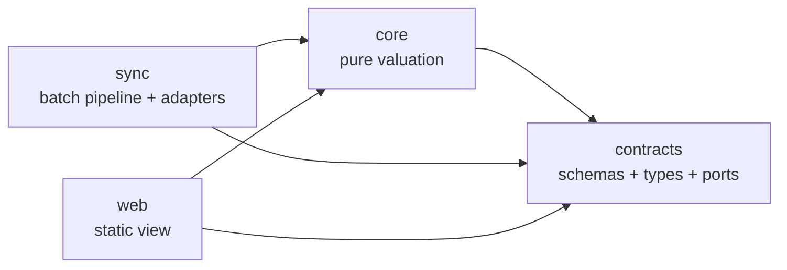
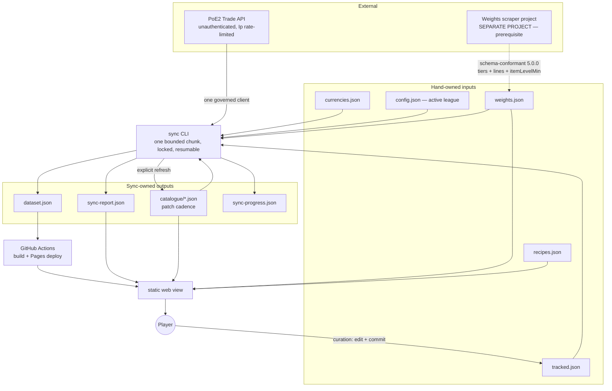
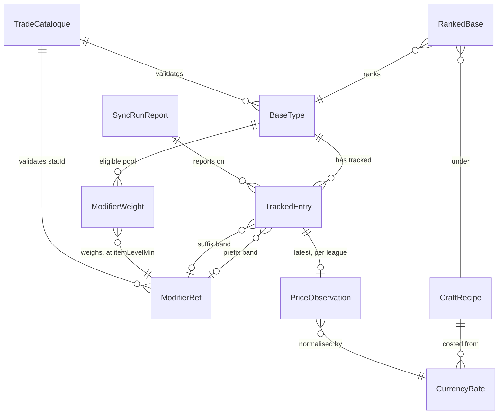

# Architecture Spine — PoE2 Crafting Base Price Checker

> **Revision 12** absorbs the PM's Phase 1 handoff so that `prd.md` rev 13 can cite this
> document by stable id instead of restating mechanism. Sixteen one-to-three-sentence
> absorptions, no AD added or retired: OQ-21 and AD-11 now carry **both** escaping shapes
> (flush and **floor** intrusion); an absent `weights.json` makes every **crafted** base
> unrankable while raw bases still rank (AD-11, AD-24, AD-27); AD-19 admits
> `schemaVersion` on `config.json`; AD-12 derives the tracked-list edit date from git and
> records a cross-file gate failure in the report; AD-7 acknowledges the *not-reached*
> record; AD-17 applies the threshold to a raw base and gives `web`'s consequence on a
> cross-file failure; AD-3 states that `recipes.json` is a list; AD-27 reports coverage with
> its denominator; AD-10's FR-11 raise-back is closed; OQ-12 gains the `valueless` wire
> shape. `IMPLEMENTATION-NOTES.md` §2.1 names the overlap error payload, §3 the reported
> denominator and §6 all six pinned-starvation identifiers; `WEIGHTS-FILE-SCHEMA.md` states
> both halves of pool completeness.
>
> **Revision 11** closes the nine critical findings of the 2026-09-19 validation gate. It
> fixes the currency contract's sourcing method and its orientation (AD-20), gives the sync
> lock contents, a staleness threshold and a report record (AD-7), names every delegated
> companion section by number so AD-0's *delegation* limb carries it rather than its weaker
> *silence* limb — every delegation in this document now carries a section number (AD-7,
> AD-8, AD-11, AD-16, AD-17, AD-20, AD-27 and the Conventions table) — makes `core` return
> each ranked base's ordered summands so
> FR-2 has a legal implementation (AD-17), and decides `web`'s behaviour on an **absent**
> artifact as distinct from an invalid one (AD-24). `IMPLEMENTATION-NOTES.md` §2.4's edge
> alignment was requantified over the contained entries' own-`statId` lines; the previous
> statement broke every band over a hybrid modifier.
>
> **Revision 10** did two things. It absorbed the approved sprint change proposal of
> 2026-09-19, which raises the weights contract to **`5.0.0`**: the producer reports
> poe2db's tier weights and stat ranges as published, the value-cell decomposition is
> withdrawn, and **whole-tier containment** is the consumer-side rule that replaces it.
> It also carried a **simplification pass**, taken while no code exists. **Ten ADs merged
> into their neighbours and their ids retired** (see *Retired AD map*), leaving **19 of the
> original 29 plus the new AD-0**; the revision history moved to `.memlog.md` and git, and
> the low-level arithmetic moved to `IMPLEMENTATION-NOTES.md`. **This document states what
> must not diverge. It no longer argues for itself, and it no longer carries formulas a
> builder executes** — but under **AD-0** the companion it delegates to binds exactly as the
> AD that cites it, so nothing was downgraded to advice by being moved.
>
> **AD ids 1–29 no longer all resolve**, and the *Retired AD map* gives every old id its new
> home. `prd.md` rev 11 completed its pass: **verified 2026-09-19, it carries 17 retired-id
> occurrences across 5 lines, every one a deliberately annotated historical record in §0 and
> §10, where substituting an id would falsify what was decided at the time.** Two documents
> have **not** had that pass and are stale against this revision — the story spec
> `docs/stories/spec-contracts-accepted-tier-and-search-id.md` (weights contract `4.1.0`,
> spine rev 9, retired **AD-2** and **AD-22** cited eight times) and the UX set
> (`DESIGN.md` 2 occurrences, `EXPERIENCE.md` 4, and `mockups/key-hero-resting.html` 1).
> The story spec is the artifact a builder opens first.

## Design Paradigm

**Functional core / imperative shell, with ports-and-adapters at the edges.**

All valuation is pure functions over plain data in `core` — price estimation,
probability, threshold-truncated expected value, craft cost, provenance propagation.
Everything that touches the outside world sits behind a named port as an adapter, and
only `sync` or `web` invokes an adapter. The outside world is the trade API, the
filesystem, git, and the clock.

| Paradigm role | Package | May import |
| --- | --- | --- |
| Contract | `contracts` | nothing |
| Functional core | `core` | `contracts` |
| Imperative shell (write side) | `sync` | `contracts`, `core` |
| Imperative shell (read side) | `web` | `contracts`, `core` |



No other edge is permitted. `core` never imports `sync` or `web`. `sync` and `web`
never import each other.

## Invariants & Rules

### AD-0 — A cited companion section binds exactly as the AD that cites it

- **Binds:** all
- **Prevents:** the simplification pass silently downgrading a rule. Revision 10 moved the
  arithmetic out of the ADs and into `IMPLEMENTATION-NOTES.md`; without this rule a builder
  reads *"…is in `IMPLEMENTATION-NOTES.md`"* as a pointer to advice, implements the obvious
  thing instead, and two conforming implementations return different numbers from the same
  files while every artifact stays schema-valid.
- **Rule:** `IMPLEMENTATION-NOTES.md` is **binding**. Where an AD delegates a computation,
  an encoding or a threshold to a named section of that file, the section carries the full
  force of the delegating AD, and a deviation is a violation of that AD and not a style
  choice. The same holds for `WEIGHTS-FILE-SCHEMA.md`, which is the weights contract itself.

  **Precedence.** Where a companion **contradicts** this spine, the spine wins and the
  companion is the defect. Where this spine is **silent** and a companion is not, the
  companion governs — silence is not permission.

  This rule does **not** extend to `AGENT-WORKFLOW.md`, which is process guidance carrying
  no invariant of its own, nor to anything under `reviews/` or `.memlog.md`, which are
  records of what was decided and when.

### AD-1 — Valuation is pure, the outside world is a port, and dependencies run one way

- **Binds:** all
- **Prevents:** I/O leaking into the ranking logic, and the package graph rotting into
  mutual imports. Either one ends offline testing and worktree-parallel development.
- **Rule:** No module in `core` performs I/O, reads the clock, generates randomness, or
  reads environment or config. `contracts` declares every external effect — HTTP, the
  filesystem, git, time — as a port interface, and `sync` or `web` implements it as an
  adapter. The caller passes time and any nondeterminism in as values.

  The edges in the paradigm diagram are the complete set. `dependency-cruiser` fails CI
  on a violation, and review does not carry that job. Shared code moves **down** into
  `contracts` or `core`; no component imports shared code sideways.

### AD-3 — One channel, one writer, one schema

- **Binds:** all
- **Prevents:** the producer and the consumer drifting on a data shape; a second,
  unversioned side channel appearing without anyone deciding to create one; two owners
  for one artifact; an entity existing in two packages' heads with no file.
- **Rule:** `sync` communicates **sync state** to `web` through exactly two artifacts,
  `dataset.json` and `sync-report.json`, and through nothing else. `sync-progress.json`
  is internal to `sync`. A third state-bearing artifact is an amendment to this AD.

  Hand-owned inputs (`tracked.json`, `currencies.json`, `recipes.json`, `config.json`,
  `weights.json`) and cached external facts (`catalogue/*.json`, AD-25) also cross the
  boundary and are **not** a sync→web channel, because neither class carries sync state.

  Every shared file has exactly one writer:

  | File | Written by | Read by |
  | --- | --- | --- |
  | `data/tracked.json`, `data/config.json` | the player, by hand | `sync`, `web` |
  | `data/currencies.json` | the player, by hand | `sync` **only** (AD-24 does not fetch it) |
  | `data/recipes.json` | the player, by hand | `web` |
  | `data/weights.json` | an external producer | **`sync` in full** — id validation (AD-9), the cross-file gate (AD-17) and the coverage figure (AD-27) — and `core` via `web` |
  | `data/catalogue/*.json` | `sync`, on an explicit refresh command (AD-25) | `sync`, `core` via `web` |
  | `data/dataset.json`, `data/sync-report.json` | `sync` only | `web` |
  | `data/sync-progress.json` | `sync` only | `sync` only — internal |

  `sync` commits **only the files `sync` owns**, by explicit path, and never runs
  `git add -A`, so a dirty working tree elsewhere neither blocks a sync nor enters its
  commit. **`sync` then pushes to the default branch, and the git write path is bounded:**
  `sync` may `pull --ff-only` before committing, and may **never** force-push, rebase,
  merge, or resolve a conflict. A push that fails **leaves the commit in place, records the
  failure in `sync-report.json`, and exits non-zero**; the next chunk re-attempts. A
  non-fast-forward remote is an operator problem, not a case for `sync` to reconcile —
  reconciling would let an automated job rewrite history that the dataset's own audit trail
  depends on (AD-19).

  Every concept that crosses a package boundary has exactly one Zod schema in
  `contracts` and no parallel definition anywhere: `BaseType`, `TrackedEntry`,
  `ModifierRef`, `PriceObservation`, `ModifierWeight`, `CraftRecipe`, `CurrencyRate`,
  `SyncRunReport`, `RankedBase`, `TradeCatalogue`. Static types are `z.infer`red from
  those schemas. `CraftRecipe` covers currency composition and the recipe's distribution
  effect, and is populated from `data/recipes.json`, **an object carrying `schemaVersion`
  and a `recipes` list of `CraftRecipe` entries, each with a unique `id`** — an object and
  not a bare array, because a bare array has nowhere to carry the `schemaVersion` every file
  must. **Adding a recipe is a data edit and needs no code change**, because AD-17 ranks the
  **cross product** of every crafted base with every recipe in the list — a recipe is a cost
  offset that applies to any base, and the file declares no per-base pairing. The `id` is
  what AD-17's outer tie-break compares. **`core` computes a recipe's *cost*
  from synced rates, and `sync` never computes a craft cost** — AD-4 permits an artifact to
  carry an observed *rate*, and a craft cost is a derived valuation term, not an
  observation. Every artifact carries `schemaVersion`. `sync` validates before writing;
  `web` validates on load and **refuses to render an invalid artifact** rather than
  degrading. Changes to `contracts` land alone and first (`AGENT-WORKFLOW.md`).

### AD-4 — Ranking is computed at read time, never precomputed

- **Binds:** `core`, `web`, `sync`
- **Prevents:** the user-facing payout threshold reordering nothing until the next sync,
  which would make the product's central control a lie.
- **Rule:** Published artifacts carry observations — prices, weights, costs — and never
  rankings or scores. The ranked list is AD-17's pure function, evaluated in the browser
  on every change to any input. `sync` must not write a rank, a score, or an ordering.
  `web` may not compute any ranking term itself, and only renders what `core` returns.

### AD-5 — Canonical modifier identity is the trade stat id plus a bounded value band

- **Binds:** all
- **Prevents:** the tracked list, the weights file and the trade query each carrying a
  different notion of "a modifier", which would mismatch silently instead of failing.
- **Rule:** A modifier reference is one of exactly two kinds, discriminated by the schema:

  | Kind | Shape | For |
  | --- | --- | --- |
  | `banded` | `(statId, valueMin, valueMax)` — an **inclusive, closed band** over the value the trade filter compares | every modifier that rolls a number |
  | `valueless` | `(statId)`, no edges at all | a modifier that rolls no number — *"Loads an additional bolt"* |

  A valueless reference is **not** a degenerate band, and no component may give it
  sentinel edges. It still carries pool membership and still counts toward completeness.

  **`valueMax` is required, everywhere, with no open-top form.** An omitted ceiling is a
  floor, and a floor spans tiers: AD-17 would sum two tiers' weight while AD-16 prices
  the cheaper one. Every game modifier has a maximum roll, so a closed band is always
  expressible. Presence alone is not sufficient — AD-17's edge-alignment check is what
  closes the sentinel loophole.

  A tracked entry is `(baseTypeId, itemLevelMin, prefix?, suffix?)`, where each affix is
  a modifier reference or is **absent**. An entry with both affixes absent is a **raw
  base**, which is how the data represents white ilvl-82 bases. `baseTypeId` is the trade
  API's base type `type` string exactly as `data/items` spells it. **No component may
  introduce a second modifier identity.**

  **A reference names a stat line, not a game modifier.** One modifier may publish
  several `statId`s that always roll together (AD-11). A `statId` identifies what the
  trade filter can ask for; it does not identify the thing the game draws.

  **`itemLevelMin` and `acceptedTier` are declared, never inferred.** A present modifier
  reference may carry an **`acceptedTier`** label beside its band — optional on both arms
  of the union, and unused on the `valueless` arm. `contracts` types it as an **optional
  free string**. The label is **display-only**, and four prohibitions ride with it:
  `core` and `sync` never read it; no component validates it against a band; **no
  component validates its spelling**; and it is **never part of a tracked entry's
  canonical key**. A missing label is a curation gap that `web` renders as a marked
  fallback, and never a load error.

### AD-7 — Sync is a bounded, resumable, single-instance chunk runner with a defined rotation

- **Binds:** `sync`, `contracts`, `web`
- **Prevents:** a host's wall-clock ceiling becoming a correctness problem; two
  overlapping runs corrupting shared progress; and two builders implementing "which
  entries does this chunk refresh?" differently — one round-robin, one oldest-first —
  which would silently change how stale any given row is while every artifact stayed
  schema-valid.
- **Rule:** The syncer is a CLI that performs **one chunk, then exits**. Whichever of
  three bounds runs out first bounds the chunk: the remaining search allowance, the
  remaining fetch allowance, or the unprocessed remainder of the workload. Progress lives
  in a schema-pinned `sync-progress.json`, committed alongside the dataset. A run
  acquires an exclusive on-disk lock; if another **live** run holds it, the new run logs that
  fact and **exits 0**, because a busy lock is a normal outcome for a repeatedly-invoked job.
  The syncer makes no assumption about what invokes it, how often, or where it runs.

  **The lock is recoverable, and a crash may not wedge the product.** The lock file carries
  the holder's **pid** and its **ISO-8601 start time**, and nothing else. A run that finds a
  lock whose start time is older than a declared staleness threshold **breaks it, proceeds,
  and writes a distinct `stale-lock-broken` record to `sync-report.json`**, which `web`
  surfaces like any other report record. Without this, one crashed run leaves a lock nobody
  clears, every later invocation exits 0 having done nothing, no report is ever written, and
  the dataset stops updating behind a green status on every surface — the failure is
  indistinguishable from a healthy idle system, which is what makes it the worst one
  available.

  Three rules keep the break safe. **Taking a lock is a single atomic operation**, so two runs
  arriving at the staleness boundary together cannot both succeed. **A run writes nothing
  unless it still holds the lock it took** — it re-reads the lock immediately before
  committing and aborts without writing if the contents are no longer its own, because a slow
  run dispossessed at the threshold would otherwise commit over the run that replaced it.
  And **a run releases the lock on every exit path where it still holds it** — including the
  aborts AD-12's run-start gates cause, since a league mismatch is a routine configuration
  error and leaving it to expire would wedge syncing for the whole staleness window behind a
  green surface, the very failure this paragraph exists to prevent. **The ownership condition
  is not a refinement:** a dispossessed run that released unconditionally would delete the
  lock its successor is holding, putting two runs back in the window this rule closes. The threshold
  and the staleness comparison are in `IMPLEMENTATION-NOTES.md` §7, binding under AD-0.

  **Within a chunk, `sync` selects entries in exactly this order**, stopping when any
  bound is reached:

  0. **currency rates first**, always, before any priced entry in the same chunk (AD-20);
  1. then every `pinned` entry (AD-12), **oldest `lastAttemptedAt` first**, subject to the
     cap below;
  2. then `active` entries by **oldest `lastAttemptedAt` first**, treating an entry that
     **carries no `lastAttemptedAt` at all** as infinitely old. The key is the field's
     absence, and never the `not-yet-synced` price state;
  3. then `unresolvable` entries (AD-9) on a **bounded retry schedule** — at most one
     attempt per entry per 24h, measured from that entry's `lastAttemptedAt`;
  4. never `pruned` entries.

  **An id that resolves again stops being `unresolvable` at that moment**, and rejoins row 2
  as an ordinary `active` entry without waiting for a retry slot. The run-start catalogue
  check (AD-9) is what observes the recovery, and it is offline and free. Without this exit,
  a patch that restores a stat id would leave the whole recovered set refreshing at one
  entry per day forever, with no artifact invalid and nothing reporting it. What row 3
  therefore covers is the narrow residue: an entry whose id **does** resolve but whose
  pricing attempt keeps failing.

  Rows 1, 2 and 4 select on curation status and row 3 on price state, so an entry that is
  `active` *and* `unresolvable` is selected by row 3 alone. Lifting such an entry out of
  row 2 is what makes row 3's bound mean anything, because oldest-first would otherwise
  re-select it every chunk regardless of the bound. Ties break on the canonical
  entry key. The order is a pure function of the tracked list, the dataset and a passed-in
  clock, computed through `core`, so a dry run and a real run produce the same order. **A
  resumed chunk recomputes the order rather than replaying a frozen plan** —
  `sync-progress.json` records which entries a chunk *completed*, never which it intended
  to visit. **`sync-report.json` carries the number of entries this chunk did not
  reach** — a per-chunk **figure**, a single count and never a list, because at a five-minute
  cadence the list is nearly the whole tracked file every chunk. **It counts the entries
  rows 1–3 above made eligible for this chunk that the chunk did not attempt** — never
  `pruned` entries, and never an `unresolvable` entry still inside its retry interval, since
  neither was due. It is a normal rotation
  outcome and never a skip (AD-9), kept distinct from the pinned-starvation **record**
  below, so a partially refreshed dataset is distinguishable from a stalled one. As a
  figure it is overwritten by the next chunk (Consistency Conventions, *Logging*). The
  product owns the requirement (PRD FR-25); the schema acknowledges the field here so
  `contracts` gives it a home.

  **The `pinned` cap is denominated against a chunk, not a full refresh**, and both ends
  enforce it: a load-time inequality that only **`sync`** evaluates, and a runtime
  truncation that records a distinct **pinned-starvation** record in `sync-report.json`
  without changing the exit code. `web` surfaces that record's presence. `web` is
  expressly **not** obliged to evaluate the load-time check and cannot, because
  `data/currencies.json` is not in AD-24's fetch set. The inequality and the cadence
  argument behind it are in `IMPLEMENTATION-NOTES.md` §6, binding under AD-0.

  **`minChunkSearches` is a validation yardstick, and never a chunk bound.** It is a
  declared field of `data/config.json` read at exactly one place — the load-time
  inequality. An implementation that lets it cap, pace or shorten a chunk has violated
  AD-8.

### AD-8 — All outbound trade traffic passes through one governed client

- **Binds:** `sync`
- **Prevents:** two call sites pacing independently, which would blow a shared rate-limit
  budget and risk the API access the whole product depends on.
- **Rule:** Exactly one adapter issues requests to the trade API — searches, fetches
  **and catalogue refreshes (AD-25) alike**. The adapter reads `X-Rate-Limit-Rules` to
  learn the active rule names **at runtime, and never enumerates rule names in code**,
  then parses the policy and `-State` header for each named rule. `X-Rate-Limit-Policy`
  distinguishes the search bucket from the fetch bucket, and the adapter paces against
  the tightest unsatisfied bucket. **No rate is hardcoded.** On a 429 the adapter honours
  `Retry-After` and yields the chunk rather than retrying tightly. The adapter sends a
  descriptive `User-Agent` naming the tool and a contact address, as GGG asks of
  third-party tools. Header-parsing detail and the measured 2026-09-12 buckets are in
  `IMPLEMENTATION-NOTES.md` §5.3, binding under AD-0.

  **Recorded risk: `trade2` is undocumented.** GGG's developer documentation covers the
  OAuth API Reference and makes no mention of the trade or `trade2` endpoints, so every
  endpoint this product depends on is unsupported surface that happens to work, and may
  change or close without notice. The architecture cannot prevent that; it makes the
  break loud and cheap — one governed client, committed fixtures whose re-record diff
  exposes a reshape (AD-13), a committed catalogue whose refresh diff exposes a rename
  (AD-25), and no user-facing path that calls the API live (AD-15).

### AD-9 — Price is four-state, absence is never zero or null, and an unresolvable id is loud

- **Binds:** `contracts`, `core`, `sync`, `web`
- **Prevents:** "no listings" being conflated with "worthless", which would drop exactly
  the plausible jackpots; a tracked combination silently disappearing from the rankings
  after a game patch; and a patched-out modifier continuing to rank on its last-good
  price forever.
- **Rule:** Every tracked entry's price is exactly one of four states: `priced` (with a
  value and an `observedAt`), `no-listings`, `not-yet-synced`, or `unresolvable`. `core`
  **excludes** every non-`priced` state from the expected-value sum rather than
  contributing zero, and reports each state separately so the view can show non-`priced`
  entries outside the ranking. No component may represent absence as `0`, as `null`, or
  as a missing key.

  **Unresolvable.** If a tracked entry references a `statId` or `baseTypeId` the trade API
  no longer exposes, `sync` writes that entry's state as `unresolvable` **and** records it
  in `sync-report.json`. `sync` never skips, defaults, or leaves the entry at its previous
  value. `core` excludes `unresolvable` entries from valuation, and `web` must surface
  their existence rather than only omitting them. **An empty result set is `no-listings`,
  never `unresolvable`.**

  **Detection is catalogue validation, owned by the component that holds the catalogue.**
  Both checks are `sync`'s, and they differ in consequence:

  | Check | When | Surfaced as |
  | --- | --- | --- |
  | every `statId` / `baseTypeId` in `data/tracked.json` exists in the catalogue | before issuing any request | the entry's `unresolvable` state + `sync-report.json` |
  | every `statId` / `baseTypeId` in `data/weights.json` exists in the catalogue | reading the file (`sync` is a reader, not its writer) | `sync-report.json` only; the file is never rewritten and never refused |

  A weights line whose `statId` is **`null`** is **skipped** by catalogue validation, not
  failed by it, and `sync` must not report it as an uncatalogued id — the two have
  different causes and different owners. `core` still validates the weights file's shape
  and pool rules at load, but cannot cross-check base types, because AD-24 withholds
  `catalogue/items.json` from `web`.

  **Timestamps.** The schema declares `lastAttemptedAt` on every entry in all four states,
  and the field is **present wherever `sync` issued a request**. Offline work — the
  catalogue check above all — never stamps it. `observedAt` exists only where there is an
  observation. A **never-synced** entry carries neither, and **no component may give it a
  placeholder**: `web` renders it as *never attempted*, and AD-7's rotation treats the
  absence as infinitely old. `web` reports age from `observedAt` where one exists and
  from `lastAttemptedAt` otherwise, labelled as what the reported age is.

  **`lastSearchId` and `lastSearchLeague` sit beside `lastAttemptedAt`, on the entry and
  never on a `PriceObservation`** — an observation exists only where there is an
  observation, and `no-listings` and `unresolvable` are two of the states in which the
  player most wants to open the market themselves. **An attempt that issues a request but
  receives no answer — a 429, a 5xx, a timeout — stamps `lastAttemptedAt` alone and
  leaves the other two exactly as they were.** `lastSearchId` may therefore be older than
  `lastAttemptedAt`, which is harmless because AD-24 tests the identifier's league and not
  its age. **A 4xx other than 429 is not a market fact and is not a price state:** it means
  the request `sync` built is malformed — the `valueless` wire shape of OQ-12 is the live
  candidate — and the same defect will fail every entry, so `sync` stamps `lastAttemptedAt`,
  leaves the entry's state as it was, writes a record to `sync-report.json` and **aborts the
  run non-zero** (Consistency Conventions, *Error shape*) rather than spending the rest of
  the chunk on requests it knows are broken. **`core` never reads either field**, and
  neither enters a ranking term.

### AD-10 — Provenance and freshness ride on every derived value and propagate upward

- **Binds:** `contracts`, `core`, `web`
- **Prevents:** a uniform-prior placeholder being quietly trusted months later with
  nothing on screen to reveal it, and a partially refreshed dataset reading as a current
  one.
- **Rule:** Every probability carries its source, and every price carries its observation
  timestamp and league. Provenance is a **three-value total order**, weakest first:

  | Rank | Provenance | Means | Arises from |
  | --- | --- | --- | --- |
  | 0 | `absent` | not an estimate at all — an upper bound | a `partial` pool (AD-17), and nowhere else |
  | 1 | `uniform-prior` | the weight was invented | `weightSource: "absent"`, or a bootstrap file |
  | 2 | `measured` | measured by someone (never ground truth) | `weightSource: "published"` |

  **The `weightSource` mapping is stated here and in one place**, because
  `"absent"` → `uniform-prior` is correct and `"absent"` → provenance `absent` is the
  reading the shared word invites and is wrong. `absent` is a `core`-side value that must
  never appear in a file, and `web` must never print `weightSource`'s own words on screen.

  `core` propagates the **weakest provenance and the oldest timestamp** of every input
  into each derived figure, **with no exception** — the numerator-only exception retired
  with `modelled-split`, whose only source was the withdrawn decomposition.

  **A probability's inputs are every entry in its scoped pool, numerator and denominator
  alike**, and the scope is stated here because "every input" has two readings that give
  different labels. Under `5.0.0` a `weightSource: "absent"` tier weakens the denominator
  **in fact** and not merely in label, so the containment-set-only reading would understate
  what the figure rests on. **The consequence is deliberate and is not a defect:** one
  invented tier anywhere in a scoped pool makes every probability on that base read
  `uniform-prior`, so the provenance badge discriminates **between base types** rather than
  within one — which is what PRD FR-11 now states (raise-back closed by PRD rev 11). `web` must
  render a figure resting on anything below `measured` visibly differently from one
  resting on `measured`. **Two render treatments, not three.**

  `web` must surface per-row age rather than a single dataset-level timestamp, because
  AD-7 guarantees rows refresh at different times. **The obligation is discharged per row,
  not per surface:** a row at or beyond the freshness cut-off is marked on every surface,
  every row's exact age is reachable in its expansion, and a row younger than the cut-off
  may show none. **The cut-off compares the age the row actually reports** — `observedAt`
  where an observation exists and `lastAttemptedAt` otherwise (AD-9), unconditionally and
  on every surface.

  **This AD binds that a cut-off exists, which clock it reads, and what it may not do. The
  number itself is a view-layer constant whose home is the PRD** — 48 hours, chosen
  against the ~15-hour partial refresh cycle. It is deliberately not a `data/config.json`
  field (AD-19) and not a ninth fetched artifact (AD-24): nothing but `web` reads it and
  no artifact carries it across a boundary, so changing it is a view change and a redeploy.

### AD-11 — Weights are a consumed file of raw tiers, and containment resolves the overlap

- **Binds:** `core`, `contracts`, `sync`, weights producers
- **Prevents:** every weight producer having to understand crafting recipes; two consumers
  normalising raw weights differently; the app growing a scraper of its own; a contract no
  producer can satisfy; a pool denominator that double-counts a multi-stat modifier; and
  the permanent loss of the fact that two stats always roll together, which nobody can
  reconstruct once the source row is split.
- **Rule:** The app consumes a file conforming to `WEIGHTS-FILE-SCHEMA.md` **`5.0.0`**,
  and never produces one. Any producer that satisfies the contract is acceptable, and the
  app does not depend on which one wrote the file.

  **One entry is one tier of one modifier, and an entry and a source row are the same
  thing.** An entry carries `sourceModifierId`, `itemLevelMin`, `weight`, `weightSource`,
  and **`lines[]`** — that tier's stat lines nested inside it, each line carrying its own
  `statId` (or **`null`**, where the producer resolved none) and its `ranges` **verbatim**,
  exactly as the source published them. The tier's weight is carried **once**, on the
  entry. **The producer performs no split, no aggregation, no normalisation and no value
  derivation.** A `null` `statId` is data, never a file error, and never a reason to
  declare a pool `partial`.

  **All of one entry's lines roll together as a single draw**, because the game draws the
  modifier rather than the line. That fact is the only thing `core` cannot reconstruct
  once it is lost, and it is why the lines are nested rather than flattened. `core` reads
  co-occurrence directly off one entry's `lines` (AD-17). In valuation `core` never reads
  `sourceModifierId` at all; it reads it at load, for the duplicate-entry check.

  **Tiers overlap in value space, and the file reports the overlap rather than resolving
  it.** Band non-overlap is withdrawn at every scope. For a modifier whose text carries
  more than one `#`, the value axis does not partition the tier axis — *measured by the
  producer 2026-09-13: 53 of 63 item classes carry such a modifier, up to 36% of a weapon
  class's pool.*

  **A line's filter-comparable interval is derived, and `core` derives it the one way, in
  one place — `IMPLEMENTATION-NOTES.md` §1, binding under AD-0.** The unit is whatever
  quantity the trade stat filter compares, and no other — that is one empirical fact about
  the trade API, not a modelling decision (OQ-12). The derivation must be **exactly
  representable**, because AD-17 compares a curator's declared edge against a derived edge
  for exact equality (OQ-19).

  **Containment is whole-tier.** A tier whose derived interval lies wholly inside a
  tracked band contributes its **whole weight, once**; a tier only **partly** covered
  contributes **nothing** to that band's numerator, and that is not an error. It still
  enters the denominator like any other entry in scope. The `contains` predicate and the
  three rules that ride with it are in `IMPLEMENTATION-NOTES.md` §1 *Containment*, binding
  under AD-0.

  Two alternatives were rejected. **Pro-rating** — computing `P(value ∈ band | tier)` from
  raw `ranges` — is correct arithmetic, but it re-sites the producer's withdrawn model
  inside the browser where nobody can diff it, and it reopens the provenance distinction
  AD-10 just retired; it survives under Deferred. **Whole-tier inclusion** — every
  overlapping tier contributing its full weight — over-counts, inflating that base's `ΣP`
  above 1 and handing it the top of the ranking, which is the same failure the partition
  rule exists to prevent.

  **What whole-tier containment costs, stated rather than implied.** Every affected
  probability is an **understatement**, and the error is **uneven** across base types, so it
  **reorders** rather than shifts. Two things blunt it. AD-16 sorts ascending and takes the
  cheapest ten, while a tier excluded for reaching past the band's ceiling sits at the top of
  the band by construction — so the population dropped from the numerator is largely the
  population the price estimate never sees, and the two errors do not compound. AD-17's edge
  alignment rejects a band whose ceiling reaches into a tier the band does not contain.

  **Neither is a bound, and this AD does not claim one. Two shapes escape, and both
  mitigations are ceiling-side.** Edge alignment compares a band only against its **own
  containment set**, so an excluded tier that is *flush* with a band edge is invisible to
  it: where two tiers share a `statId` and a maximum — T7 `[43, 56.5]` at weight 900 and
  T8 `[50, 56.5]` at weight 100 — the band `[50, 56.5]` aligns perfectly, contains T8,
  silently drops nine tenths of the mass, and is priced on T7's cheap items — a **flush
  intrusion**. A scoped same-`statId` tier whose interval covers the band's `valueMin`
  without being contained and without sharing an edge is a **floor intrusion**, and it is
  the worse case: it sits at the cheap end of the priced sample, which is the end AD-16's
  ascending sort takes ten of, so the band carries the tracked tier's weight while the
  estimate carries the intruder's price, and below AD-17's threshold the summand truncates
  and takes the tracked tier's mass with it. `IMPLEMENTATION-NOTES.md` §2.4's worked
  `56.0 – 80.0` band over T7 `[43.0, 56.5]` / T8 `[56.0, 80.0]` is exactly that shape, and
  edge alignment accepts it. Non-overlap withdrew with the decomposition, so nothing in the
  contract prevents either shape. **How far the understatement can run is therefore
  unmeasured and unbounded (OQ-21).** The residual is carried under Deferred with its
  revisit condition.

  **`gamePatch` is operator-asserted, and no component derives it.** Neither the
  producer's sources nor the trade API states a patch version, so a producer takes it as a
  required run-time input and refuses to run without it rather than emitting a default.
  `core` does not parse it and must not branch on it. `web` surfaces it beside
  `producer.id` and `producer.generatedAt`.

  **The file is a prerequisite, not a convenience.** The trade API exposes no pool
  membership, no tier, no item-level availability and no spawn weight (AD-25), so nothing
  in this system can derive what the file carries. Until a conforming file exists, AD-17
  makes every **crafted** base unrankable, and that outcome is the honest one; **raw bases
  need no pool and still rank** on AD-17's separate branch, so the Raw Base price list
  survives the file's absence. A uniform-prior file
  (every `weight: 1`, `weightSource: "absent"`) remains a valid *weighting* shortcut, and
  is never a *sourcing* shortcut.

  **What `core` can check, and what it cannot.** `5.0.0` withdrew ten checks, each because
  its subject is gone rather than because the bar dropped. `core` retains the shape rules,
  the duplicate-`sourceModifierId` rule and the pool rules that `WEIGHTS-FILE-SCHEMA.md`
  lists. It has **no arithmetic audit of the producer's work at all**: a dropped tier and a
  dropped stat line now rest entirely on the producer's `poolCoverage` assertion, and the
  quiet case — a second tier publishing one `statId`, so no error fires while a numerator
  deflates — has nothing behind it. That trust surface is wider than `4.x`'s, and this AD
  states it rather than implying it.

### AD-12 — The workload is declared and curated, and the search budget is the ceiling

- **Binds:** `sync`, `contracts`, `web`, curation workflow
- **Prevents:** an unbounded, unreviewable request budget; curation becoming a
  mutable-store feature that forces a server into a static architecture; an unenumerated
  second workload silently consuming the same bucket; and the addendum's named risk — *"a
  stale top five that the user trusts is worse than no tool"* — becoming the steady state
  because nothing ever prompts a review.
- **Rule:** Exactly **four** sources generate a request, and nothing else does:

  | Source | Cadence | Cost |
  | --- | --- | --- |
  | `data/tracked.json` — combinations to price | every chunk | one search + one fetch per entry |
  | `data/currencies.json` — currencies to price for AD-20 | every chunk, **first** (AD-7) | small, fixed |
  | League validation against the live leagues endpoint (AD-19) | once per run | one request |
  | Catalogue refresh (AD-25) | explicit command, patch cadence, never on the chunk path | four requests |

  A fifth source is an amendment to this AD, not an implementation detail.
  `sync-report.json` must report requests consumed **per source**, so budget drift is
  observable per cause.

  **Three run-start gates stand in front of those four sources**, and their consequences
  differ by design. `sync` validates every tracked id against the catalogue (AD-9) — a
  per-entry condition, so the entry is marked `unresolvable` and the run continues.
  `sync` runs `core`'s cross-file validation of `data/tracked.json` against the weights
  file — **all four checks** (AD-17) — as one gate. `sync` validates the configured league
  (AD-19). A league mismatch or a cross-file failure invalidates the run's premise, so the
  run **aborts**, and **a cross-file failure is recorded in `sync-report.json`** with the
  failing check's payload (AD-17), so the abort is visible on the surface `web` already
  reads and not only in an exit code nobody watches. **An aborting run still commits and
  pushes `sync-report.json`** — that file alone, by AD-3's path, with `dataset.json` and
  `sync-progress.json` untouched — because a record that never deploys is a record nobody
  reads. The league gate does the same.

  **An absent `weights.json` is not a cross-file failure — there is no cross-file to check.**
  `sync` skips that gate, records the absence in `sync-report.json`, and **runs normally**:
  pricing a tracked entry needs the trade API and the catalogue, never the weights file. The
  distinction is load-bearing, because AD-24 makes an absent weights file the product's
  day-one state; a gate that aborted on it would leave the dataset unpopulatable during
  exactly the phase the product ships in, with `web` rendering an empty ranking it could never
  fill. A weights file that is **present and fails** still aborts. Only the league gate costs a request; the other two exist precisely to
  stop budget being spent on a configuration that cannot be ranked.

  **Curation is an edit and a commit.** No component writes either workload file at
  runtime. `TrackedEntry` carries an explicit `status` of `active`, `pinned` or `pruned`
  as **schema members, not conventions**. `pinned` means *refreshed every chunk, exempt
  from rotation*, subject to AD-7's cap. `pruned` is a **tombstone** carrying its reason:
  `sync` excludes it from the workload **and** AD-17's sum excludes it from `tracked(base)`,
  because pruning that left the last-good price contributing would be a no-op on the
  ranking. `sync-report.json` records the date of the last tracked-list edit, **derived by
  `sync` from the git history of `data/tracked.json`** — the author date of the last commit
  touching it, read through the git port (AD-1), **which therefore carries one read
  operation beside its commit, pull and push — the last-commit author date of a path** —
  **and never from a hand-maintained field**, because a field the curator must remember to update is exactly the kind of
  memorised number this tool exists to abolish. An uncommitted working-tree edit does not
  move the date, and a file with no commit history yields no date at all, which `web`
  renders as *unknown* and never as a placeholder (AD-9's rule for absence). `web`
  surfaces the tracked list's age, so a list running unattended is visible as such.

  **The ceiling is denominated in searches, not in entries.** Against the measured 2,400
  searches per day, a full refresh is held to **~1,500 searches**; the remainder serves
  retries, the currency set, the catalogue refresh, the per-run leagues check and a second
  recipe. One tracked entry always costs one search. **`pinned` entries spend from that
  headroom differently** — a search in *every* chunk, so their daily cost scales with
  invocation cadence rather than with list size, which is the real reason AD-7's cap
  exists. **Under `5.0.0` the curation unit is the tier**, so the entry count a curator
  needs is the tier count; `4.x`'s finer-than-tier partition could demand more, and that
  pressure is relieved rather than added to.

  **Every price in the system is an asking price.** The system never observes a sale, and
  the view must not present an estimate as a realised value.

### AD-13 — The test path has zero network

- **Binds:** all
- **Prevents:** any automated test depending on a live, rate-limited third party, which
  would end unattended agent development — the brief's hardest requirement.
- **Rule:** No test, at any level, may make a real network call. MSW runs in
  `onUnhandledRequest: "error"` mode, so an unfixtured request fails loudly rather than
  escaping. External responses are real captured trade-API payloads, committed as
  fixtures. Re-recording is a separate, explicitly-invoked command and is never part of a
  test run. The resulting fixture diff is how GGG's changes become visible.

### AD-15 — The browser writes nothing; there is no backend

- **Binds:** `web`
- **Prevents:** an agent quietly introducing a server, an account, or per-user
  persistence — each of which contradicts the single-user, static, zero-upkeep premise.
- **Rule:** `web` is a static bundle. `web` performs no authenticated request, stores no
  server-side state, and has no write path to anything but the viewer's own browser
  storage. Any requirement that appears to need a backend is escalated, not implemented.

  **An outbound link the player clicks is permitted and is not an exception.** A
  `target="_blank" rel="noopener"` link to the trade site issues no request from the page
  and leaves the page unchanged, so it is neither a write path nor the runtime call AD-24
  forbids. The distinction is **who acts**. **The consequence runs the other way too:**
  because `web` may not make the call, `web` cannot mint a trade-site search itself, so
  any search a link targets must have been issued by `sync` and persisted (AD-9).

  *Confirmed 2026-09-12 by live unauthenticated calls: `trade2` leagues, search and fetch
  all return 200 with no session cookie. This premise is measured, not assumed.* Re-checked
  2026-09-19: the leagues endpoint and all four `data/*` endpoints still answer
  unauthenticated. **The POST search and fetch legs rest on the 2026-09-12 run alone** and
  have not been independently re-confirmed since; a re-check belongs in the first `sync`
  fixture recording (AD-13).

### AD-16 — The price estimate is the cheapest live instant-buyout listings

- **Binds:** `sync`, `core`, `contracts`
- **Prevents:** the single most load-bearing definition in the product being left to
  whichever agent writes the syncer. The brief calls this *"the product; everything else
  is presentation."*
- **Rule:** For each tracked entry, `sync` issues **one search and one fetch of the
  cheapest 10 result ids**, building the search from the entry alone:

  | Query field | Value |
  | --- | --- |
  | `query.type` (top level, **not** a filter) | the entry's `baseTypeId`, verbatim |
  | `type_filters.rarity` | `magic` for an entry carrying affixes, `normal` for a raw base |
  | `type_filters.ilvl` | `min` = the entry's `itemLevelMin` |
  | stat filters | one per modifier reference: a `banded` reference carries **both `min` and `max`**; a `valueless` reference carries the stat id and **no edges at all** |
  | `trade_filters.sale_type` | the option labelled **"Buyout or Fixed Price"**, whose `id` is JSON `null` |
  | `query.status` | **unsettled — OQ-20.** A live browser search sends `{"option": "securable"}`, and this spine does not yet fix the value |
  | `sort` | price **ascending** |

  Four traps make this costly to get right in code, and all four are recorded with their
  evidence in `IMPLEMENTATION-NOTES.md` §5.2, binding under AD-0: the base type is
  `query.type` and never
  `type_filters.category`; `priced_with_info` is *not* instant buyout and its correct
  option's `id` is `null`, which a serialiser will silently drop; passing the band's
  `max` as well as its `min` is what keeps the priced population the one AD-17 weighed;
  and a multi-`#` stat filters on one derived value whose identity is a measurement, not
  a choice (OQ-12).

  **`sync` emits a band edge exactly as the derivation produces it, and may not round.**
  Rounding a half-integer to reach an integer filter would silently price a different
  population than the one AD-17 weighed, which is the same defect as trap 3 reached from the
  adapter side. If the filter turns out to reject non-integer edges, that is a failure to
  surface, not one to paper over here.

  The `PriceObservation` is the **median of those listings' prices after normalisation to
  divine** (AD-20), recorded with the sample size actually returned. **On an even sample
  the median is the lower of the two middle values, never their mean** — ten results is
  the normal path, so this is not an edge case, and the lower value keeps every persisted
  price a price someone actually asked.

  **`sync` records the search identifier on the entry rather than on the observation**
  (AD-9), whenever the trade site answers the search, **whatever that answer contains**.

  Three effects are accepted and recorded rather than corrected. The API's ascending sort
  is per listing currency, so a result set spanning currencies may not be the globally
  cheapest ten. Fewer than 10 results is valid and records the true count; zero is
  `no-listings`. And **the priced population is deliberately wider than the weighted
  one** — a band containing one tier still admits the neighbouring tier's tail, which
  neither the search nor the curator can exclude (AD-11). *[ASSUMPTION]* What keeps that
  mismatch cheap is this AD's own ascending sort, which sees the excluded tail last, plus
  AD-17's edge alignment.

### AD-17 — Valuation: the ranking function, its probability term, its threshold and its unit

- **Binds:** `core`, `web`, `contracts`, `sync`
- **Prevents:** three mutually satisfying readings of "threshold-truncated expected value"
  producing three different orderings from identical data; a view whose dial is
  denominated differently from the value it filters; and two builders deriving different
  probabilities from the same weights file, which silently reorders the entire ranked list
  rather than failing.
- **Rule:** For a `(baseTypeId, recipe)` pair whose base is **crafted** — its tracked
  entries carry affixes:

  ```
  EV = ( Σ  P(combo) × price(combo) )  −  craftCost(recipe)
        combo ∈ tracked(base), state = priced, price(combo) ≥ threshold
  ```

  The threshold compares against a combination's **gross** price, not the price net of
  craft cost. `core` subtracts craft cost **once** from the summed expected payout, not
  once per combination, because the crafter pays it on every attempt including failures.
  **Threshold, all prices and craft cost are denominated in divine** (AD-20), and no other
  unit may cross a package boundary. `web` supplies the threshold as a value, renders the
  result, and computes no term.

  **`core` returns the summands, not only the total.** Each `RankedBase` carries its
  surviving summands — the combinations that passed the threshold — each with its own
  `P(combo) × price(combo)` contribution, **ordered by that contribution, descending**, ties
  breaking on the canonical entry key under the byte-wise ordering the Conventions table
  fixes. `web` renders a prefix of that list and **chooses only how many to show**, which is a
  view constant like AD-10's freshness cut-off. **The ranked list itself breaks ties the same
  way**, on the `baseTypeId` then the recipe id, so two builders produce the same order from
  the same files rather than the same *set* in two orders. **A base whose summands all fall
  below the threshold ranks at `EV = −craftCost`** with an empty summand list — it is ranked,
  not unrankable, because the threshold excluding every outcome is an answer about that base
  and not an absence of data. Without this,
  a surface that names a base's top contributing combinations has no legal implementation at
  all: AD-4 forbids `web` from computing a ranking term, and a builder would either break
  AD-4 or invent a `core` API that nothing binds — two builders inventing two different
  tie-breaks for the product's primary screen.

  **Raw bases rank on a separate branch.** A tracked entry with both affixes absent is
  never a summand — at `P = 1` it would enter at certainty and swamp every crafted
  outcome. Its `EV` is its observed price with zero craft cost, ranked in the same list
  and labelled as an uncrafted base. **The threshold applies to a raw base exactly as to a
  combination's gross price:** a raw base whose observed price is below the threshold
  leaves the ordering for that threshold entirely — it has no craft cost to rank at, so
  the `EV = −craftCost` rule above does not give it a row at zero. **`core` returns it in a
  distinct below-threshold group, outside the ordering and outside the unrankable group**,
  so `web` has something to count without a term to compute (AD-4); whether `web` shows
  that group is a view decision, ranking it is not. `[ADOPTED]` from PRD
  FR-3 and `EXPERIENCE.md`'s `raw-base-row` component row.

  **Summands must be mutually exclusive.** The sum is over a partition, not a list. Two
  tracked entries on one base whose outcome sets overlap would double-count, inflating that
  base's `ΣP` past 1 and handing it the top of the ranking. **Overlap is a validation error
  on `data/tracked.json`, rejected at load**, and never a case `core` reconciles. A
  **predicate** defines overlap, not an enumeration of shapes — an enumerated list has
  twice been found to miss a case. The predicate, its branch ordering and its four
  consequences are in `IMPLEMENTATION-NOTES.md` §2.1, binding under AD-0.

  **Where the pool cannot answer `coOccur`, the answer is `false` and the tracked list still
  loads.** A base absent from `weights.json`, and a base whose pool is `partial`, have no
  reading of that branch, and the two available behaviours are not equally safe. Refusing
  would take the whole site down over a base this AD has **already excluded from the
  ordering**, so the partition `coOccur` protects is never summed for that base and a missed
  double-count cannot reorder anything. `core` therefore answers `false`, renders, and
  reports the base's unrankability as it already would. This is a ruling rather than an
  inference, because two builders split here — one short-circuits silently, the other
  rejects `tracked.json` site-wide — and both readings conform to everything else stated.

  **The crafted entries on one `baseTypeId` must share one `itemLevelMin`.** `EV` is an
  expectation over one crafting act on one item population, and entries at different floors
  are normalised against differently-scoped pools. A raw base is exempt, because it is
  never a summand.

  **Probability is a ratio over a pool scoped by item level, and the same scope applies to
  both halves.** With `L = entry.itemLevelMin`:

  ```
  scoped(base, slot, L) = { entry ∈ pool(base, slot) : entry.itemLevelMin <= L }

                           Σ { e.weight : e ∈ scoped(base, slot, L) ∧ contains(ref, e) }
  P(ref | base, slot, L) = ────────────────────────────────────────────────────────────
                                   Σ { e.weight : e ∈ scoped(base, slot, L) }
  ```

  **The denominator is a plain sum over entries** — one entry is one tier is one source
  row, counted once (AD-11), so the double-counting reading is no longer reachable in any
  shape the file admits. `ModifierRef` itself carries no item level: the scope comes from
  the entry's floor and the weights entry's `itemLevelMin`, and from no third source.
  `P(combination)` treats prefix and suffix as **independent draws** — `P(prefix) ×
  P(suffix)`, with `P = 1` for an absent affix. *[ASSUMPTION]* Independence holds because a
  transmute rolls one affix and an augment adds the other; mod-group exclusion makes the
  second draw weakly conditional, and that refinement is Deferred.

  *[ASSUMPTION]* The model treats the crafting act as occurring at **exactly** the entry's
  floor, while the `ilvl >=` search returns a superset. Accepted rather than corrected,
  because correcting it needs an exact-item-level filter the trade API does not offer.

  **Four cross-file checks are defined once in `core`, and every shell holding both files
  runs them** — `web` at load, and **`sync` as a run-start gate before any priced entry
  consumes budget** (AD-12), a failure aborting the run non-zero and leaving
  `sync-progress.json` untouched. **The two shells differ in consequence by design.**
  `sync` aborts because a failed check means budget would be spent on a configuration
  that cannot be ranked. `web` **reports and still renders**: a cross-file failure is not
  an invalid artifact under AD-3 — each file is valid on its own — so `web` surfaces the
  failing check's payload, excludes the affected base's **crafted branch** from the ordering
  as unrankable with that reason, and ranks every unaffected base normally, the same ruling
  the `coOccur` paragraph above gives for a pool that cannot answer — `[ADOPTED]` from PRD
  FR-33 and `EXPERIENCE.md`'s *Cross-file policy check failure* state. **The affected base is
  well-defined for all four checks**: every check evaluates a reference that belongs to a
  tracked entry, and **every payload names that entry by its canonical key**, whose first
  element is the `baseTypeId`. **The overlap predicate straddles the two kinds of check**,
  and its consequence follows the branch that fired: the within-file branches — bands
  intersect, both valueless, an absent affix — need only `tracked.json`, are `contracts`'
  per-file validation, and refuse the artifact under AD-3; the `coOccur` branch needs the
  weights file, is the cross-file check in the table below, and takes the per-base
  consequence. `sync` imports `core`,
  so this adds no edge and no second
  implementation; a check re-implemented in a shell would be the divergence this rule
  prevents. The four:

  | Check | Fails when | Mechanics |
  | --- | --- | --- |
  | **Edge alignment** | a `banded` reference's edges are not exactly the extremes of its containment set under the scope — which is what closes the sentinel loophole that mere `valueMax` presence leaves open, and additionally catches a band that reaches into a tier it does not contain | §2.4 |
  | **Empty containment set** | a reference contains no entry under the scope — a validation error, never a `P = 0` | §2.5 |
  | **`coOccur`** | two references in one slot name two lines of one entry, so a single item satisfies both and the partition is not a partition | §2.2 |
  | **Kind agreement** | **any** scoped line sharing the reference's `statId` disagrees with the reference's kind — a line's kind is read from **whether its `ranges` is empty**, since `5.0.0` has no `kind` field. The quantifier is **universal, not existential**: a `statId` either rolls a value or it does not, so one disagreeing line is a defect in the file however many lines agree. `contracts` separately owns the **within-file** half — two tracked entries naming one `statId` under different kinds — which a per-file schema sees on its own | §2.3 |

  **The named sections carry the full force of this AD (AD-0).** Each check's mechanics —
  the quantifiers, the scope, the error payload — live there and nowhere else, so a shell
  that re-derives one has diverged from this AD rather than from a style note.

  Edge alignment is evaluated **under the scope, at the entry's own floor**, and is
  floor-dependent by design; AD-17 gives a base exactly one crafted floor, so `core`
  evaluates it once per base. **The straddle rule and band non-overlap are withdrawn**, and
  the withdrawal is forced rather than chosen: with cells gone, no closed band contains one
  tier without clipping its neighbour, so retaining them would reject every crafted
  configuration on 53 of 63 item classes. **Edge alignment is therefore not a general bound
  on containment's loss** — it tests a band only against its own containment set, and OQ-21
  records the shape that escapes it.

  **A tier cannot be isolated, and a band spanning adjacent tiers is legitimate.** Because
  tiers overlap, a band on one tier necessarily admits the neighbour's tail into the priced
  sample, and the trade search cannot exclude it either. A curator may therefore write a
  single tier's own interval, or **a run of whole adjacent tiers**; what a curator may not
  write is a band that contains one tier and clips another, which edge alignment rejects.
  **Prefer a single tier by default.** AD-16 prices a reference from the cheapest ten
  listings it matches, so a span is priced at the cheap end of the *whole* span while
  carrying both tiers' mass — and below AD-17's threshold that summand does not merely
  understate, it **truncates to zero and takes the good tier's mass with it**. Span a
  boundary only where the two tiers' prices are known to be close. The empty containment set keeps **both** its
  causes — a reference naming a tier that cannot roll at the floor, and a weights file that
  dropped the stat line while still declaring the pool `complete` — and `core` cannot
  distinguish them, so the error names the reference, its floor and the absence, and leaves
  the question of which document is at fault to the reader. **Nothing mechanical now stands
  behind the second cause** (AD-11).

  **A base whose pool is not `complete` is not ranked on its crafted branch**, and both
  halves apply: the base's crafted `(baseTypeId, recipe)` pairs leave the ordering entirely
  and return in a separate unrankable group with the reason,
  *and* every probability derived from a `partial` pool carries provenance `absent`
  (AD-10), because such a probability is an upper bound rather than an estimate. A base
  absent from the weights file is likewise unrankable on that branch; `core` has no other
  pool source and must not invent one. **Its raw-base entry, if it has one, still ranks** —
  the raw branch above never consults a pool.

  **Recipe has no distribution term in v1.** `CraftRecipe` contributes **only a cost
  offset**, and the distribution transform is identity, because the mechanics numbers do
  not exist (Open Questions). Ordering is therefore recipe-invariant in v1 and differs only
  by the subtracted cost. This is a stated limitation, not a formula with an empty slot for
  `core` to fill by invention.

### AD-19 — League is part of every observation's identity; the dataset is a snapshot and git is the history

- **Binds:** all
- **Prevents:** the brief's *"central threat to the one-year horizon"* — a league reset
  wiping prices while "latest observation per entry" silently serves last league's numbers
  as current. Also prevents page weight growing without bound, a retention policy nobody
  maintains, and a history feature v1 never asked for.
- **Rule:** The active league id is configuration, held in `data/config.json`, which also
  carries AD-7's `minChunkSearches` and the `schemaVersion` every file carries (Consistency
  Conventions) — **and nothing else**. It is a player-owned file, not a settings bag. Every `PriceObservation` records the league it was made in. `core` refuses
  to value any observation whose league differs from the active league and treats it as
  `not-yet-synced` rather than stale-but-usable, so a league change is a config edit plus a
  natural re-sync, with the ranking honestly empty until data arrives. `sync` validates the
  configured league against the live leagues endpoint at the start of each run and fails
  loudly on a mismatch.

  `dataset.json` carries **only the latest observation per tracked entry** — no history —
  each stamped with its league, alongside the current `CurrencyRate` set (AD-20). **`sync` does not filter `dataset.json` on write** — league filtering
  happens once, in `core`, so a league change neither rewrites the dataset nor blanks the
  site while a re-sync runs. Historical prices are recovered from the git log of sync
  commits, and no component may depend on in-file history. A chunked partial refresh
  publishes normally, and AD-10's per-row freshness is what makes that honest.

### AD-20 — One currency unit crosses every boundary

- **Binds:** `sync`, `core`, `contracts`
- **Prevents:** a moving denominator silently corrupting the payout term, the craft-cost
  term and the user's threshold at once — the most under-detectable class of error in the
  system.
- **Rule:** `sync` normalises all prices to **divine** at the adapter boundary, and raw
  listing currency never enters `core`. Every normalised price records the exchange
  observation used — rate, source, timestamp — and that observation participates in AD-10's
  propagation like any other input.

  **`rate` is divine per one unit of the named currency, and the orientation is fixed here.**
  A listing of `n` units normalises to `n × rate`; a recipe spending `q` of a currency costs
  `q × rate`. The inverse reading is the same number's reciprocal and every artifact stays
  schema-valid under it, so nothing downstream can detect the swap — `sync` and `core` would
  simply disagree, and every crafted `EV` would come out deeply negative. `contracts` repeats
  the orientation in the `CurrencyRate` schema description, because `contracts` is built
  first, by whoever holds neither side of the calculation.

  **Rates are sourced the one way — a bulk exchange query, not AD-16's path.** `sync` obtains
  every rate in `data/currencies.json` through the governed client (AD-8) as an **exchange
  query against divine**, at step 0 of the chunk (AD-7). **Divine's own rate is never fetched
  and is always written**: `sync` emits a `CurrencyRate` for divine of exactly `1`, stamped
  with the active league like any other, so the set `core` reads is complete. Omitting it
  instead would make every divine-denominated recipe uncostable by this AD's own
  missing-rate rule — permanently, and for the denomination everything else is expressed in.

  **AD-16 is expressly not the instrument here, and the reason is not cost.** AD-16's search
  is item-shaped — `query.type`, rarity, item level, stat filters — and has no form a currency
  fits; and AD-16's median is taken over prices **already normalised to divine**, which is
  circular for the step that computes that normalisation. A builder who reached for AD-16
  would have to invent both a query shape and a way out of the circularity, and two builders
  would invent them differently.

  The exchange step is **one request for the whole set, not one per currency**, which is what
  keeps AD-12's currency row small and fixed and what `IMPLEMENTATION-NOTES.md` §6's
  `currencyStepSearches` has always denominated. `sync` reports the figure the step actually
  cost, so the cap and the reality cannot drift. **An exchange ratio is not an asking price**
  — it is `measured` under AD-10 like any other observation, and AD-12's *"every price in the
  system is an asking price"* is about payouts, which this is not. **`sync` syncs currency rates before any priced entry
  in the same chunk** (AD-7). If a listing's currency has no current rate, `sync` writes the
  entry as `not-yet-synced` rather than storing it unnormalised: there is no "priced but not
  yet convertible" state, because a half-normalised dataset is one where the ranking is
  silently wrong rather than visibly empty.

  **A `CurrencyRate` records the league it was observed in, exactly as a `PriceObservation`
  does, and `core` refuses one whose league is not the active league** (AD-19) — a recipe
  costed from it is **uncostable**, never costed from the stale rate. Without the stamp,
  AD-19's refusal reaches every price and no rate: after a league reset the payouts void
  correctly while last league's rates keep computing `craftCost`, which is AD-19's *"central
  threat to the one-year horizon"* re-entering through the currency path instead of the
  price path.

  **`dataset.json` carries the current `CurrencyRate` set alongside the per-entry
  observations, and that is how rates reach `core`.** `core` computes craft cost from those
  rates (AD-3), and a crafting currency may never appear in any listing, so a rate reachable
  only through a priced observation would leave `craftCost` uncomputable for exactly the
  orbs the recipe spends. The rates ride in the artifact `web` already fetches rather than in
  a ninth one, so AD-24's set stays closed. A recipe naming a currency with no current rate
  makes that recipe's `craftCost` unavailable, and `core` reports the recipe as uncostable
  rather than substituting zero — a zero craft cost inflates every `EV` on that recipe.

### AD-24 — Dataset delivery, the read-time budget, and the outbound link

- **Binds:** `web`, `core`
- **Prevents:** two builders choosing differently between bundling and fetching the
  dataset, which changes cache behaviour, staleness and deploy semantics. Also prevents a
  read-time ranking that AD-4 mandates but nobody sized.
- **Rule:** `web` **fetches** exactly **eight** artifacts at runtime, as separate
  cache-busted requests: `dataset.json`, `sync-report.json`, `weights.json`, `recipes.json`,
  `tracked.json`, `config.json`, `catalogue/stats.json` and `catalogue/static.json`. It
  never fetches `sync-progress.json` (internal to `sync`), `catalogue/items.json` or
  `catalogue/filters.json` (only `sync` needs them), or `data/currencies.json` (a sync-side
  workload declaration, whose absence is what makes AD-7's cap a `sync`-side check). **A
  ninth artifact requires an amendment to this AD.**

  The two catalogue files are what let `web` render a stat id and a currency as human text
  **without a runtime call to pathofexile.com**, and they carry different halves of that
  job: **`catalogue/stats.json` supplies a `statId`'s display text**, and
  **`catalogue/static.json` supplies a currency's label**. v1 denominates currency as text
  and defines no icon — AD-20 leaves at most one denomination on screen, so an icon would
  distinguish nothing; `static.json`'s icons stay fetched but unconsumed, so a future
  multi-denomination view needs no new artifact.

  **An absent artifact is not an invalid one, and the eight split in two.** AD-3 makes `web`
  refuse to render an artifact that fails validation; this AD decides what an artifact that
  is simply **not there** does, because the two have different causes and the product ships
  through one of them.

  | Class | Artifacts | Absent behaviour |
  | --- | --- | --- |
  | **Required for a render** | `dataset.json`, `tracked.json`, `config.json`, `catalogue/stats.json`, `catalogue/static.json` | refuse to render, exactly as for an invalid artifact — without them there is no list, no league and no display text |
  | **Absent-tolerable** | `weights.json`, `recipes.json`, `sync-report.json` | render, and name the absence on screen |

  An absent `weights.json` makes **every crafted base unrankable with that reason** (AD-17)
  rather than blanking the site, **and raw bases still rank** — they need no pool — so the
  Raw Base price list is the day-one content. That state is the product's entire day-one
  phase, before a conforming file exists, so it is the launch experience and not an edge
  case. An absent
  `recipes.json` leaves **no `(baseTypeId, recipe)` pairs at all**, so the crafted branch is
  empty and only raw bases rank — which is a different state from AD-20's *uncostable*, where
  a recipe exists but a rate for its currency does not. An absent `sync-report.json` costs the
  report surfaces alone. **A degraded render always names what is missing**, and never
  presents a diminished list as a whole one.

  The build never bundles the eight artifacts into the JS, so a sync commit updates data
  without rebuilding the app. Each carries `schemaVersion` and is validated on load (AD-3).
  `web` renders from a single consistent set and does not mix artifacts across a refresh.
  **Ranking the full tracked list must complete under 100 ms** on a mid-range machine and
  must re-run synchronously on a threshold change; if it cannot, the fix is memoising the
  pure function, never precomputing in `sync` (AD-4). Colour alone must not carry AD-10's
  distinctions.

  **`web` renders an outbound link to the trade site if and only if all three hold:** the
  entry's `lastSearchId` is present, its `lastSearchLeague` equals the active league
  (AD-19), and the entry is not `pruned` (AD-12). **No branch of this rule reads price
  state** — a builder reaching for price state as a shortcut would suppress the link on
  exactly the `not-yet-synced` row that AD-19's league refusal produces, whose player most
  wants it. The URL shape is `/trade2/search/:realm/:league/:lastSearchId` on the trade
  host, realm `poe2`, **with the league segment percent-encoded**, because live league ids
  carry spaces and an unencoded segment silently 404s. *Verified 2026-09-19 against a
  captured live request: the search endpoint itself is `/api/trade2/search/poe2/Forbidden%20Rites`.*

  *[ASSUMPTION]* A stored identifier cannot go stale enough to matter, because the league
  conjunct bounds its age below GGG's ~six-month expiry — a temporary league's whole
  lifetime is shorter. The one configuration that breaks the argument is a **permanent
  league**, accepted rather than handled: the cost is one wasted click onto the trade site's
  own *"search is no longer valid"* page, and the row's age is on screen before the click.
  *The expiry figure is sourced, not assumed — GGG staff, forum thread 3524729: "Currently
  they'll expire after around 6 months **without usage**." The "without usage" clause
  strengthens the argument, since a linked search is a used search. The thread is PoE1, so
  `trade2` applicability is inferred rather than confirmed.*

### AD-25 — The trade catalogue is a committed artifact, refreshed on command

- **Binds:** `sync`, `contracts`, `web`, `core`
- **Prevents:** a GGG catalogue change landing as a silent behaviour change instead of as a
  reviewable diff. Also prevents an agent reaching for an external modifier catalogue
  because the app has no authority of its own for what a stat id means.
- **Rule:** `sync` fetches the four trade data endpoints through the governed client
  (AD-8), validates the responses, and commits them as sync-owned artifacts under
  `data/catalogue/`:

  | Artifact | Endpoint | Carries | Consumed for |
  | --- | --- | --- | --- |
  | `items.json` | `/api/trade2/data/items` | base types by category | `baseTypeId` validation (AD-9), curation |
  | `stats.json` | `/api/trade2/data/stats` | stat ids + display text | `statId` validation (AD-9), modifier text in `web` |
  | `static.json` | `/api/trade2/data/static` | currency ids + labels + icons | `data/currencies.json` id validation in `sync`; currency display text in `web` (icons unconsumed in v1) |
  | `filters.json` | `/api/trade2/data/filters` | filter ids + options | search construction (AD-16) |

  The refresh is an **explicit command at GGG patch cadence**, never part of a chunk and
  never on a view path. Its four requests are a declared source under AD-12. The resulting
  diff is how a renamed stat id or a new base type becomes visible.

  **The catalogue is an identity and validation authority, and never a pool authority.**
  *Verified 2026-09-12, re-checked 2026-09-13:* `/data/stats` returns **category groups** of
  the form `{id, label, entries[]}` with each stat nested as `{id, text, type}` — not a flat
  list, so a consumer flattens before looking an id up, and the group's `label` is a trade-UI
  heading carrying no pool meaning. The catalogue carries no per-base association, no tier,
  no item-level availability and no spawn weight. All four live in the weights file (AD-11),
  and no component may derive them from the catalogue or from search results.

### AD-27 — Pool coverage is measured before the view is built, and re-measured on every regeneration

- **Binds:** build sequence, `web`, `core`, `sync`
- **Prevents:** the view being designed around a full ranked list that the weights file
  cannot populate — discovered after the layout is committed rather than while it is still
  free to change.
- **Rule:** AD-17 excludes any base whose pool is not `complete` from the ordering, so the
  size of the ranked list is a direct function of the weights file's coverage, and that
  fraction is **unmeasured until someone measures it**. Coverage is the share of *rankable*
  tracked bases that are *covered*; both predicates are defined exactly in
  `IMPLEMENTATION-NOTES.md` §3, binding under AD-0, because a measurement that binds a layout
  decision must be
  reproducible by two people who have never spoken. The denominator is **the tracked list**,
  not the catalogue, and counts only bases that need a pool. An unresolved stat line does
  **not** affect coverage.

  **The gate measures a weights file that exists.** Where `data/weights.json` is **absent**,
  coverage is not `0%` — it is undefined, and none of the rows below fires. That state is the
  product's declared day-one phase (AD-12, AD-24), in which every crafted base is
  unrankable for a reason `web` states, and reading it as a coverage failure would have
  this AD instruct the player to escalate rather than ship precisely when shipping is the
  plan.

  **The figure is always reported with its denominator** — `sync-report.json` carries the
  count of rankable bases beside the fraction, and `web` shows both — because the fraction
  alone is meaningless on a small list, and the reader must be able to see when that
  applies. What size makes the bands advisory is a product judgement the PRD owns (FR-4).

  The result binds, once a file is present:

  | Coverage | Consequence |
  | --- | --- |
  | **≥ 80%** | Proceed as specified. |
  | **50–80%** | Proceed, but the unrankable group is a **first-class surface** in `web`, not a footer. |
  | **< 50%** | The ranking premise fails. Escalate rather than ship — either the producer improves coverage, or this spine is amended to rank `partial` pools under explicit upper-bound semantics. Do not resolve this inside `core`. |

  **Coverage is re-measured on every weights-file regeneration**, not once before the view,
  because the fraction moves across a game patch. The measurement is part of accepting a
  regenerated file, and `sync-report.json` carries the figure `sync` computed. The rule is
  **source-agnostic** and survives a change of producer untouched.

## Retired AD map

Revision 10 merged **ten** decisions into their neighbours and retired their ids, taking the
set from 29 to 19 (plus the new AD-0). **No id is ever reused.** A citation naming a retired
id resolves here.

| Retired | Absorbed into | Why they were one decision |
| --- | --- | --- |
| AD-2 — dependency direction | **AD-1** | Purity and the one-way graph are two halves of enforcing one paradigm. |
| AD-6 — unresolvable stat ids | **AD-9** | `unresolvable` is one of the four price states; detection is that state's own ownership clause. |
| AD-14 — snapshot, git as history | **AD-19** | The snapshot rule exists only because observations are league-stamped. |
| AD-18 — weight aggregation | **AD-17** | The ranking function and its probability term are one valuation decision. |
| AD-21 — one writer per file | **AD-3** | One writer, one schema and one channel are one artifact-boundary decision. |
| AD-22 — concepts defined once | **AD-3** | As above. |
| AD-23 — curation is deliberate | **AD-12** | Curation status *is* the workload declaration. |
| AD-26 — refresh rotation | **AD-7** | A chunk's bounds and its selection order are one runner decision. |
| AD-28 — value-axis decomposition | **AD-11** | `5.0.0` withdrew the decomposition; what survives is how `core` reads the consumed file. |
| AD-29 — stat lines per modifier | **AD-11** | As above — under `5.0.0` the file's shape and its reading are one decision. |

## Consistency Conventions

| Concern | Convention |
| --- | --- |
| Naming — entities | `BaseType`, `TrackedEntry`, `ModifierRef`, `PriceObservation`, `ModifierWeight`, `CraftRecipe`, `CurrencyRate`, `RankedBase`, `SyncRunReport`, `TradeCatalogue`. Singular, PascalCase, defined once in `contracts` (AD-3). |
| Naming — files & modules | kebab-case files; one exported concept per file in `core`; adapters named `<port>-<impl>` (e.g. `trade-client-http`, `trade-client-fixture`). |
| Naming — ports | Interface `<Thing>Port` in `contracts`; every port ships a fake alongside the real adapter. |
| Ids | `statId` and `baseTypeId` are the trade API's own identifiers and no component re-encodes them; `baseTypeId` is the `type` string exactly as `data/items` spells it. Internal surrogate ids are forbidden, and every id is validated against the committed catalogue (AD-25). **Two fields name things the app does not define, and neither is a counter-example:** `sourceModifierId` is producer-owned, opaque, scoped to one `(baseTypeId, slot)`, never catalogue-validated, and appears only on weights entries; `lastSearchId` is the trade site's own search identifier, stored verbatim, never parsed, and appears only on a dataset entry. Neither is ever a modifier or entity identity. |
| Bands | A modifier reference is `banded` — `(statId, valueMin, valueMax)` with **inclusive, always-present** edges — or `valueless` — `(statId)` with no edges (AD-5). **Weights-file tiers overlap freely in value space; non-overlap is withdrawn at every scope** (AD-11). Edges sit on the lattice the trade filter compares against, which may be finer than the integers. |
| Entity keys | A `TrackedEntry`'s canonical key is `(baseTypeId, itemLevelMin, prefixBand, suffixBand)`, serialised in that field order, with each affix encoded in one of three distinguishable forms so an absent affix and a valueless affix can never collide (encoding in `IMPLEMENTATION-NOTES.md` §4.1, binding under AD-0). **Keys compare by UTF-8 code unit, never by locale collation** — every tie-break in the system resolves on this ordering (AD-7's rotation, AD-17's summands), and at cold start, when every entry is equally stale, it is the *only* ordering, so a locale-sensitive comparison would have two builders sync different entries in the first chunk. **`acceptedTier`, `lastSearchId` and `lastSearchLeague` are never part of the key** — a key admitting any of them would make a relabelling or a re-search orphan an entry's price history. |
| Item level | `itemLevelMin` is a declared floor, uniform across a base's crafted tracked entries (AD-17) and present on every weights **entry** (AD-11). No component infers or adjusts it. |
| Dates & time | ISO-8601 UTC strings in all persisted data. Time enters `core` only as a passed-in value (AD-1). |
| Units | Divine for all currency (AD-20). Band edges and item levels are raw game numbers. No field name implies a unit on its own — schemas name the unit. |
| Numeric precision | **Band edges are `number`, never `integer`** — the lattice the trade filter compares on may be finer than the integers, and which lattice it is, is a producer-side fact the schema must not pre-empt. AD-17's alignment and containment rules compare edges for **exact equality**, so a producer emits values exact on the lattice and never a rounded approximation. Every persisted divine value — `PriceObservation` and `CurrencyRate` alike — is rounded to **4 decimal places** at the point of normalisation, in `sync`, once; `core` never re-rounds. The figure binds both sides deliberately: a coarser grid would round a cheap crafting currency toward zero and silently collapse AD-17's `craftCost` term. |
| Encoding | All files UTF-8 without BOM, LF line endings, JSON with stable key order and a trailing newline — so a sync commit's diff shows changed data, not reserialisation noise. |
| Error shape | `core` returns typed results and never throws for expected conditions such as no listings, a missing weight, or an unresolvable stat. `sync` throws only for unrecoverable run failures. Everything else lands in `sync-report.json`. |
| Validation | Zod schemas in `contracts` are the single source of truth and types are `z.infer`red. Validate at every trust boundary: API response, before artifact write, and on artifact load. |
| Schema versioning | Every published artifact and input file carries `schemaVersion`. A consumer refuses an unknown major version rather than guessing. |
| Logging | `sync` emits structured records into `sync-report.json`, not free-text console output. The report is data the view reads. **The report holds two kinds of entry, and `SyncRunReport` types them apart.** **Figures** describe the latest chunk and are overwritten by the next one: requests consumed per source (AD-12), the not-reached count (AD-7), the coverage fraction with its denominator (AD-27), the tracked-list edit date (AD-12). **Records** describe an event the player must see: `stale-lock-broken` (AD-7), pinned-starvation (AD-7), an `unresolvable` entry (AD-9), a cross-file gate failure (AD-12), a failed push (AD-3). **A record survives the chunk that wrote it.** `sync-report.json` carries the current chunk's records plus every **unacknowledged** record from earlier chunks — a record is cleared by the player's edit, never by the next run. A report rewritten wholesale each chunk would erase a `stale-lock-broken` or pinned-starvation record within minutes of its being written, which is the window in which nobody is looking. |
| Config | No runtime environment lookups in `core`. `sync` reads `data/config.json` plus a small env overlay for the contact `User-Agent`. |
| Tests | Vitest everywhere. `core` is tested as pure functions with literal inputs, `sync` against recorded fixtures through ports, `web` with MSW-served artifacts. |

## Structural Seed

Everything in this section is true at cold-start and owned by the code once it exists.

### Stack

| Name | Version |
| --- | --- |
| Node.js | 24.21.0 (Krypton LTS) |
| TypeScript | 6.0.3 |
| pnpm (workspaces) | 12.4.2 |
| React | 19.3.0 |
| Vite | 8.3.0 |
| Mantine (`@mantine/core`, `@mantine/hooks`) | 9.6.1 |
| Zod | 4.6.5 |
| Vitest | 5.0.1 |
| MSW | 2.15.0 |
| ESLint + typescript-eslint | 10.11.0 + 8.70.0 |
| dependency-cruiser | 18.3.1 |
| Hosting | GitHub Pages via Actions build workflow |
| Sync invoker | Windows Task Scheduler (host-agnostic per AD-7) |

**Upgrade trigger — TypeScript 7.** TS 7.0.2 is current, but two dependencies block the
upgrade and both must clear (re-verified 2026-09-19): `typescript-eslint` 8.70.0 peers
`typescript` at `>=4.8.4 <6.1.0`, and `dependency-cruiser` 18.3.1 still declares
`supportedTranspilers.typescript: ">=2.0.0 <7.0.0"`. **Both blockers have one upstream
cause** — TS 7 ships no programmatic API yet (typescript-eslint#12518) — so neither will
clear on its own schedule, and watching that issue is more informative than watching either
release feed. `dependency-cruiser` is the more consequential of the two, because it is what
mechanically enforces AD-1's dependency direction; moving first would remove the boundary
enforcement the whole parallel-worktree workflow rests on. The `@typescript/typescript6`
shim is **not** an accepted route around this — it would leave the enforcement gap open
while making the tree read as upgraded.

### System view



### Core entities



`web` derives `RankedBase` in the browser and no component persists it (AD-4). A
`TrackedEntry` with both affixes absent is a raw base, and every crafted entry on one
`BaseType` shares that `BaseType`'s `itemLevelMin` (AD-17). A `ModifierRef` is a bounded
band or a valueless stat reference, optionally carrying a display-only `acceptedTier` that
only `web` reads (AD-5). A `PriceObservation` exists only where there is an observation, so
the attempt-scoped `lastSearchId` and `lastSearchLeague` sit on the dataset entry beside
`lastAttemptedAt` (AD-9). **A `ModifierWeight` is one tier of one modifier holding its own
`lines`, not a cell in a cohort** (AD-11). `TradeCatalogue` is an identity authority only
and contributes nothing to the eligible pool (AD-25).

### Deployment & environments

There is one environment. The syncer runs on the player's machine under Task Scheduler,
invoked repeatedly; each run takes the lock, does one bounded chunk, commits the files it
owns, and exits. That push triggers a **GitHub Actions workflow** that builds the Vite
bundle and deploys to Pages — branch-published Pages runs Jekyll and cannot build this app,
so the workflow is required, not optional. There is no staging environment, no secret
material (the trade API is used unauthenticated, as confirmed), and nothing to patch on a
server. Local development is `pnpm dev` against committed fixtures, with no network.

Two recurring maintenance dependencies run on GGG patch cadence and neither is on the chunk
path: the weights file (AD-11), owned by the separate scraper project, and the trade
catalogue (AD-25), refreshed by an explicit command here. A stale weights file degrades
provenance; a stale catalogue degrades id validation and display text. Neither breaks the
app, and both surface as a reviewable diff rather than as behaviour.

### Source tree

```text
poe-crafting-base-price-checker/
  packages/
    contracts/      # Zod schemas, derived types, port interfaces — depends on nothing
    core/           # pure: price estimation, weights, EV, provenance, craft cost
    sync/           # trade client, rate governor, chunk runner, lock, writers
    web/            # static Mantine view, read-time ranking via core
  data/
    tracked.json    # curated combinations — the request budget (AD-12)
    currencies.json # currencies to price for normalisation + craft cost (AD-12, AD-20)
    recipes.json    # CraftRecipe definitions (AD-3)
    config.json     # active league (AD-19) + minChunkSearches (AD-7) + schemaVersion
    weights.json    # consumed weights file, contract 5.0.0 — external producer (AD-11)
    catalogue/      # sync-owned trade catalogue, patch cadence (AD-25)
      items.json
      stats.json
      static.json
      filters.json
    dataset.json    # published snapshot — sync-owned (AD-19, AD-3)
    sync-report.json
    sync-progress.json
  fixtures/         # recorded real trade-API responses (AD-13)
  .github/workflows/deploy.yml
  docs/
```

## Scope → Architecture Map

| Scope item | Lives in | Governed by |
| --- | --- | --- |
| Ranked base list with chase modifiers | `web` + `core` | AD-4, AD-17, AD-10 |
| Expandable full combination list | `web` | AD-3, AD-9 |
| Player-set payout threshold | `web` + `core` | AD-17, AD-4, AD-15 |
| Price estimation from listings | `sync` + `core` | AD-16, AD-20 |
| Background sync, rate-limit aware | `sync` | AD-7, AD-8, AD-12 |
| Curation: prune, pin | `data/tracked.json` | AD-12, AD-3 |
| Weights schema (the contract) | `contracts` | AD-11, AD-17 |
| Weights file (the data) | external scraper project — **not this repo** | AD-11, AD-27 |
| Trade catalogue: base types, stat ids, currencies | `sync` + `contracts` | AD-25, AD-9 |
| Magic bases, one prefix + one suffix | `contracts` | AD-5 |
| White ilvl-82 bases | `contracts` + `core` | AD-5, AD-17 |
| Craft cost from currency prices | `sync` + `core` | AD-20, AD-3 |
| Surviving league resets | `core` + config | AD-19 |

## Deferred

- **Consumer-side pro-rating.** `core` could compute `P(value ∈ band | tier)` from raw
  `ranges` instead of applying whole-tier containment, recovering the understated mass.
  Deferred because it re-sites the producer's withdrawn model inside the browser, where
  nobody can diff it. **Revisit if** the measured understatement below proves material —
  and if adopted, AD-10's `modelled-split` provenance must return **in the same change**,
  or the product carries an unlabelled model inside every ranked number.
- **Measuring the understatement.** Whole-tier containment's residual error is unmeasured
  (AD-11). This is cheap and gates the two items around it. **Revisit when** the first
  conforming `5.0.0` file lands.
- **A mechanical guard on a dropped tier or a dropped stat line.** `5.0.0` leaves both
  resting entirely on the producer's `poolCoverage` assertion, and the quiet case fires no
  error at all (AD-11). **Revisit if** a file is ever found to have dropped one in practice.
- **Pricing a deliberate conjunction of co-occurring stats.** A `TrackedEntry` carries at
  most one `ModifierRef` per slot, so a curator cannot express *"I want both lines of this
  modifier"* as one outcome — AD-17 correctly rejects the two-entry spelling as an overlap.
  The data exists from day one: the conjunction's probability is the one entry's weight, not
  a product. Deferred because it widens `ModifierRef` from a field to a set and touches
  AD-5, AD-16 and AD-17 at once. **Revisit if** a curator finds a hybrid whose two lines are
  individually unremarkable and jointly a chase.
- **A per-currency search fallback for rates.** If `trade2` exposes no usable exchange
  surface (OQ-22), AD-20's step becomes one search per currency filtered to divine-denominated
  listings. Held as the named fallback rather than adopted, because it costs a search per row
  against AD-7's cap and needs a query shape AD-16 does not define. **Revisit when** OQ-22
  resolves against the exchange endpoint.
- **Repository split.** The weights schema stays in this repo until the schema stops moving
  — `5.0.0` is the third breaking revision in seven days. Extraction is then mechanical.
- **Weights production.** The scraper is a separate project and a **prerequisite**, not an
  optional enrichment (AD-11). The app is indifferent to which producer satisfies the
  contract.
- **`itemLevelMin` as a ranking key.** Ranking `(baseTypeId, itemLevelMin, recipe)` as
  distinct rows would be strictly more expressive and remains sound, because each key is its
  own partition over its own scoped pool. Deferred because it multiplies rows, spends from
  AD-12's ceiling, and contradicts the PRD's per-base-type floor. **Revisit if** the
  uniformity rule forces a real choice between two floors worth tracking.
- **Per-band conditional item level.** AD-17 models the craft as occurring at exactly the
  entry's floor while the `ilvl >=` search returns a superset. **Revisit only if** the trade
  API gains an exact-item-level filter.
- **Unidentified pool weight.** A per-`(base, slot)` scalar carrying the weight of modifiers
  the source publishes unnamed, entering the denominator but never a numerator. Rejected
  because it is a new way for a producer to hide weight. **Revisit if** unnamed rows recur at
  scale after a patch.
- **Mod-group conditional probability.** AD-17 assumes independent affix draws; group
  exclusion makes the second weakly conditional. **Revisit when** measured weights land and
  the error becomes estimable.
- **Authenticated sync.** Would move the rate-limit rule off `Ip` to a higher bucket, and is
  a quantified lever. **Revisit if** the tracked list must exceed ~1,500 entries. It
  reintroduces a rotting credential.
- **Migration to a hosted syncer.** AD-7 makes this config, not a rewrite. **Revisit if** a
  day-stale dataset becomes intolerable.
- **Price history features.** Git carries the data (AD-19); no feature reads it in v1.
- **Coarser fallback pricing** for zero-listing combinations. Held as the named option if
  the unknown bucket proves unusable; AD-9 keeps unknowns segregated meanwhile.
- **Market scanning as candidate generation.** Rejected on both shallowness and cost. Not
  revisited without a new API capability.
- **Re-seeding from community sources** (build popularity for demand) — the most promising
  answer to cold start and meta blindness. Out of v1 by AD-12, which records the problem
  rather than solving it.
- **RePoE as anything but a last resort.** RePoE carries modifier metadata but no spawn
  weights, so it was never the authority for the load-bearing field. What it fills is
  stamped `uniform-prior`, never `measured`.
- **Loot filter export, rare items, augment advice, accounts.** Out of v1 by the brief.
  AD-15 keeps accounts from creeping in.
- **Observability beyond the run report.** A committed structured report is the whole story.
  There is no metrics stack.

## Open Questions

- **OQ-12 — the filter unit for a multi-`#` stat.** Exactly one fact defines it: which
  single quantity the `trade2` stat filter compares for a stat whose text carries two `#`.
  The producer's evidence points at the **average**, because a 56.5 range edge can only
  arise from averaging two integers, but nobody has confirmed it against a live search, nor
  confirmed the filter's acceptance of **non-integer** `min`/`max`. Under `5.0.0` the unit
  binds **two parties independently** — the producer, which publishes `ranges`, and `core`,
  which derives an interval from them — so a disagreement now fails **loudly**, as
  edge-alignment errors, rather than silently as a wrong population. **A third unverified
  edge sits beside these two: the wire shape of a `valueless` stat filter.** AD-16 says it
  carries *"the stat id and no edges at all"*, but whether the filter object omits `value`,
  carries `"value": {}`, or is rejected by the API is unconfirmed against a live payload;
  the wrong shape raises no error and returns nothing or the wrong population. The captured
  live search settles nothing — its three filters all carry `min`. The one precedent found
  (2026-09-19) is Awakened PoE Trade against PoE1's `/api/trade/`, which always emits a
  `value` object and serialises a flat stat as `"value": {}`; nothing was found for
  `trade2` or for omitting `value`, so the fixture should try `{}` first. **Owner for
  that edge: `sync`'s builder**, by live verification recorded as a fixture (AD-13). **Owner
  for the unit: the weights
  scraper project**, by live verification. *Blocking for correctness, not for building.*
- **OQ-19 — does any single stat line carry three or more `#`?** AD-17 compares a declared
  edge against a derived edge for exact equality with no tolerance, and under `5.0.0`
  `core` computes one side by dividing. Two `#` divide by two, which is exact in binary.
  **Three or more divide by three or more, which is not**, and every reference against such
  a line would fail edge alignment permanently, with nothing a curator could write to
  satisfy it. Whether PoE2 publishes such a line is unknown — the producer's measurement
  counts rows by stat *count*, a different axis. **The answer is a contract amendment, never
  an epsilon in `core`. Owner: the weights scraper project.** *Blocking for correctness on
  affected bases only.*
- **OQ-21 — how far can whole-tier containment understate, and does the gap need a check?**
  AD-11 records that containment understates unevenly and therefore reorders, and that
  neither of the two mitigations is a bound. **Two shapes escape.** A **flush intrusion** is
  a scoped same-`statId` tier that intersects a band without being contained *and* shares
  an edge with it, which edge alignment cannot see because it compares a band only against
  its own containment set. A **floor intrusion** is a scoped same-`statId` tier whose
  interval covers the band's `valueMin` without being contained, sharing no edge; it is the
  worse case because AD-16's ascending sort prices the band **on the intruder**, and
  `IMPLEMENTATION-NOTES.md` §2.4's accepted `56.0 – 80.0` band is exactly this shape. The
  question has two halves, asked of **each** shape: how often it occurs in a real pool, and
  how far the error runs when it does — and for the floor case, how far the *price* moves.
  The obvious remedy — reject any intersecting-but-uncontained tier —
  **must not be adopted without analysis**, because it is the withdrawn straddle rule under
  another name and would again reject every crafted configuration on 53 of 63 item classes.
  A narrower rule keyed on one shape specifically may be satisfiable, and that is the
  question. **Owner: this spine, with the player, once the first conforming `5.0.0` file
  makes the frequency measurable.** *Not blocking for building; blocking for trusting the
  ordering.*
- **OQ-20 — what `query.status` must carry, and whether it duplicates `sale_type`.** A
  captured live browser search (2026-09-19) sends `{"option": "securable"}`, and AD-16's
  search-construction table has never specified `query.status` at all. *Verified live
  2026-09-19:* `/api/trade2/data/filters` publishes `securable` under `status_filters`
  with the label **"Instant Buyout"** — so the value is documented by the very endpoint
  AD-25 commits as `catalogue/filters.json`, and its label is strong evidence that it
  expresses exactly what this AD's rule intends. **Two things remain open.** First, what
  omitting the field does — a default could silently widen or narrow the population AD-17
  weighs, which is the same class of defect as the `priced_with_info` trap. Second, and
  newly raised by that label: **whether `status_filters.securable` and
  `trade_filters.sale_type` overlap**, since AD-16 already requires the latter set to
  *"Buyout or Fixed Price"*. Two filters expressing one intent may be redundant, may
  compose, or may conflict, and only a live call distinguishes them. **Owner: `sync`'s
  builder**, by comparing result sets across the combinations. *Not blocking for
  `contracts`; blocking for a correct first price.*
- **OQ-22 — what `trade2`'s exchange surface is, and what one query returns.** AD-20 sources
  every currency rate from a bulk exchange query against divine, and `IMPLEMENTATION-NOTES.md`
  §6 has always denominated `currencyStepSearches` on that assumption, but **no live call has
  confirmed the endpoint, its request shape, its rate-limit bucket, or whether one query
  covers the whole set**. The three consequences differ: a different bucket changes AD-8's
  pacing, a per-currency shape changes AD-7's cap arithmetic, and no endpoint at all forces
  the Deferred fallback. **Owner: `sync`'s builder**, by live verification recorded as a
  fixture (AD-13). *Not blocking for `contracts` or `core`; blocking for a correct first
  price, alongside OQ-20.*
- **The trade-site search response's identifier field.** AD-9 persists `lastSearchId` and
  AD-24 builds a URL from it, and neither names the field `sync` reads it out of — `id` and
  `tradeId` are both plausible. The 2026-09-19 capture does not settle it: its `referer`
  ends in an encoded-query blob, which is a different thing from a returned identifier.
  **Owner: `sync`'s builder, by live verification against a recorded fixture (AD-13).** *Not
  blocking.*
- **Recipe distribution mechanics.** Nothing in the inputs supplies the numbers for how
  perfect and greater transmute or augment shift the tier distribution. v1 ships a single
  recipe under a documented assumption (AD-17). Ranking per `(base, recipe)` needs this
  resolved. *Carried; the PRD defers it to v2.*
- **Per-tier item level availability at the producer.** AD-11 requires `itemLevelMin` on
  every weights entry and the trade API cannot supply it. Where the scraper sources it is the
  producer's problem; if no source exists, the producer fills it by hand and stamps
  `weightSource: "absent"`, which AD-27's coverage gate then measures. **Owner: the weights
  scraper project.**
