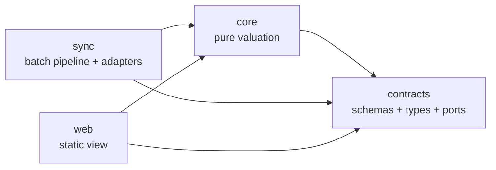
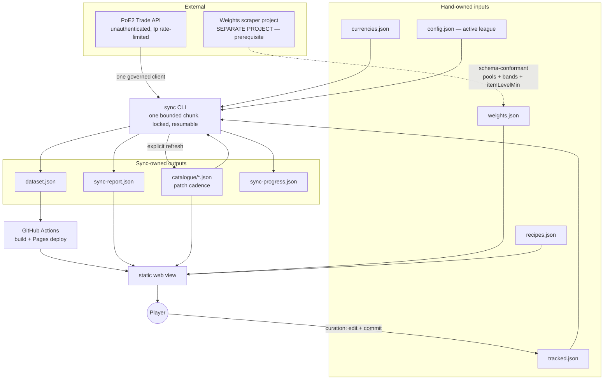
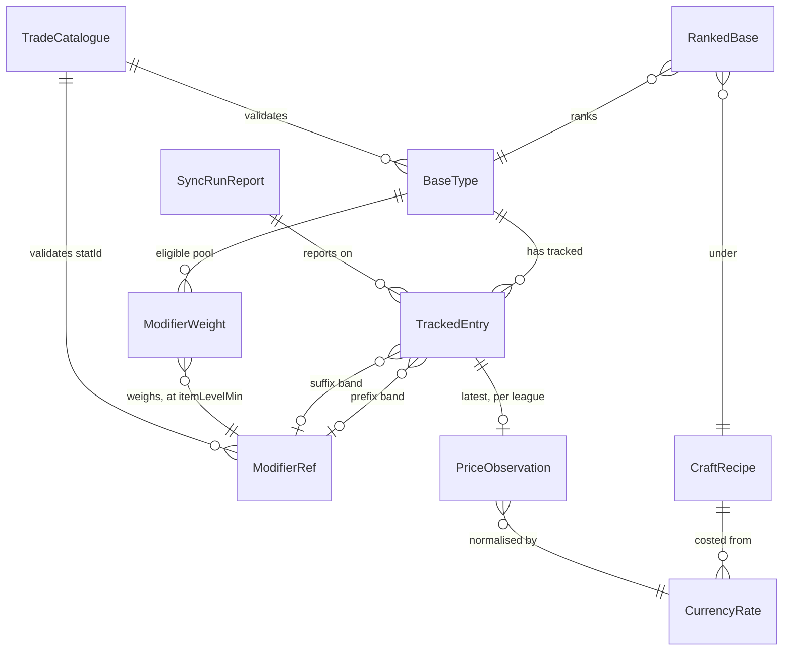

# Architecture Spine — PoE2 Crafting Base Price Checker

> **Revision 8.** Revision 8 answers the one item revision 7 raised back (PRD OQ-18). Revision 7 moved AD-18's three cross-file checks — edge alignment, the straddle rule, the empty containment set — into both shells, `web` at load and `sync` as a run-start gate. AD-17's two cross-file checks, `coOccur` and cross-file kind agreement, were not moved with them, and AD-17 went on citing AD-18's checks as the pattern it follows — a citation revision 7 left stale, since AD-18's checks no longer describe a core-at-load-only check the way AD-17's still did. **The argument for moving them is at least as strong as the one that moved AD-18's three**: a failed `coOccur` or kind-agreement check does not make one entry unrankable, it makes the overlap predicate reject `data/tracked.json` entirely, so an ungated `sync` run can spend a full refresh's budget on a list `web` will then refuse to load at all. **AD-17** now states plainly that its own two cross-file checks are defined once in `core` and run by every shell holding both files — `web` at load, `sync` as a run-start gate before any priced entry consumes budget, a failure aborting the run — instead of pointing at AD-18 as an external pattern. **AD-18**'s ownership clause is unchanged in substance; it now reads as the mechanism both ADs share, rather than as the only AD that uses it. **AD-12** widens its cross-file-validation gate's citation to `data/tracked.json` against the weights file under both AD-17 and AD-18, since the one gate `sync` runs at start now evaluates all five checks together. Revision 8 changes nothing about what any check *is* or what any file may contain — only which shells are obliged to run AD-17's two checks, and when. AD ids are stable. **Revision 8 amends AD-12, AD-17 and AD-18 in place, and adds no AD.**
>
> **Revision 7.** Revision 7 is a single-item pass. Revision 7 answers the one ownership question that PRD revision 6 raised back (PRD OQ-17). The spine assigned three cross-file checks to `core` at load: edge alignment, the straddle rule, and the empty containment set. The spine also stated expressly "not `sync` at request time". The spine then motivated the assignment with a scenario that reading does not prevent: `sync` prices a misaligned configuration on Monday, and `core` refuses to rank the same configuration on Tuesday, after the budget is spent. **AD-18** now states two facts about the three checks. The checks are *defined once in `core`*. Every shell that holds both files *runs* the checks — `web` at load, and **`sync` as a run-start gate before any priced entry consumes budget**. `sync` reports a failure and aborts the run with a non-zero exit. AD-18's `Binds` gains `sync`. **AD-12** names the three run-start gates that stand in front of the four request sources. AD-12 also records that the consequences of the three gates differ by design: an uncatalogued id degrades one entry (AD-6), and a league mismatch (AD-19) or a cross-file failure (AD-18) aborts the run. Revision 7 changes nothing about what the checks *are*. Revision 7 fixes only which component must run the checks, and when. AD ids are stable. **Revision 7 amends AD-12 and AD-18 in place, and adds no AD.**
>
> **Revision 6.** Revision 6 opened as a small revision and did not stay one. PRD revision 5 absorbed revision 5 of this spine in full. PRD revision 5 raises back one confirmed item, plus two candidate questions that the PRD could not rule on itself. The reviewer gate then falsified the reasoning behind one of the two rulings, and the correction is the substance of what follows. **AD-29** stops spelling the source-modifier mass function as `mass(g, L)`. AD-18 governs the function, writes `mass(g)`, and states that the function carries no `L`. A source row is one tier and therefore one cohort, so the scope admits a group whole or not at all. Nothing was ambiguous to build. A `contracts` or `core` author who read AD-29 alone would, however, have carried an `L` into a function that does not take one (PRD OQ-16, and the same shape as the retired OQ-11).
>
> The first candidate question was that nothing in the contract fixed a numeric tolerance for the contract's exact comparisons. The exact comparisons turn out not to be one problem. **Band edges** are lattice values, exactly representable in binary. Exact equality on band edges is therefore sound *and* load-bearing, because an epsilon would readmit the straddle that the partition removes. The two **sum** rules that `core` actually applies are the exposed comparisons, because a conserving split does not generally sum back exactly once serialised. A stated **producer obligation** answers the two sum rules, rather than a tolerance, so the checks keep failing closed. The reviewer gate then found that the rule was not yet well defined at all. No **summation order** was pinned anywhere, and float addition is not associative, so three conforming `core` implementations returned three verdicts on one file. **AD-28** now pins the file's own entry order, and AD-28 states the comparison as one over **parsed doubles**.
>
> The second candidate question was that a producer can drop one stat line of a multi-stat row and still pass every check. Revision 6 first accepted the dropped line as a limitation, on the ground that a dropped line could not reorder the ranking. The gate then **falsified that premise**. The premise holds only where the stat has a single publisher. Where a **second source modifier publishes the same `statId`**, which AD-29 permits, nothing is loud: the reference's numerator quietly loses a share and deflates on that base alone, and a lost co-occurrence marker can drive that base's `ΣP` above 1 and take the top of the list. **AD-29** therefore gains an optional `statLineCounts` declaration, checked wherever a group declares it, on the `cohortTotals` pattern. The weights contract goes to **`4.1.0`**, a non-breaking minor, so no file already built is invalidated. **AD-18** now names **both** causes of an empty containment set instead of blaming the tracked list. AD-18 also records that the error fires only in the single-publisher case. Revision 6 closes a second gate finding alongside the first: a group sitting in exactly one cohort was asserted but never checked, which left `mass(g)` with two conforming readings. That condition is now a hard error.
>
> Outside the AD set, revision 6 adds two **Deferred** items with revisit conditions: making `statLineCounts` required, and a relative epsilon on the two sum rules. Revision 6 also corrects **`PRD-EDIT-PROPOSALS.md` C-53**. C-53 listed the uniform-prior bootstrap as a third case where `core` cannot evaluate `coOccur`. AD-17 names only two such cases, and a bootstrap file ranks normally, because the contract requires `sourceModifierId` regardless of provenance. The PRD deviated from C-53 deliberately and was right. Revision 6 fixes the proposals file so that a future run cannot re-introduce the error.
>
> AD ids are stable. **Revision 6 amends AD-18, AD-28 and AD-29 in place, and adds no AD.**
>
> **Revision 5.** Revision 5 absorbs the five items that PRD revision 4 raised back against this spine, three smaller drifts alongside them, and a second defect that the weights-file **producer** raised against the contract. **AD-9** stops contradicting itself: the schema *declares* `lastAttemptedAt` in all four states, but the field is *present* only where `sync` issued a request. A never-synced entry carries no `lastAttemptedAt`, rather than a placeholder. A placeholder would both lie on screen and sort wrongly in AD-26's rotation. **AD-6** settles the uncatalogued-id disagreement in AD-6's own favour. The check stays `sync`'s and stays report-only, and the contract's hard-error row goes, because `core` cannot evaluate a check whose catalogue AD-24 withholds from `web` (PRD OQ-14). **AD-16** fixes the even-sample median as the **lower** of the two middle values (PRD FR-21). Persisted price precision **stays at 4 decimal places**, and PRD FR-23 moves to match. The player reconsidered the 2-decimal call after seeing that one precision has to serve the cost side too. On the cost side, a crafting currency worth a fraction of a divine would round toward zero and silently collapse AD-17's `craftCost` term (PRD OQ-13). **AD-17** splits the cross-kind `statId` rejection by what each component can see: `contracts` sees within a file, and `core` sees between files. **AD-28**'s `Binds` gains `sync`, which AD-28's band-unit clause was already constraining. **AD-29** is new: a poe2db row may publish several trade stats under one spawn weight, so every weights entry carries a `sourceModifierId`, each exploded line keeps the full weight, and **AD-18**'s denominator sums over source modifiers rather than over entries. **AD-17**'s overlap predicate gains a co-occurrence branch, because a single item satisfies two references that name two lines of one modifier. **AD-5** records that a reference names a stat line, not a game modifier. **AD-26** re-keys the "infinitely old" rotation slot on an absent `lastAttemptedAt` rather than on the `not-yet-synced` price state, which AD-9 had just decoupled from that slot. Revision 5 raises the weights contract to **4.0.0** (breaking) and to `status: final`. Revision 5 corrects both earlier revision notes below, because both under-reported what they amended (PRD OQ-15).
>
> Outside the AD set, revision 5 also changes three **Consistency Conventions** rows: the *Bands* non-overlap key, the *Ids* row's carve-out for `sourceModifierId`, and *Numeric precision*. The *Numeric precision* row keeps 4 decimal places, and now says plainly that the figure binds `CurrencyRate` as well as `PriceObservation`, and why that single figure is only safe at this precision. Revision 5 adds one **Deferred** item: *pricing a deliberate conjunction of co-occurring stats*.
>
> AD ids are stable. **Revision 5 amends AD-5, AD-6, AD-9, AD-11, AD-16, AD-17, AD-18, AD-26 and AD-28 in place, and adds AD-29.**
>
> **Revision 4.** Revision 4 absorbs a defect that the weights-file **producer** raised against the contract: a modifier that rolls two numbers cannot produce non-overlapping value bands, and 53 of 63 item classes carry such a modifier. The contract had conflated the value axis with the tier axis. The two axes coincide for single-number modifiers and differ in general. Non-overlap turned out to be a proxy for AD-18's straddle rule, rather than an invariant of non-overlap's own. **AD-28** is new. AD-28 decomposes such families over the value axis, keeps mass conservation as the invariant, and leaves the split estimator to the producer. **AD-5** makes `ModifierRef` a discriminated union, so a modifier that rolls no number has a home other than a sentinel band. **AD-10** gains a fourth provenance, `modelled-split`, for weight that is measured but distributed by a model. Revision 4 amends AD-11, AD-16 and AD-18 to match. **AD-17** gains the `valueless` branch of `slotOverlap`, and **AD-27** gains its coverage re-measurement clause. Revision 4 raises the weights contract to **3.0.0** (breaking). AD ids are stable. Revision 4 amends AD-5, AD-10, AD-11, AD-16, AD-17, AD-18 and AD-27 in place and adds AD-28. *(Corrected in revision 5: this note originally omitted AD-17 and AD-27, and both carry amended text — PRD OQ-15.)*
>
> **Revision 3.** Revision 3 absorbs the four items that PRD revision 2 raised back against this spine. All four are places where two decisions did not compose. **AD-26** re-denominates the `pinned` cap against a chunk rather than against AD-12's full-refresh ceiling, because the two quantities never composed into a writable inequality. AD-26 also adds the runtime half that no load-time validator can supply, and corrects the rationale for the `unresolvable` retry bound, which rested on a cost that AD-6's offline detection had already removed (PRD OQ-8, OQ-9). **AD-27** narrows its coverage denominator to bases that actually need a pool, because a raw-base-only base can never be `complete` and was depressing a fraction that binds a layout decision (PRD OQ-10). **AD-11** and **AD-18** drop the residual `valueMax?` spellings that contradicted AD-5 (PRD OQ-11). The revision's own reviewer gate amended four more ADs. **AD-9** gains the stamping rule for `lastAttemptedAt`. **AD-12** states that a `pinned` entry spends per chunk rather than per refresh. **AD-21** stops listing `web` as a reader of `currencies.json`. **AD-24** names `currencies.json` among the files `web` does not fetch, and closes the fetch set at eight. AD ids are stable. Revision 3 amends AD-9, AD-11, AD-12, AD-18, AD-19, AD-21, AD-24, AD-26 and AD-27 in place, and adds no AD. *(Corrected in revision 5: this note originally named only AD-11, AD-18, AD-19, AD-26 and AD-27 — PRD OQ-15.)*
>
> **Revision 2.** Revision 2 absorbs the three blocking questions that PRD §10 raised against the inherited valuation model — BQ-1 (a floor-spanning probability priced at its lowest tier), BQ-2 (an eligible pool with no item-level dimension), BQ-3 (unmeasured pool coverage) — together with the `itemLevelMin` amendment that PRD §9 OQ-1 routed here under AD-22. Revision 2 also removes RePoE as a data dependency. The trade API's own catalogue endpoints (AD-25) supply identity and validation, and the weights file supplies everything else. AD ids are stable. Revision 2 amends AD-5, AD-6, AD-8, AD-11, AD-12, AD-16, AD-17, AD-18, AD-21 and AD-24 in place, and adds AD-25 to AD-27.

## Design Paradigm

**Functional core / imperative shell, with ports-and-adapters at the edges.**

All valuation is pure functions over plain data in `core`. Valuation covers price estimation, probability, threshold-truncated expected value, craft cost, and provenance propagation. Everything that touches the outside world sits behind a named port as an adapter, and only `sync` or `web` invokes an adapter. The outside world here means the trade API, the filesystem, git, and the clock.

| Paradigm role | Package | May import |
| --- | --- | --- |
| Contract | `contracts` | nothing |
| Functional core | `core` | `contracts` |
| Imperative shell (write side) | `sync` | `contracts`, `core` |
| Imperative shell (read side) | `web` | `contracts`, `core` |



No other edge is permitted. `core` never imports `sync` or `web`. `sync` and `web` never import each other.

## Invariants & Rules

### AD-1 — Valuation is pure; the outside world is a port

- **Binds:** `core`, `sync`, `web`
- **Prevents:** I/O leaking into the ranking logic. Leaked I/O would make the one part that must be provably right impossible to test offline or to reason about.
- **Rule:** No module in `core` may perform I/O, read the clock, generate randomness, or read environment or config directly. `contracts` declares every external effect as a port interface, and `sync` or `web` implements the port as an adapter. External effects are HTTP, the filesystem, git, and time. The caller passes time and any nondeterminism in as values.

### AD-2 — Dependency direction is one-way and mechanically enforced

- **Binds:** all
- **Prevents:** the package graph rotting into mutual imports. Mutual imports would end worktree-parallel development and would make `core` impossible to test in isolation.
- **Rule:** The edges in the paradigm diagram are the complete set. `dependency-cruiser` fails CI on a violation, and review does not carry that job. Shared code moves *down* into `contracts` or `core`. No component imports shared code sideways.

### AD-3 — Sync and web communicate only through schema-pinned published artifacts

- **Binds:** `sync`, `web`, `contracts`
- **Prevents:** the producer and the consumer drifting on a data shape, which is the largest divergence risk in a two-component system built by independent agents. Also prevents a second, unversioned side channel appearing without anyone deciding to create one.
- **Rule:** `sync` communicates **sync state** to `web` through exactly two artifacts, `dataset.json` and `sync-report.json`, and through nothing else. `sync-progress.json` is internal to `sync`, and no other component reads it. Adding a third state-bearing artifact requires an amendment to this AD.

  Two other classes of file cross the same boundary and are **not** a sync→web channel, because neither class carries sync state:

  | Class | Files | Written by | Why it is not a channel |
  | --- | --- | --- | --- |
  | Hand-owned inputs | `tracked.json`, `currencies.json`, `recipes.json`, `config.json`, `weights.json` | the player / the scraper project | Authored upstream of `sync`; `web` reads the same file `sync` does. |
  | Cached external facts | `catalogue/*.json` (AD-25) | `sync`, on an explicit command | A verbatim mirror of GGG's catalogue at a patch. `sync` is its fetcher, not its author, and it says nothing about any run. |

  Every artifact named anywhere above has a Zod schema in `contracts` and carries `schemaVersion`. Static types are derived from those schemas through `z.infer`, and no component declares a parallel type. `sync` validates before writing. `web` validates on load, and refuses to render an invalid artifact rather than degrading. Adding a third artifact requires an amendment to this AD.

### AD-4 — Ranking is computed at read time, never precomputed

- **Binds:** `core`, `web`, `sync`
- **Prevents:** the user-facing payout threshold reordering nothing until the next sync, which would make the product's central control a lie.
- **Rule:** Published artifacts carry observations — prices, weights, costs — and never rankings or scores. The ranked list is the pure function of AD-17, evaluated in the browser on every change to any input. `sync` must not write a rank, a score, or an ordering. The ranking function lives in `core`. `web` may not compute any ranking term itself, and only renders what `core` returns.

### AD-5 — Canonical modifier identity is the trade stat id plus a bounded value band

- **Binds:** all
- **Prevents:** the tracked list, the weights file and the trade query each carrying a different notion of "a modifier", which would mismatch silently instead of failing. Since revision 2, this AD also prevents a probability that covers two tiers being multiplied by one tier's price (AD-17, AD-18).
- **Rule:** A modifier reference is one of exactly two kinds, and the schema discriminates the two kinds:

  | Kind | Shape | For |
  | --- | --- | --- |
  | `banded` | `(statId, valueMin, valueMax)` — an **inclusive, closed band** over the value the trade filter compares (AD-28) | every modifier that rolls a number |
  | `valueless` | `(statId)`, no edges at all | a modifier that rolls no number — *"Loads an additional bolt"* |

  The trade API has no tier concept. A "tier" exists only as a band. **A valueless reference is not a degenerate band.** A sentinel pair such as `1/1` would pass every containment check, straddle check and edge-alignment check. The same sentinel pair would make AD-16 emit a min/max filter for a stat that has no value. That defect is the same class as the sentinel ceiling that this AD's `valueMax` rule exists to close. A valueless reference still carries `weight` and `itemLevelMin`, and still counts toward pool completeness. AD-16 emits a valueless reference's filter with no edges.

  **A band is a value interval, not a tier.** For a modifier that rolls more than one number, the value interval and the tier are different axes, and one interval draws weight from several tiers. AD-28 governs the decomposition, and this AD's identity is unchanged by the decomposition.

  **A reference names a stat line, not a game modifier.** One modifier may publish several `statId`s that always roll together (AD-29). A `statId` therefore identifies what the trade filter can ask for, which is the only thing this identity has to do. A `statId` does **not** identify the thing the game draws. The thing the game draws is `sourceModifierId`, which lives on the weights file and never on a reference, because a curator can only ever filter on what trade exposes. AD-18's denominator and AD-17's overlap predicate are where the difference between a stat line and a game modifier is paid for. This AD's identity is unchanged by that difference.

  **`valueMax` is required, everywhere, with no open-top form.** An omitted ceiling is a floor by another name, and a floor is exactly what BQ-1 removed. A floor spans tiers again, so AD-18 sums two tiers' weight while AD-16's ascending sort prices the cheaper tier. Worse, the defect would be *unvalidatable*: `sync` checks `tracked.json`, and the band edges that `sync` would need to check against live in `weights.json`. Every game modifier has a maximum roll, so a closed band is always expressible. A curator who wants "T1 and everything above" writes the real ceiling, not a blank. A tracked entry is `(baseTypeId, itemLevelMin, prefix?, suffix?)`, where each affix is a modifier reference or is **absent**. An entry with both affixes absent is a raw base, and a raw base is how the data represents white ilvl-82 bases. `baseTypeId` is the trade API's base type `type` string exactly as `data/items` spells it. No component may introduce a second modifier identity.

  **Why a band, not a floor.** Under a floor, a reference at the T2 edge covers T1 and T2 together. AD-18 then summed both tiers' weight, while AD-16 sorted ascending and priced essentially T2. That defect did not understate the jackpot. That defect *deleted* the jackpot: if the T2 price fell below the payout threshold, the whole entry truncated to zero and took its T1 probability mass with it. Truncation destroyed the jackpot isolation that threshold-truncated EV exists to provide. Bands make **outcomes** disjoint, so each outcome carries its own price and AD-17's partition holds with both outcomes tracked. Outcomes are disjoint, and tiers are not: where a modifier rolls more than one number, outcomes and tiers are different things, and AD-28 supplies the decomposition that keeps the outcomes disjoint anyway.

  **`itemLevelMin` is declared, never inferred.** A curator authors `itemLevelMin` by hand as part of curation. Neither `sync` nor `core` derives or adjusts `itemLevelMin`. Choosing the accepted tier and choosing the band are one authoring act, and the curator records the item level that the choice implies next to the choice.

### AD-6 — An unresolvable stat id is a loud failure with a dataset representation

- **Binds:** `sync`, `contracts`, `web`
- **Prevents:** a tracked combination silently disappearing from the rankings after a game patch, with no symptom the player would ever notice. Equally, prevents a patched-out modifier continuing to rank on its last-good price forever.
- **Rule:** If a tracked entry references a stat id or base type that the trade API no longer exposes, `sync` writes that entry's price state as `unresolvable` (AD-9) **and** records the entry in `sync-report.json`. `sync` never skips the entry, never defaults the entry, and never leaves the entry at its previous value. `core` excludes `unresolvable` entries from valuation. `web` must surface the existence of `unresolvable` entries, rather than only omitting them.

  **Detection is by catalogue validation, not by inference.** There are two checks with distinct owners, because the two files are read in different places:

  | Check | Owner | Surfaced as |
  | --- | --- | --- |
  | every `statId` / `baseTypeId` in `data/tracked.json` exists in the catalogue | `sync`, before issuing any request | the entry's `unresolvable` state + `sync-report.json` |
  | every `statId` / `baseTypeId` in `data/weights.json` exists in the catalogue | `sync`, reading the file (it is a **reader**, not its writer — AD-21 governs writers) | `sync-report.json` only; the file is never rewritten |

  `sync` owns both checks, because `sync` is the only component that holds the full catalogue. AD-24 deliberately keeps `catalogue/items.json` out of `web`'s fetch set, so `core` cannot perform a base-type cross-check at load, and `core` must not pretend to perform one. `core` still validates the weights file's **shape and pool rules** at load. Under AD-1, loading is an adapter's job, and validating is pure. This split is what stops a mistyped base key from silently vanishing from the product with nothing anywhere reporting the loss.

  **An uncatalogued id is therefore never a weights-file refusal, and the contract must not list an uncatalogued id as one.** A hard file error is `core`'s refusal at load, and `core` cannot evaluate this check at all, because the base-type half needs `catalogue/items.json`, which AD-24 withholds from `web`. Making the check a refusal would require an amendment to AD-24 to fetch a ninth artifact. The refusal would then take the whole product down over a condition that this AD already reports through the one component that can see the condition. `WEIGHTS-FILE-SCHEMA.md` is corrected to match this AD, rather than the reverse: the check is `sync`'s, the check is report-only, and the file loads.

  An empty result set means `no-listings` (AD-9) and never means `unresolvable`. Conflating the two states would report a patch-out every time a combination simply had no sellers.

### AD-7 — Sync is a bounded, resumable, single-instance chunk runner

- **Binds:** `sync`
- **Prevents:** a host's wall-clock ceiling becoming a correctness problem, two builders assuming different restart semantics, and two overlapping runs corrupting shared progress.
- **Rule:** The syncer is a CLI that performs **one chunk, then exits**. Whichever of three bounds runs out first bounds the chunk: the remaining search allowance, the remaining fetch allowance, or the unprocessed remainder of the workload. Progress lives in a schema-pinned `sync-progress.json`, committed alongside the dataset, so a killed run loses at most the requests in flight. A run acquires an exclusive on-disk lock. If another run holds the lock, the new run logs that fact and **exits 0**. A busy lock is a normal outcome for a repeatedly-invoked job, and a non-zero exit would make every scheduler treat routine overlap as a failure. Concurrent runs are forbidden, not merely discouraged. The syncer makes no assumption about what invokes it, how often, or where it runs. Task Scheduler, cron, a VPS and a CI runner must all be valid invokers with no code change.

### AD-8 — All outbound trade traffic passes through one governed client

- **Binds:** `sync`
- **Prevents:** two call sites pacing independently, which would blow a shared rate-limit budget and would risk the API access that the whole product depends on.
- **Rule:** Exactly one adapter issues requests to the trade API — searches, fetches **and catalogue refreshes (AD-25) alike**. The adapter reads `X-Rate-Limit-Rules` to learn the active rule names. For each named rule, the adapter then parses two headers: `X-Rate-Limit-` plus that rule name, which carries the policy, and the same name with the suffix `-State`, which carries consumption. Unauthenticated, the rule is `Ip`, which gives `X-Rate-Limit-Ip` and `X-Rate-Limit-Ip-State`. **The adapter reads rule names at runtime, and never enumerates rule names in code.** GGG documents other rules, `Client` among them, that an authenticated or future caller would see. An adapter that recognises only `Ip` would silently stop pacing on the day the rule set changes. `X-Rate-Limit-Policy` names the active policy and distinguishes the search bucket from the fetch bucket. The adapter paces against the tightest unsatisfied bucket. **No rate is hardcoded.** The measured values below are the expected shape, not a constant to compile in. On a 429 response the adapter honours `Retry-After` and yields the chunk, rather than retrying tightly. The adapter sends a descriptive `User-Agent` that identifies the tool and a contact address, as GGG asks of third-party tools.

  **Recorded risk: `trade2` is undocumented.** GGG's developer documentation covers the OAuth API Reference and makes no mention of the trade or `trade2` endpoints. Every endpoint that this product depends on — search, fetch, and all four catalogue endpoints (AD-25) — is therefore *unsupported surface that happens to work*. Those endpoints may change or close without notice and without deprecation. Nothing in the architecture can prevent that change. What the architecture does instead is make a break loud and cheap: one governed client (this AD), committed fixtures whose re-record diff exposes a reshape (AD-13), a committed catalogue whose refresh diff exposes a rename (AD-25), and no user-facing path that calls the API live (AD-15). This risk is recorded here so that nobody rediscovers the risk as a surprise.

  Measured 2026-09-12, unauthenticated, rule `Ip`:

  | Policy | Buckets (`hits:seconds:penalty`) | Effective |
  | --- | --- | --- |
  | `trade-search-request-limit` | `5:10:60, 15:60:300, 30:300:1800, 600:21600:3600` | 600 searches / 6h |
  | `trade-fetch-request-limit` | `12:4:10, 16:12:300, 50:300:300, 1000:21600:1800` | 1000 fetches / 6h |

### AD-9 — Price is four-state; absence is never zero or null

- **Binds:** `contracts`, `core`, `web`
- **Prevents:** "no listings" being conflated with "worthless", which would drop exactly the plausible jackpots that the addendum identifies as unresolved. Also prevents an unresolvable entry having nowhere to live.
- **Rule:** Every tracked entry's price is exactly one of four states: `priced` (with a value and an `observedAt`), `no-listings`, `not-yet-synced`, or `unresolvable`. `core` excludes every non-`priced` state from the expected-value sum, rather than contributing zero for that state. `core` reports each state separately, so the view can show the non-`priced` entries outside the ranking. No component may represent absence as `0`, as `null`, or as a missing key.

  **The schema declares `lastAttemptedAt` on every entry in all four states, and the field is present wherever `sync` has issued a request.** `observedAt` exists only where there is an observation. `lastAttemptedAt` records when `sync` last **issued a request** for the entry, regardless of the outcome. Offline work never stamps `lastAttemptedAt`, and AD-6's catalogue validation is the main example of offline work. A check that ran over every entry on every run would flatten the timestamp across the whole list and would destroy AD-26's ordering key. The two timestamps are distinct, and neither substitutes for the other. Without `lastAttemptedAt`, AD-26's rotation would re-select every `no-listings` entry forever, because a `no-listings` entry never acquires an observation time, and AD-6's bounded retry would have no state to count against. `web` reports age from `observedAt` where an `observedAt` exists, and from `lastAttemptedAt` otherwise, labelled as what the reported age is.

  **The one entry with neither timestamp is a never-synced entry, and no component may give that entry a placeholder.** *Declared in all four states* is a statement about the schema, not about the data. An entry for which no request has ever been issued has no attempt to record, so the field is genuinely **absent** on that entry. Stamping a placeholder to satisfy a non-null field would fail twice over. First, the placeholder would render as an age on screen where there is no age. Second, the placeholder would hand AD-26 a rotation key that sorts wrongly, because row 2 treats a never-synced entry as **infinitely old** precisely so that the rotation picks up a new entry before any refresh, while a placeholder would sort the entry as freshly attempted and park the entry at the back of the queue that the entry should lead. Such a row carries no age at all, and `web` renders the row as *never attempted*, which is a different fact from an old attempt and is shown as a different fact. This is the only state with no age. A `no-listings` or `unresolvable` entry that has been attempted has an age.

### AD-10 — Provenance and freshness ride on every derived value and propagate upward

- **Binds:** `contracts`, `core`, `web`
- **Prevents:** a uniform-prior placeholder being quietly trusted months later with nothing on screen to reveal the placeholder. Also prevents a partially refreshed dataset reading as a current one.
- **Rule:** Every probability carries its source, and every price carries its observation timestamp and league. Provenance is a **four-value total order**, weakest first:

  | Provenance | Means | Arises from |
  | --- | --- | --- |
  | `absent` | not an estimate at all — an upper bound | a `partial` pool (AD-18), and nowhere else |
  | `uniform-prior` | the weight was invented | the bootstrap file, or a field filled by hand |
  | `modelled-split` | the weight was **measured**, but a **model** distributed it across value cells | AD-28's decomposition, and nowhere else |
  | `measured` | measured by someone (never ground truth — AD-11) | a producer's real spawn weights |

  `core` propagates the **weakest provenance and the oldest timestamp** of every input into each derived figure, so a base's ranking states what the ranking rests on. `web` must render a figure that rests on anything below `measured` visibly differently from a figure that rests on `measured`. `web` must also render `modelled-split` distinctly from `uniform-prior`, because collapsing the two labels would either overstate an invented weight or understate a measured one. `web` must also surface per-row age, and not merely a single dataset-level timestamp, because AD-7 guarantees that rows refresh at different times.

  **A modelled split does not weaken a denominator, and `modelled-split` therefore propagates from the numerator only.** AD-28 conserves mass exactly, so a scoped pool's total is identical whether or not a family within the pool was decomposed. The denominator rests on the same measured weights either way. Taking the weakest provenance across the *whole pool* would stamp `modelled-split` on nearly every weapon base, because 53 of 63 item classes carry a decomposed family somewhere in the pool, and a label that universal distinguishes nothing. `core` therefore draws this one provenance from a reference's **containment set** (AD-18), and not from the denominator. Every other provenance still propagates from every input: a `partial` pool weakens the denominator in fact, not merely in label, and `absent` still rides over everything.

### AD-11 — Weights are a consumed file; normalisation and recipe effects live in core

- **Binds:** `core`, `contracts`, weights producers
- **Prevents:** every weight producer having to understand crafting recipes, two consumers normalising raw weights into probabilities differently, and the app growing a scraper of its own.
- **Rule:** The app consumes a weights file that conforms to `WEIGHTS-FILE-SCHEMA.md`, and never produces such a file. The file carries **raw game spawn weights, banded by rolled value and by item level**, per base type and affix slot. A banded entry is `(sourceModifierId, statId, valueMin, valueMax, itemLevelMin, weight)`, and a valueless entry is `(sourceModifierId, statId, itemLevelMin, weight)`. Every field of the chosen kind is required, and no field is nullable (AD-5, AD-29). Bands are **value cells**. For a multi-number modifier, a cell's weight is a conserving split of several tiers' weight across the cells that those tiers reach (AD-28). The producer owns the split, and `core` never performs a split. Conversion to probabilities is AD-18's rule, and conversion happens only in `core`. `core` models craft-recipe effects on the tier distribution, and no component bakes those effects into the weights file. The producer of the file is irrelevant to the app.

  **The operator asserts `gamePatch`, and no component derives it.** The file names the GGG patch that the file's weights describe, and nothing can compute that field. The producer's sources do not state the patch, and the trade API exposes no patch version either (AD-25). A producer takes `gamePatch` as a required run-time input, and refuses to run without it rather than emitting a default, because a defaulted value propagates silently past the one person who could have caught the error. `core` does not parse `gamePatch` and must not branch on it. `web` surfaces `gamePatch` beside `producer.id` and `producer.generatedAt` (AD-24), so a file left behind by a patch is visible as such.

  **The file is a prerequisite, not a convenience.** The trade API exposes no pool membership, no tier, no item-level availability and no spawn weight (AD-25), so nothing in this system can derive what the file carries. Until a conforming file exists, AD-18 makes every base unrankable. That outcome is the honest one, not a degradation to engineer around.

  **v1 depends on the external scraper project for this file**, and that dependency is decided rather than assumed. The scraper supplies pool membership, band edges, `itemLevelMin` and weights. A uniform-prior file remains a valid *weighting* shortcut, with every `weight: 1`, but a uniform-prior file is never a *sourcing* shortcut, because the two fields it cannot fake are the two fields the trade API cannot supply. **RePoE is a last-resort fallback only**, because RePoE carries modifier metadata but not spawn weights, and RePoE was never the authority for the field that matters.

### AD-12 — The workload is declared, and the search budget is the ceiling

- **Binds:** `sync`, `contracts`, curation workflow
- **Prevents:** an unbounded, unreviewable request budget; curation becoming a mutable-store feature that forces a server into a static architecture; and an unenumerated second workload silently consuming the same bucket.
- **Rule:** Exactly **four** sources generate a request, and nothing else generates one. Two sources are the recurring workload, and both are schema-pinned committed files. Two sources are fixed overheads:

  | Source | Cadence | Cost |
  | --- | --- | --- |
  | `data/tracked.json` — combinations to price | every chunk | one search + one fetch per entry |
  | `data/currencies.json` — currencies to price for AD-20 | every chunk, **first** (AD-26) | small, fixed |
  | League validation against the live leagues endpoint (AD-19) | once per run | one request |
  | Catalogue refresh (AD-25) | explicit command, patch cadence, never on the chunk path | four requests |

  **Three run-start gates stand in front of the four sources, and two of the three gates cost nothing to run.** Before the first priced entry spends a search, `sync` performs three actions. `sync` validates every tracked id against the catalogue (AD-6). `sync` runs `core`'s cross-file validation of `data/tracked.json` against the weights file — all five checks, edge alignment, the straddle rule and the empty containment set (AD-18) alongside `coOccur` and cross-file kind agreement (AD-17) — as one gate. `sync` validates the configured league (AD-19), which is the one gate that costs a request. Only the league check appears in the table above, because only the league check consumes budget. The other two gates exist precisely to stop budget being consumed on a configuration that cannot be ranked. **The consequences of the three gates differ, and the difference is deliberate.** An uncatalogued id is a per-entry condition, so AD-6 marks that entry `unresolvable` and the run continues on the rest. A league mismatch (AD-19) or a cross-file validation failure (AD-17, AD-18) invalidates the run's premise, so the run aborts.

  No component writes either workload file at runtime. Curation is an edit and a commit. `sync-report.json` must report requests consumed **per source** against the live bucket, so budget drift is observable per cause. A fifth source is an amendment to this AD, not an implementation detail.

  **The ceiling is denominated in searches, not in entries.** Against the measured 2,400 searches per day, a full refresh is held to **~1,500 searches**. The remaining headroom serves retries, the currency set, the catalogue refresh, the per-run leagues check (AD-19) and a second recipe. **`pinned` entries (AD-26) spend from that headroom too, and `pinned` entries spend differently from everything else here.** A `pinned` entry costs a search in *every* chunk, rather than once per refresh, so a `pinned` entry's daily cost scales with invocation cadence rather than with the size of the tracked list. A pinned set sized at AD-26's cap can consume a substantial share of the measured 2,400 per day on its own. That consumption is the real reason the cap exists, and the reason `pinned` is a scarce designation rather than a convenience. One tracked entry always costs one search. What changes under AD-5's bands is **how many entries a curator needs**. Isolating a jackpot band means tracking two entries where one entry stood, and that second band spends from the same ceiling. For a modifier that rolls more than one number, the curator splits at **cell** edges rather than at tier edges (AD-28), and the finer partition means that the isolation a curator reaches for may cost more entries than the tier count suggests. Stating the budget in searches is what keeps that trade-off visible at the moment a curator makes it, instead of surfacing months later as a refresh cycle that quietly stopped completing. This figure supersedes the addendum's ~2,000 figure, which rested on a throughput assumption about 7 times too optimistic.

### AD-13 — The test path has zero network

- **Binds:** all
- **Prevents:** any automated test depending on a live, rate-limited third party, which would end unattended agent development, the brief's hardest requirement.
- **Rule:** No test, at any level, may make a real network call. MSW runs in `onUnhandledRequest: "error"` mode, so an unfixtured request fails loudly rather than escaping. External responses are real captured trade-API payloads, committed as fixtures. Re-recording is a separate, explicitly-invoked command, and re-recording is never part of a test run. The resulting fixture diff is the mechanism by which GGG's changes become visible.

### AD-14 — The dataset holds the current snapshot; git is the history

- **Binds:** `sync`, `contracts`, `web`
- **Prevents:** page weight growing without bound, a retention policy nobody maintains, and a history feature v1 never asked for.
- **Rule:** `dataset.json` contains only the latest observation per tracked entry, and each observation is stamped with the league it was observed in. `sync` does **not** filter `dataset.json` on write. League filtering is AD-19's job and happens once, in `core`, so a league change does not require rewriting the dataset and does not blank the site while a re-sync runs. Historical prices are recovered from the git log of sync commits. No component may depend on in-file history. A chunked partial refresh publishes normally, and per-row freshness (AD-10) is what makes publishing a partial refresh honest.

### AD-15 — The browser writes nothing; there is no backend

- **Binds:** `web`
- **Prevents:** an agent quietly introducing a server, an account, or per-user persistence. Each of those three contradicts the single-user, static, zero-upkeep premise.
- **Rule:** `web` is a static bundle. `web` performs no authenticated request, stores no server-side state, and has no write path to anything but the viewer's own browser storage, which holds the threshold dial and view preferences. Any requirement that appears to need a backend is escalated, not implemented.

  *Confirmed 2026-09-12 by live unauthenticated calls: `trade2` leagues, search and fetch all return 200 with no session cookie. This premise is measured, not assumed.*

### AD-16 — The price estimate is the cheapest live instant-buyout listings

- **Binds:** `sync`, `core`, `contracts`
- **Prevents:** the single most load-bearing definition in the product being left to whichever agent writes the syncer. The brief calls this section "the product; everything else is presentation."
- **Rule:** For each tracked entry, `sync` issues one search and one fetch of the **cheapest 10 result ids**. `sync` builds the search from the entry alone, using these filter ids, verified present in `data/filters` on 2026-09-12:

  | Query field | Value |
  | --- | --- |
  | `query.type` (top level, **not** a filter) | the entry's `baseTypeId`, verbatim |
  | `type_filters.rarity` | `magic` for an entry carrying affixes, `normal` for a raw base (AD-5) |
  | `type_filters.ilvl` | `min` = the entry's `itemLevelMin` (AD-5) |
  | stat filters | one per modifier reference: a `banded` reference carries **both `min` and `max`** from the band; a `valueless` reference carries the stat id and **no edges at all** (AD-5) |
  | `trade_filters.sale_type` | the option labelled **"Buyout or Fixed Price"**, whose `id` is JSON `null` |
  | sort | price **ascending** |

  There are four traps. The live payloads on 2026-09-12 verified the first three, and each trap is costly to discover in code:

  - **The base type is `query.type`, not `type_filters.category`.** `category` takes taxonomy ids such as `weapon.bow` and `accessory.amulet`, and not base type names. No committed artifact maps a base type to its leaf category, because `data/items` groups only ten coarse labels. `sync` must not attempt that mapping. The base type alone is sufficient and exact.
  - **`priced_with_info` is not instant buyout.** Its live label is *"Price with Note"*. The option this product needs is *"Buyout or Fixed Price"*, and that option's `id` is `null`. A serialiser will silently drop a `null` value unless the code emits the field explicitly. Getting this option wrong does not error. Getting this option wrong silently widens the result set to unpriced listings and corrupts every estimate.
  - **Passing the band's `max` as well as the band's `min`** is what makes the priced population the same population that AD-18 computes a probability for. A min-only filter returns every higher tier too, and prices the band at the band's floor. That result is the BQ-1 defect, reintroduced at the adapter.
  - **A multi-`#` stat filters on one derived value, and which value that is, is a measurement rather than a choice.** *"Adds # to # Lightning Damage"* rolls two numbers, and the filter compares one value. Band edges are expressed in **that quantity and no other**, because this adapter passes the edges into the filter and AD-18 counts the population that the filter returns. A producer that picks a different quantity produces a file that validates and prices the wrong population. Identifying the quantity is an Open Question with a named owner, not an assumption to code around.

  The `PriceObservation` is the **median of those listings' prices after normalisation to divine** (AD-20), recorded with the sample size actually returned.

  **On an even sample the median is the lower of the two middle values, and never their mean.** Ten results is the common case, so the even sample is the normal path and not an edge case. The even-sample rule also sits inside the one definition that the brief calls *"the product; everything else is presentation"*. Left unstated, two implementations return different prices from identical data, and every downstream figure diverges with them. Taking the lower value has three benefits. First, it keeps **every persisted price a price someone actually asked**, rather than a synthetic midpoint that no listing carries. Second, it needs **no second rounding step**, because each listing is normalised and rounded once on the way in (Consistency Conventions), so choosing one of the listings cannot leave the grid. A mean of two adjacent values would leave the grid, and would then need a rounding rule of its own that two builders could write differently. Third, it leans very slightly cheap, in the same conservative direction as the ascending sort.

  The API's ascending sort is per listing currency. When a result set spans currencies, `core` takes the median over normalised values, and the sample may not be the globally cheapest ten. That effect is accepted and recorded, and no component corrects it with extra requests. Fewer than 10 results is valid and records the true count. Zero results is `no-listings` (AD-9), and never a price. Ascending sort is what keeps stale overpriced listings out of the estimate. The instant-buyout-only filter is what removes listings priced below market, which a buyer would already have bought.

  **The estimator prices the cheap end of whatever band the estimator is given, so the band must be homogeneous.** Pricing the cheap end is harmless for a band whose population is one tier. Pricing the cheap end is dangerous for a band that spans a tier boundary, where the cheapest listings are the neighbouring tier's tail while AD-18 carries the whole span's probability. AD-28 names the curation rule that keeps the priced population and the weighted population aligned — track interior cells — and names the reason that rule is a rule rather than a preference.

### AD-17 — The ranking formula, its threshold, and its unit

- **Binds:** `core`, `web`, `contracts`, `sync`
- **Prevents:** three mutually satisfying readings of "threshold-truncated expected value" producing three different orderings from identical data. Also prevents a view whose dial is denominated differently from the value the dial filters.
- **Rule:** For a `(baseTypeId, recipe)` pair where the base is **crafted**, which means that the base's tracked entries carry affixes:

  ```
  EV = ( Σ  P(combo) × price(combo) )  −  craftCost(recipe)
        combo ∈ tracked(base), state = priced, price(combo) ≥ threshold
  ```

  The threshold compares against a combination's **gross price**, and not against the price net of craft cost. `core` subtracts craft cost **once** from the summed expected payout, and not once per combination. The crafter pays the craft cost on every attempt, including failures, which is already what dividing through by attempts expresses. **Threshold, all prices, and craft cost are denominated in divine** (AD-20). No other unit may cross a package boundary. `web` supplies the threshold as a value and renders the result. `web` computes no term.

  **Summands must be mutually exclusive.** The sum is over a partition, not over a list. Two tracked entries for one base whose outcome sets overlap would double-count. Double-counting would inflate `ΣP` past 1 for that base alone and would hand that base the top of the ranking. Overlap is a **validation error on `data/tracked.json`**, rejected at load. Overlap is not a case that `core` reconciles.

  A predicate defines overlap, and no enumeration does, because an enumerated list of shapes has twice been found to miss a case:

  ```
  overlap(a, b)  ⇔  slotOverlap(a.prefix, b.prefix) ∧ slotOverlap(a.suffix, b.suffix)

  slotOverlap(x, y) =  true              if x is absent or y is absent
                       true              if x.statId != y.statId ∧ coOccur(x, y)
                       false             if x.statId != y.statId
                       true              if both are valueless
                       bands intersect   otherwise
  ```

  **`coOccur` is what stops one game modifier being counted as two outcomes (AD-29).** A source modifier may publish several stat lines that always roll together, and a single item satisfies two references that name two of those lines. `x.statId != y.statId` is therefore not on its own evidence of disjointness. `coOccur(x, y)` holds when some `sourceModifierId` in the scoped pool emits an entry contained by `x` **and** an entry contained by `y` in the same item-level cohort. One modifier can then satisfy both references at once. The pool is scoped to **this base's own crafted floor `L`** (AD-18), which is the same `L` that scopes every probability on the base, and AD-17 gives a base exactly one such floor.

  **Where the pool cannot answer, `coOccur` is `false` and the tracked list still loads.** A base absent from `weights.json`, and a base whose pool is `partial`, have no reading of this branch. The safe behaviour is *not* to refuse. AD-18 has already excluded such a base from the ordering entirely, so `core` never sums the partition that `coOccur` protects for that base, and a missed double-count cannot reorder anything. Refusing instead would take the whole site down over a base that was never going to rank, and AD-6 and AD-26 both decline that failure elsewhere. Two builders would otherwise split here: one builder would short-circuit to `false` and render, and the other builder would treat the check as unevaluable and reject `tracked.json` site-wide. The reading is therefore named rather than left to judgement. `core` reports the base's unrankability as `core` already would, and surfaces nothing new. Without this branch the predicate short-circuits to `false`, the partition check passes, and that base's `ΣP` exceeds 1. That failure is the same failure as the prefix-only and suffix-only case below, reached from the other direction. This is a **cross-file** test: co-occurrence is a fact of `weights.json`, and the references are in `tracked.json`. **`core` defines this test once, and every shell holding both files runs it — `web` at load, and `sync` as a run-start gate before any priced entry consumes budget, aborting the run on failure** — the same ownership and gating AD-18 states for its own three cross-file checks. A `coOccur` failure is a whole-list rejection, not a per-entry one, which makes gating `sync` on it at least as urgent as gating on AD-18's checks: an ungated `sync` would otherwise spend a full refresh's budget pricing a `data/tracked.json` that `web` then refuses to load at all (revision 8, PRD OQ-18).

  One kind pairing is unreachable rather than handled. A `statId` either rolls a value or does not roll a value, so one banded reference and one valueless reference can never share a `statId`. That rejection is **split by what each component can see.** `contracts` owns the **within-file** case: two tracked entries in `data/tracked.json` that name one `statId` under different kinds, which a per-file schema sees on its own. **Kind agreement *between* files is `core`'s job.** A `valueless` tracked reference against `banded` cells in `weights.json`, or the reverse, is a cross-file disagreement that `contracts` cannot see, because the weights schema has no view of the tracked list. That check belongs to the component that holds both sides of the check, the same reason AD-6 gives, and it is gated exactly like `coOccur` above and AD-18's straddle and edge-alignment checks: defined once in `core`, run by every shell holding both files, `web` at load and **`sync` as a run-start gate**, a failure aborting the run (revision 8, PRD OQ-18).

  An absent affix means *any roll in that slot*, so an absent affix overlaps everything. That is why the conjunction covers **both** slots. Three consequences are worth naming, and the earlier enumeration missed the third:

  - Adjacent tiers of one `statId` in one slot are disjoint, and a curator may track both. That is the point of AD-5's bands. Bands that *intersect* still overlap and are still rejected.
  - A partial-affix entry subsumes a fuller entry, because leaving a slot absent covers every roll in that slot.
  - **A prefix-only entry and a suffix-only entry on one base overlap each other.** Neither entry subsumes the other, and no two bands intersect. An item carrying both named modifiers nevertheless satisfies both entries, so the sum counts that item twice. The predicate catches this case, and a list of shapes did not.

  Separately, **the crafted entries on one `baseTypeId` must share an `itemLevelMin`.** Two entries with identical affixes at floors 75 and 82 are *nested, not disjoint*, because every ilvl-82 item also matches the ilvl-75 search.

  Rule 3 has a second, independent reason to hold. `EV` is an expectation over **one crafting act on one item population**. Entries at different floors describe crafts on differently-levelled bases, and their `P` terms are normalised against differently-scoped pools (AD-18). Summing such entries is not an expectation over anything. A base therefore has exactly one crafted item level floor, and validation checks the tracked list for that property.

  **Rule 3 binds summands only, so a raw base is exempt.** A raw entry is never a summand, because a raw entry ranks on the separate branch below. A raw entry's floor therefore cannot break a partition that the raw entry does not enter. A white base pinned at exactly ilvl 82 may therefore coexist with crafted entries on the same `baseTypeId` at a lower floor. Without this exemption the rule would reject the very configuration the brief asks for, because curators track white bases at 82 and magic bases well below 82.

  **Raw bases rank on a separate branch.** A `TrackedEntry` with both affixes absent (AD-5) is never a summand. At `P = 1` such an entry would enter at certainty and would swamp every crafted outcome. A raw entry's `EV` is its observed price, with zero craft cost, ranked in the same list and labelled as an uncrafted base.

### AD-18 — Weight aggregation and normalisation

- **Binds:** `core`, `sync`
- **Prevents:** two builders deriving different probabilities from the same weights file. That divergence silently reorders the entire ranked list rather than failing.
- **Rule:** A modifier reference's weight is the **sum of the weights of every weights-file entry that the reference contains**. Containment depends on the reference's kind (AD-5):

  | Reference kind | Contains a weights entry when |
  | --- | --- |
  | `banded` | the entry is `banded`, shares the `statId`, and lies **wholly inside** the reference — `band.valueMin >= ref.valueMin` **and** `band.valueMax <= ref.valueMax` |
  | `valueless` | the entry is `valueless` and shares the `statId` |

  Whole bands only. There is no open-top form to handle. A reference without a ceiling is a floor, and a floor is the BQ-1 defect that AD-5 exists to remove, so `core` never encounters a floor. `contracts` rejects a floor at the schema.

  **A reference's edges must be edge-aligned to the pool, and edge alignment is what closes the sentinel loophole.** Requiring `valueMax` to be *present* only closes the syntax of an open top. A curator who writes `valueMax: 9999`, or `valueMin: 0`, is schema-valid, passes every containment check and every straddle check, and makes AD-16's stat filter operationally min-only. `core` then sums two tiers' weight while `sync` prices the cheaper tier. That result is BQ-1 verbatim, re-entered through a sentinel. Therefore, for every tracked **`banded`** reference, over the reference's containment set under the scope:

  ```
  ref.valueMin == min { band.valueMin : band ∈ contained }
  ref.valueMax == max { band.valueMax : band ∈ contained }
  ```

  A `valueless` reference has no edges to align, so the rule does not apply to a `valueless` reference. A reference must begin exactly where the reference's lowest contained band begins, and must end exactly where the reference's highest contained band ends. A sentinel ceiling above the pool's top band fails this check, and so does a sentinel floor below the pool's bottom band. Combined with the empty-containment-set rule below, this is a validation error against **`data/tracked.json`**, defined in `core` and run by both shells — `web` at load, and `sync` at run start, per the ownership clause below.

  **`core` evaluates edge alignment under the scope, at the entry's own floor, and edge alignment is floor-dependent by design.** The containment set shrinks as the floor drops, so a reference can align at one floor and fail at a lower floor. That failure is the rule working. The failure means that the curator has written a ceiling the scoped pool cannot reach, which is the same defect as the empty-containment-set case and is caught the same way. AD-17 gives a base exactly one crafted floor, so `core` evaluates the check once per base and never ambiguously. A builder who computed the containment set **unscoped** would silently accept exactly the references this check catches. The scope is not optional. A weights-file band that straddles a tracked band edge is a **validation error**, and not a pro-rata split. The producer must emit bands whose edges align to the edges in use, because a straddling band describes a population that the trade filter does not match (AD-16 filters on rolled value), and no arithmetic in `core` can recover the difference.

  **The straddle rule is the invariant, and non-overlap is only a proxy for the straddle rule.** Two weights-file bands that share a `statId` may cover the same value interval when their `itemLevelMin` values differ (AD-28). Such bands are distinct item-level cohorts' contributions to one interval, and the scoping below admits each band at most once, so nothing is double-counted. What must never happen is a band **straddling** a tracked reference's edge, and `core` checks straddling directly rather than inferring straddling from disjointness.

  **A straddle is a cross-file error, and `data/tracked.json` owns a straddle.** A straddle is not a property of either file alone: the same weights file straddles nothing against a differently-aligned tracked list. A straddle is therefore never grounds for refusing the weights file. `contracts` cannot even see a straddle, because the weights schema has no view of the tracked list. `core`'s check reports a straddle against the tracked entry whose edge was straddled, wherever that check runs. This follows AD-6's pattern of assigning a check to the component that holds both sides of the check.

  **Both shells run these checks, and `sync` runs them first — before any priced entry consumes budget.** This AD carries three cross-file checks: **edge alignment**, the **straddle** rule, and the **empty containment set**. AD-17 carries two more against the same two files, `coOccur` and cross-file kind agreement, gated identically since revision 8 — the five together are what `sync` runs as its one cross-file-validation gate (AD-12). The three checks here are *defined and implemented once, in `core`*, as pure functions over the two loaded files (AD-1). Every component that holds both sides *runs* the three checks. `web` runs the three checks at load, which is what keeps an unrankable configuration out of the view. **`sync` holds both sides too**, because `data/tracked.json` is `sync`'s declared workload (AD-12) and `sync` already reads the weights file to validate the file's ids (AD-6). **`sync` therefore runs the same `core` functions as a run-start gate**, in the same class as AD-6's catalogue check on every tracked id and AD-19's league check: after the lock is acquired, and before the first priced entry spends a search. `sync` imports `core` (AD-2), so this rule adds no edge and no second implementation. A check re-implemented in the shell would be the divergence that this AD exists to prevent.

  **A failure aborts the run.** `sync` records the failure in `sync-report.json`, exits **non-zero**, and leaves `sync-progress.json` untouched. The configuration is wrong, not busy, so AD-7's exit-0-on-lock is not the precedent here. AD-19's loud league failure is the precedent. `sync` never prices around the misaligned entry, and never skips the misaligned entry silently into a partial chunk.

  **What this ordering prevents is a wasted refresh, not a wrong number**, which is why it is an ordering rule rather than a new check. Were the checks `web`'s alone, `sync` could spend a full refresh's searches pricing a population that `core` then refuses to rank. The budget (AD-12) would be gone, the observation would be written and committed, and the row would be unrankable anyway. The defect would surface in the browser a day after the requests that proved the defect were spent.

  **`core` scopes the pool by item level before summing anything, and the same scope applies to both halves of the ratio.** Let `L = entry.itemLevelMin`, and then:

  ```
  scoped(base, slot, L) = { band ∈ pool(base, slot) : band.itemLevelMin <= L }

                       Σ { band.weight : band ∈ scoped(base, slot, L) ∧ band ⊆ ref }
  P(ref | base, slot, L) = ─────────────────────────────────────────────────────────
                            Σ { mass(g) : g ∈ sources(scoped(base, slot, L)) }
  ```

  **The denominator sums over source modifiers, and the numerator sums over entries (AD-29).** `sources(S)` is the distinct `sourceModifierId` values in `S`. `mass(g)` is the weight of that one source row: the common value of `Σ { e.weight : e ∈ g, e.statId == s }`, taken over each `statId s` that the group publishes. **`mass(g)` carries no `L`.** A source row is one tier, and therefore sits in exactly one item-level cohort (AD-29), so the scope admits a group whole or not at all. The sums have nothing to disagree across, the quantifier is unambiguous, and the value exists. Where the value does not exist, `core` never has to choose a reading: a group whose per-`statId` sums disagree is a hard file error, and the file was refused before this ratio was evaluated. The two halves count different things, because the two halves answer different questions. The denominator is the total weight of the **draw**, and an affix draw selects one *modifier*, so a modifier that publishes several stat lines must contribute its weight **once**. The numerator asks how much of that mass carries the stat line the reference names, and every entry carrying that stat line counts. Summing the denominator over entries instead inflates the denominator by each multi-stat modifier's surplus lines. That inflation understates every probability on the base, and understates unevenly, because a base whose pool holds more such modifiers is distorted more. The result therefore **reorders the ranked list** rather than shifting the list. For a pool of single-stat modifiers the two readings coincide exactly, which is why the defect survived until a producer met a hybrid row.

  **Numerator and denominator are still drawn from the same scoped set.** Scoping only the denominator — the reading the earlier wording permitted — leaves a numerator that counts bands that cannot roll at `L`. That numerator inflates one modifier's probability without touching any other probability, and so reorders the list. `ModifierRef` itself carries no item level. The scope comes from the *entry's* floor and from the *weights band's* `itemLevelMin`, and from no third source.

  A tracked reference whose containment set is empty under the scope is a **validation error**, and not a `P = 0`. Silently contributing zero would hide the error.

  **Two different faults produce that symptom, `core` cannot distinguish the two faults, and `core` therefore reports both.** Under the first fault, the reference names a tier that cannot roll at the entry's floor, because every band the reference covers requires a higher item level. That fault is a defect in `data/tracked.json`. Under the second fault, the weights file dropped that stat line entirely while still declaring the pool `complete`. Nothing catches the second fault unless that group declares `statLineCounts` (AD-29), because the group-consistency rule compares sums only across the lines a group *does* publish. The error names the reference, the reference's floor, and the absence of any cell for that `statId` in the scoped pool. The error leaves the question of which document is at fault to the reader. Blaming the tracked list unconditionally would send a curator hunting a defect in a file that is correct.

  Note the asymmetry, because the asymmetry is what makes `statLineCounts` worth emitting. This error only fires when the dropped stat had a **single** publisher. Where a second source modifier publishes the same `statId`, the containment set is non-empty, nothing is reported, and the numerator quietly loses a share (AD-29).

  Without this scoping the denominator includes bands that cannot roll on the items the search returns. Every probability on that base is then wrong by a factor that varies per base, which *reorders the ranked list* rather than shifting the list uniformly. That is why the weights file requires the item-level dimension (AD-11) rather than approximating it.

  *Stated assumption:* the model treats the crafting act as occurring on a base at **exactly** the entry's item level floor. The `ilvl >= floor` search returns a superset, so the priced population skews slightly higher-level than the modelled population. This effect is accepted and recorded rather than corrected, because correcting it would need an exact-item-level filter that the trade API does not offer.

  `P(combination)` treats prefix and suffix as **independent draws**: `P(prefix) × P(suffix)`, with `P = 1` for an absent affix.

  **A base whose pool is not `complete` is not ranked, and the base's probabilities are stamped.** Partial coverage shrinks the denominator and inflates every probability for that base by `1/coverage`. Partial coverage therefore *reorders the list*, and a provenance label does not change a sort. `core` therefore excludes such bases from the ordering entirely, and returns them in a separate unrankable group with the reason. **Both halves apply:** the base leaves the ordering, *and* every probability derived from a `partial` pool carries provenance `absent` (AD-10), because such a probability is an upper bound rather than an estimate. The unrankable group therefore renders those figures as unknowns, instead of as numbers that merely failed to sort. `absent` arises here and nowhere else. A base absent from the weights file is likewise unrankable. `core` has no other pool source, and must not invent one.

  *Stated assumption:* independence holds because a transmute rolls one affix and an augment adds the other affix, so under an even slot choice the ordering term cancels exactly. Mod-group exclusion makes the second draw weakly conditional on the first draw. That refinement is deferred, not overlooked.

  **Recipe has no distribution term in v1.** AD-17 ranks per `(base, recipe)`, but the mechanics numbers do not exist (see Open Questions). `CraftRecipe` therefore contributes **only a cost offset**, and the distribution transform is identity. Ordering is therefore recipe-invariant in v1, and differs only by the subtracted cost. This is a stated limitation, and not a formula with an empty slot for `core` to fill by invention.

### AD-19 — League is part of every observation's identity

- **Binds:** all
- **Prevents:** the brief's "central threat to the one-year horizon" — a league reset wiping prices while AD-14's "latest observation per entry" silently serves last league's numbers as current.
- **Rule:** The active league id is configuration, held in `data/config.json`. `data/config.json` also carries AD-26's `minChunkSearches`, and nothing else, because `data/config.json` is a player-owned file rather than a settings bag. Every `PriceObservation` records the league the observation was made in. `core` refuses to value any observation whose league differs from the active league, and treats such an observation as `not-yet-synced` rather than as stale-but-usable. A league change is therefore a config edit plus a natural re-sync, with the ranking honestly empty until data arrives, and never quietly wrong. `sync` validates the configured league against the live leagues endpoint at the start of each run, and fails loudly on a mismatch.

### AD-20 — One currency unit crosses every boundary

- **Binds:** `sync`, `core`, `contracts`
- **Prevents:** a moving denominator silently corrupting the payout term, the craft-cost term and the user's threshold at once, which is the most under-detectable class of error in the system.
- **Rule:** `sync` normalises all prices to **divine** at the adapter boundary. Raw listing currency never enters `core`. Every normalised price records the exchange observation used — rate, source, timestamp — and that exchange observation participates in provenance and freshness propagation (AD-10) exactly like any other input. **`sync` syncs currency rates before any priced entry in the same chunk.** If a listing's currency has no current rate, `sync` writes the entry as `not-yet-synced` (AD-9) rather than storing the entry unnormalised. There is no "priced but not yet convertible" state, because a half-normalised dataset is a dataset where the ranking is silently wrong rather than visibly empty. `sync` syncs exchange rates for the currencies in `data/currencies.json` as part of the declared workload (AD-12).

### AD-21 — One writer, one entity, one commit path

- **Binds:** `sync`, curation workflow
- **Prevents:** two owners for one artifact, and a sync run sweeping an in-progress curation edit into an automated commit.
- **Rule:** Every shared file has exactly one writer:

  | File | Written by | Read by |
  | --- | --- | --- |
  | `data/tracked.json`, `data/config.json` | the player, by hand | `sync`, `web` |
  | `data/currencies.json` | the player, by hand | `sync` **only** — it is deliberately absent from AD-24's fetch set, which is why AD-26's cap is a `sync`-side check |
  | `data/weights.json` | an external producer (the scraper project) | `core` via `web` |
  | `data/catalogue/*.json` | `sync`, on an explicit refresh command only (AD-25) | `sync`, `core` via `web` |
  | `data/dataset.json`, `data/sync-report.json` | `sync` only | `web` |
  | `data/sync-progress.json` | `sync` only | `sync` only — internal |

  `sync` commits **only the files `sync` owns**, by explicit path, and never runs `git add -A`. A dirty working tree elsewhere does not block a sync, and never enters a sync's commit.

### AD-22 — Every shared concept is defined once, in `contracts`

- **Binds:** all
- **Prevents:** `contracts` becoming an unowned dumping ground, and entities such as `CraftRecipe` existing in two packages' heads with no file.
- **Rule:** Every concept that crosses a package boundary has exactly one Zod schema in `contracts` and no parallel definition anywhere. Those concepts are `BaseType`, `TrackedEntry`, `ModifierRef`, `PriceObservation`, `ModifierWeight`, `CraftRecipe`, `CurrencyRate`, `SyncRunReport`, `RankedBase` and `TradeCatalogue`. `CraftRecipe` covers currency composition and the recipe's distribution effect, and is a `contracts` schema populated from `data/recipes.json`. `core` computes a recipe's *cost* from synced rates, and `sync` never computes a craft cost. Changes to `contracts` land alone and first (see `AGENT-WORKFLOW.md`).

### AD-23 — Curation is a deliberate, reviewed act

- **Binds:** curation workflow, `web`
- **Prevents:** the addendum's named unsolved risk — *"a stale top five that the user trusts is worse than no tool"* — quietly becoming the product's steady state because nothing ever prompts a review.
- **Rule:** The system cannot discover what nobody tells the system to watch. This AD records that limitation rather than solving it. `TrackedEntry` carries an explicit `status` of `active`, `pinned` or `pruned` in its `contracts` schema. The three values are schema members, not conventions. `pinned` means *refreshed every chunk, exempt from rotation*. `pruned` is a **tombstone**. A `pruned` entry carries its reason, so nobody re-adds and re-learns the same combination each league. `sync` excludes a `pruned` entry from the workload (AD-12), **and** AD-17's sum excludes a `pruned` entry from `tracked(base)`. Pruning that left the last-good price contributing would be a no-op on the ranking, which is the opposite of pruning's purpose. `sync-report.json` records the date of the last tracked-list edit, and `web` surfaces the tracked list's age, so a list running unattended is visible as such. Every price in the system is an asking price. The system never observes a sale, and the view must not present an estimate as a realised value.

### AD-24 — Dataset delivery and the read-time budget

- **Binds:** `web`, `core`
- **Prevents:** two builders choosing differently between bundling and fetching the dataset, which changes cache behaviour, staleness and deploy semantics. Also prevents a read-time ranking that AD-4 mandates but nobody sized.
- **Rule:** `web` **fetches** exactly eight artifacts at runtime, as separate cache-busted requests: `dataset.json`, `sync-report.json`, `weights.json`, `recipes.json`, `tracked.json`, `config.json`, `catalogue/stats.json` and `catalogue/static.json`. `web` never fetches `sync-progress.json`, which is internal to `sync`. `web` never fetches `catalogue/items.json` or `catalogue/filters.json`, which only `sync` needs. `web` never fetches `data/currencies.json`, which is a sync-side workload declaration (AD-12) that `web` has no use for. The absence of `data/currencies.json` from this set is what makes AD-26's cap a `sync`-side check. The eight artifacts are the complete set, and a ninth requires an amendment to this AD. The two catalogue files are what let `web` render a stat id as its human text and a currency as its icon **without a runtime call to pathofexile.com**, which AD-15 forbids. The build never bundles the eight artifacts into the JS, so a sync commit updates data without rebuilding the app. Each artifact carries `schemaVersion` and is validated on load (AD-3). `web` renders from a single consistent set, and does not mix artifacts across a refresh. Ranking the full tracked list must complete **under 100 ms** on a mid-range machine, and must re-run synchronously on a threshold change. If ranking cannot meet that budget, the fix is memoising the pure function, and not precomputing in `sync` (AD-4). Colour alone must not carry the distinctions AD-10 requires.

### AD-25 — The trade catalogue is a committed artifact, refreshed on command

- **Binds:** `sync`, `contracts`, `web`, `core`
- **Prevents:** a GGG catalogue change landing as a silent behaviour change instead of as a reviewable diff. Also prevents an agent reaching for an external modifier catalogue because the app has no authority of its own for what a stat id means.
- **Rule:** `sync` fetches the four trade data endpoints through the governed client (AD-8), validates the responses, and commits them as sync-owned artifacts under `data/catalogue/`:

  | Artifact | Endpoint | Carries | Consumed for |
  | --- | --- | --- | --- |
  | `items.json` | `/api/trade2/data/items` | base types by category | `baseTypeId` validation (AD-6), curation |
  | `stats.json` | `/api/trade2/data/stats` | stat ids + display text | `statId` validation (AD-6), modifier text in `web` |
  | `static.json` | `/api/trade2/data/static` | currency ids + icons | `data/currencies.json` ids, icons in `web` |
  | `filters.json` | `/api/trade2/data/filters` | filter ids + options | search construction (AD-16) |

  The refresh is an **explicit command at GGG patch cadence**. The refresh is never part of a chunk (AD-7), and never on a view path. The refresh's four requests are a declared source under AD-12. The resulting diff is how a renamed stat id or a new base type becomes visible, which is the same mechanism AD-13 uses for fixtures.

  **The catalogue is an identity and validation authority, and never a pool authority.** Verified 2026-09-12: `/data/stats` is a flat global list of 3,108 explicit stat ids, each of the form `{id, text, type}` and nothing more. The catalogue carries no per-base association, no tier, no item-level availability and no spawn weight. Every one of those four facts lives in the weights file (AD-11). No component may attempt to derive those four facts from the catalogue or from search results.

### AD-26 — Refresh rotation is a defined, deterministic order

- **Binds:** `sync`, `contracts`, `web`
- **Prevents:** two builders implementing "which entries does this chunk refresh?" differently — one round-robin, one oldest-first — which would silently change how stale any given row is while every artifact stayed schema-valid. AD-23 already depends on the word *rotation*, and before this AD nothing defined the word.
- **Rule:** Within a chunk (AD-7), `sync` selects entries in exactly this order, and stops when any bound in AD-7 is reached:

  0. **currency rates first**, always, before any priced entry in the same chunk. AD-20 requires this order, and a rotation that omitted currency rates would produce a chunk of `not-yet-synced` entries by construction;
  1. then every `pinned` entry, each chunk, which is what `pinned` means, subject to the cap below. **Within the pinned set, order by oldest `lastAttemptedAt` first**, the same key row 2 uses. Under the cap a chunk normally reaches every pinned entry, and the order is then immaterial. The order becomes load-bearing exactly when a chunk cannot reach every pinned entry, and the order is then what makes the pinned tail rotate instead of starving permanently behind a fixed key order. A builder who ordered pinned entries by the canonical key would diverge here without violating anything else in this AD, which is why this AD names the key rather than leaving the key to the tie-break;
  2. then `active` entries by **oldest `lastAttemptedAt` first** (AD-9), treating an entry that **carries no `lastAttemptedAt` at all** as infinitely old, so that the rotation picks up a new entry before any refresh. **The key is the field's absence, and not the `not-yet-synced` price state**, which AD-9 has decoupled from this key. AD-20 writes `not-yet-synced` for an entry whose currency had no rate, and `sync` *did* attempt that entry, so the entry carries a fresh timestamp. Sorting that entry as infinitely old would re-select the entry every chunk and would let the entry monopolise the rotation permanently. That outcome is the same starvation this row's ordering exists to prevent, reached through the price state instead of through the observation time. Ordering on `lastAttemptedAt` rather than on the observation time is what keeps a permanently `no-listings` entry in the rotation without letting that entry monopolise the rotation;
  3. then `unresolvable` entries (AD-6) on a **bounded retry schedule** — at most one attempt per entry per 24h, measured from that entry's `lastAttemptedAt`;
  4. never `pruned` entries, which are excluded from the workload entirely (AD-23).

  **Rows 1–4 are a precedence order over two different fields.** Rows 1, 2 and 4 select on curation status. Row 3 selects on price state, and an entry can be `active` *and* `unresolvable` at once. Row 3 alone selects such an entry. Lifting such an entry out of row 2 is what makes row 3's bound mean anything, because the oldest-first ordering would otherwise re-select the entry every chunk regardless of the bound.

  **What the `unresolvable` retry bound actually buys, and what an "attempt" is.** The bound is *not* budget protection. AD-6's catalogue check is **offline and free**, and the catalogue check runs over every tracked id on every run regardless of this rotation. The bound therefore paces no re-validation and suppresses no reporting.

  Two definitions make row 3 coherent, and without the two definitions two builders diverge:

  - **Only an attempt that issues a request stamps `lastAttemptedAt`.** The free offline catalogue check never stamps `lastAttemptedAt`. Otherwise every run would stamp every entry, row 2's oldest-first ordering would flatten to a single timestamp across the whole list, and the rotation would lose its ordering key entirely. That failure is far larger than the failure row 3 addresses.
  - **An id that resolves again stops being `unresolvable` at that moment**, and rejoins row 2 as an ordinary `active` entry. Such an entry does not wait for a retry slot.

  What row 3 therefore covers is the narrow residue: an entry whose id *does* resolve but whose pricing attempt keeps failing. The 24h bound paces **that** retry, and guarantees that row 3 terminates rather than re-selecting a permanently failing entry every chunk. That claim is smaller than the claim revision 2 made, and it is the claim that survives AD-6.

  **The `pinned` cap is denominated against a chunk, and not against a full refresh.** AD-12's ~1,500 searches is a ceiling across a full refresh of many chunks, while a `pinned` entry costs a search in **every** chunk. The two quantities never composed into an inequality anyone could write. The binding requirement is that *a chunk must be able to refresh every `pinned` entry and still make progress on the `active` rotation below it*. Both ends enforce that requirement, because neither end is sufficient alone:

  | Where | Owner | Rule |
  | --- | --- | --- |
  | Load time, a `tracked.json` validation error | **`sync` only** | `count(pinned) + currencyStepSearches ≤ 0.5 × config.minChunkSearches` — at least half of a minimum chunk is left for the `active` rotation. The currency step is a summand because AD-20 spends it at step 0 of the same chunk; `currencyStepSearches` is **what that step actually costs in searches**, not the row count of `data/currencies.json`, since a bulk exchange query may price many currencies in one request. `sync` reports the figure it used (AD-12's per-source accounting), so the two cannot drift. |
  | Runtime, every chunk | **`sync`**, surfaced by `web` | If the discovered allowance cannot cover the pinned set **plus at least one `active` entry**, `sync` **truncates the pinned set for that chunk** — taking them in row 1's oldest-`lastAttemptedAt` order and reserving at least one search for the `active` rotation — then completes the chunk normally and records a distinct **pinned-starvation** record in `sync-report.json`, carrying the allowance it saw, the pinned count, and how many `active` entries it managed. It is not an error and does not change the exit code (AD-7). `web` surfaces its presence alongside the tracked-list age (AD-23) — a report field nothing renders is a field nobody reads. |

  **The load-time check is `sync`'s alone, and `web` is expressly not obliged to perform the load-time check.** `web` also validates `tracked.json` on load (AD-3), so without an owner column two builders would read the load-time check as a shared rule. `web` *cannot* evaluate the check, because `data/currencies.json` is not in AD-24's eight-artifact fetch set, and the currency step's search cost is a sync-side fact. `web` refusing to render over a cap that `web` cannot compute would take the product down for a curation error that only ever affects a sync run. This mirrors AD-6, which assigns its two catalogue checks by which component holds the file.

  **`minChunkSearches` is a validation yardstick, and never a chunk bound.** `minChunkSearches` is a declared field of `data/config.json` (AD-19, player-owned per AD-21), read at exactly one place: the load-time inequality above. A chunk's actual size stays what AD-7 and AD-8 say the size is — the live remaining allowance in the tightest unsatisfied bucket, discovered at runtime, with no rate compiled in. An implementation that lets this field cap, pace, or shorten a chunk has violated AD-8. An implementation that reads this field anywhere but `tracked.json` validation has violated this AD. The field answers *"could this tracked list ever work?"*, and not *"how much work is there right now?"*.

  **`minChunkSearches` is a declaration about the player's own cadence, and not a constant read off a bucket.** Whichever of AD-8's search buckets is tightest governs a chunk's allowance, and in steady state the long bucket is the tightest. `600:21600` is **100 searches per hour sustained**, while `30:300` is a burst allowance that a chunk only receives in full at an invocation interval around 18 minutes or longer. A syncer invoked every 5 minutes therefore sees roughly **8** searches per chunk once the 6-hour bucket saturates, and not 30. Seeding `minChunkSearches` from the burst figure at a short cadence would certify a pinned set that starves every chunk forever, which is the precise failure this cap exists to prevent, re-entering through the yardstick. The player declares the smallest allowance a chunk will actually receive **at the cadence the player schedules**, bounded above by `sustainedRate × interval`. AD-7 is untouched, because the syncer still assumes nothing about its invoker: the player declares the number, and the runtime check audits the number.

  **The runtime half audits the declaration.** `sync` records the allowance `sync` actually observed in every chunk, so a `minChunkSearches` set too high shows up as a starvation record within one run, rather than being inferred months later from a refresh that never completes. A declared number nobody checks would be worse than no cap at all, because such a number would carry the authority of having passed validation. A load-time cap alone cannot be sound, because live rate-limit headers determine a chunk's real allowance at runtime (AD-7, AD-8), and no compiled-in or declared number governs that allowance. A runtime check alone would let a curator author a list that can never work. The runtime half is what makes the failure AD-26 exists to prevent **visible**. An oversized pinned set starves both its own tail and the rotation below it, and without the report line the symptom is indistinguishable from a slow refresh.

  Ties break on the canonical entry key (Consistency Conventions), so a run is reproducible and a resumed run is explainable. The order is a pure function of the tracked list, the dataset and a passed-in clock value. `sync` computes the order through `core`, so the order is testable with literal inputs and is identical between a dry run and a real run.

  **A resumed chunk recomputes the order rather than replaying a frozen plan.** `sync-progress.json` records which entries a chunk has *completed*, and not which entries the chunk intended to visit. Freezing a plan would make a resumed run act on a stale view of the dataset, and would re-price entries that a concurrent-but-earlier run already refreshed. Freezing a plan would also add a second, divergent notion of what the rotation is.

### AD-27 — Pool coverage is measured before the view is built

- **Binds:** build sequence, `web`, `core`
- **Prevents:** the view being designed around a full ranked list that the weights file cannot populate — discovered after the layout is committed rather than before, while the layout is still free to change.
- **Rule:** AD-18 excludes any base whose pool is not `complete` from the ordering, so the size of the ranked list is a direct function of the weights file's coverage. That fraction is **unmeasured until someone measures it**. Before any view work, measure:

  ```
  rankable(base) = base carries at least one tracked entry that is
                   crafted (AD-5: at least one affix present)
                   and not pruned (AD-23)

  covered(base) = base is PRESENT in weights.json
                  ∧ both slots declare poolCoverage "complete"
                  ∧ neither slot's pool is empty

  coverage = |{ baseTypeId ∈ tracked.json : rankable ∧ covered }|
             ──────────────────────────────────────────────────
             |{ baseTypeId ∈ tracked.json : rankable }|
  ```

  **The numerator's three conditions are each load-bearing, and stating only the middle condition makes the fraction ambiguous.** "Both slots are `complete`" is **vacuously true** of a base absent from `weights.json` entirely, because such a base has no slots to fail. A base that declares `complete` over an *empty* pool passes a naive reading, while AD-18 excludes that base from the ordering anyway. Either gap lets the same tracked list and the same weights file score 100% or 40%, depending on who runs the measurement, across a gate whose consequences turn at 80% and 50%. A measurement that binds a layout decision must be reproducible by two people who have never spoken.

  The denominator is **the tracked list**, and not the catalogue. The question is how much of what the curator wants ranked can be ranked, and a base nobody tracks cannot affect the product. Both slots must be `complete`, because one `partial` slot is enough to make the base unrankable under AD-18.

  **The denominator counts only bases that need a pool.** A base tracked solely as a raw base has no probability term at all, because such a base ranks on AD-17's separate branch. Such a base can therefore never resolve to `complete`, and counting such a base would depress a fraction that **binds a layout decision**. A depressed fraction would promote the unrankable group on the strength of bases that were never unrankable. `pruned` entries are excluded for the same reason: AD-23 removes `pruned` entries from the ranking sum, so a base whose only crafted entries are tombstones needs no pool either. A base carrying **both** raw and crafted entries does count, because its crafted branch needs a pool like any other crafted branch. The result binds:

  | Coverage | Consequence |
  | --- | --- |
  | **≥ 80%** | Proceed as specified. |
  | **50–80%** | Proceed, but the unrankable group is a **first-class surface** in `web`, not a footer — at this coverage it is a large share of the catalogue and hiding it misrepresents the product. |
  | **< 50%** | The ranking premise fails. Escalate rather than ship: either the producer improves coverage, or the spine is amended to rank `partial` pools under explicit upper-bound semantics. Do not resolve this inside `core`. |

  **Coverage is re-measured on every weights-file regeneration, and not once before the view.** This AD was written as a pre-view gate, but the fraction moves. A patch introduces modifiers that the source publishes unnamed, a producer must drop those rows, and the affected pools fall back to `partial` under the weights contract's placeholder-row rule. A product that measured 85% before launch can therefore be at 60% the week after a patch, with nothing reporting the drop. The measurement is therefore part of accepting a regenerated file, and `sync-report.json` carries the figure `sync` computed, so a drop across a patch boundary is visible where the rest of the run's health already is. The thresholds above bind a layout decision, and a layout decision made against a stale number is the failure this AD exists to prevent.

  The rule is **source-agnostic**. The rule binds whatever produces the weights file, and survives a change of producer untouched.

### AD-28 — Multi-number modifiers decompose over the value axis, not the tier axis

- **Binds:** `contracts`, `core`, `sync`, weights producers
- **Prevents:** a contract no producer can satisfy. A modifier that rolls two numbers has no tier-to-value mapping, so tier bands overlap in value space, and every rule for collapsing them yields a file that AD-18's straddle rule must refuse. Were the straddle rule merely relaxed instead, this AD also prevents a numerator that sums tier weight the trade filter never selected.
- **Rule:** For a modifier whose text carries more than one `#` — *"Adds # to # Lightning Damage"* — the game rolls two numbers and the trade filter compares one derived value. **The value axis therefore does not partition the tier axis.** One value interval genuinely draws spawn weight from several tiers, and no collapsing rule separates those tiers.

  *Measured by the producer 2026-09-13:* 53 of 63 item classes carry such modifiers, up to 36% of a weapon class's pool. Every candidate rule — average, first number, second number, sum, span — leaves 170–1,250 overlapping tier pairs, and most of those pairs overlap strictly rather than touching at an edge. Bows, *"Adds # to # Lightning Damage"*, by average: T7 (ilvl 60) runs 43.0–56.5, while T8 (ilvl 65) opens at 56.0.

  **The producer measures the band's unit, and never chooses the unit.** A band is expressed in whatever quantity the trade stat filter compares, and in no other quantity, because AD-16 passes the band's edges into that filter and this rule counts the population that comes back. Which quantity the filter compares is one empirical fact about the trade API, and not a modelling decision with five defensible answers. **This clause binds `sync`**, and not only the producer. `sync` is what puts a cell edge into a stat filter, so `sync` emits the edge as the file declares the edge. `sync` may not round a half-integer to reach an integer filter, because rounding would silently price a different population than the population AD-18 weighed. If the filter turns out to reject non-integer edges (Open Questions), that is a failure to surface, and not one to paper over at the adapter.

  **A band is a value cell, and a cell may hold mass from several tiers.** Per `(baseTypeId, slot, statId)` family the producer:

  1. cuts the value axis at **every** tier endpoint in the family, giving one partition into cells — computed **once over all tiers, never per item level**. Two adjacent tiers that merely touch at one lattice point still share that point, so that point is its own one-point cell. Cut uniformly rather than merging the narrow overlaps. Cutting once is what makes **straddling** floor-invariant: a reference whose edges sit on this partition's boundaries straddles no cell at any item level, so AD-18's straddle check cannot pass for one tracked entry and fail for the next entry. A per-cohort partition would lose that property. Cutting once does **not** make AD-18's *edge-alignment* check floor-invariant, and is not meant to, because that check is floor-dependent by design (AD-18);
  2. groups the family's tiers into cohorts by `itemLevelMin`;
  3. emits, for each **(tier `t`, cell `c`)** carrying weight, one entry with `c`'s edges, `t`'s own `itemLevelMin`, `t`'s own `sourceModifierId`, and

     ```
     weight(t, c) = w(t) × P(value ∈ c | t)
     ```

     **Emission is per tier, and not per cohort, because a tier is a source row and an entry names exactly one source row (AD-29).** Two tiers of one family may share a cohort, and a per-cohort entry would then have to name two source rows or discard one. Naming two source rows is unrepresentable, and discarding one destroys a co-occurrence marker that AD-29 requires. Per-tier emission also makes conservation directly checkable at the level where the split happens.

     A cohort's total is then `Σ { w(t) : t ∈ tiers(ℓ) }`, where **`tiers(ℓ)` is the tiers whose `itemLevelMin` *equals* `ℓ`**, and never the tiers whose `itemLevelMin` is `≤ ℓ`. Every tier belongs to exactly one cohort, and the cohorts partition the family. Read as `≤`, the same tier counts into every cohort above it, which triangular-double-counts the whole family *and still satisfies a per-cohort conservation check*, so nothing downstream catches the error. That is why this AD writes the equality rather than leaving the equality to the reader.

     A cell that tier `t` cannot reach is **not emitted**. A missing cell is a different thing from `weight: 0`. `weight: 0` means *this modifier cannot roll on this base*, and a `complete` pool requires `weight: 0` rows. A missing cell says nothing about pool membership, because the family is present in the cohorts that do reach the cell.

  **Mass conservation is the invariant, and the split estimator is not.** For every tier, `Σ over cells of its split == w(t)` exactly. Any conserving split leaves the base's denominator and every reference's total exact, and errs only in how mass distributes *within* a family. The recommended estimator treats the two numbers as independent uniform integers over their per-tier ranges, counted over the value lattice. A producer unable to defend that estimator for a family may split otherwise, and then carries `provenance: "modelled-split"` (AD-10). A producer that **measures** the cell masses directly, rather than modelling them, carries `measured`. The provenance names how the mass was distributed, and not that a decomposition happened.

  **Conservation is checkable, and is therefore checked.** A rule `core` cannot verify is an aspiration, and this rule guards the denominator of every affected base. The file therefore carries, per decomposed family, the **pre-split cohort total**, which is the plain sum of that cohort's tier weights, and which the producer holds before splitting anything. `core` validates that the cohort's emitted cells sum to that total. The total is derived by an independent path from the cells themselves, so the check catches the failure that actually happens — a dropped, duplicated or misattributed cell — even though the check cannot catch a subtly wrong conditional distribution. What remains unverifiable is the *shape* of the split, and `modelled-split` is precisely the label for that residue.

     **The comparison is exact, and `core` must not soften the comparison.** There is no tolerance, no epsilon, and no rounding before the test. `core` sums the parsed numbers and tests equality, here and in AD-29's group-consistency check. **The summation order is pinned to the file's own entry order**, folded left as the array is written. Float addition is not associative, so an implementation that folds grouped by `statId` — an equally natural reading — can reach a different total and refuse a file that another `core` accepts. An exact comparison is only well-defined once the order is fixed, so this AD fixes the order rather than leaving the order to whoever writes the loop. The pinned order is also the order a producer can reproduce. The errors these two checks exist to catch are the size of a whole cell, so an epsilon would buy nothing against those errors while letting a genuinely unconserved file load. Making a conserving split *serialise* exactly in IEEE doubles is therefore a **producer obligation**, and the contract states how a producer discharges that obligation. The alternative — a tolerance in `core` — is Deferred with its revisit condition. Band edges are a separate matter, and stay exact for a different reason (below).

  **Non-overlap is restated, not dropped.** Bands that share a `statId`, an `itemLevelMin` **and** a `sourceModifierId` within a `(base, slot)` must not overlap. Bands that share a `statId` at **different** `itemLevelMin` values may cover the same interval, and so may bands under **different** `sourceModifierId`s at the same `itemLevelMin`. Two distinct game modifiers can publish the same stat over the same values, and AD-29 keeps the two modifiers' mass separable. The partition itself is still cut once per `(base, slot, statId)` across every tier of every modifier that publishes the stat, because edge-alignment is a property of the stat the trade filter asks for, and not of the modifier behind the stat. Under this decomposition AD-18's straddle rule holds by construction for any cell-aligned reference, which is what non-overlap was only ever a proxy for.

  **A tier can no longer be isolated, and that is correct.** A reference that spans a tier boundary necessarily includes the neighbouring tier's tail. The trade search cannot isolate the tier either, so the priced population and the weighted population remain the same population, which is the only property AD-16 and AD-18 jointly require. `tierLabel` on such a cell names a mixture, and stays display-only (AD-5).

  **A curator should nevertheless track the interior cell rather than the span, and the boundary cells exist for that purpose.** AD-16 prices a reference from the **cheapest 10** listings the reference matches, so a reference that spans a boundary cell is priced at the cheap tail of the neighbouring tier while carrying the whole span's probability mass. Below AD-17's threshold that summand does not merely understate. That summand **truncates to zero and takes the good tier's mass with it**, which is BQ-1's failure mode, re-entered through a heterogeneous band rather than through a floor. The partition already supplies the remedy: the interior cell — `[57,78.5]` rather than `[56,80]`, in the worked example — is a reference whose population is one tier and whose price is that tier's price. The boundary mass is then untracked, which costs nothing, because AD-17 sums over a partition of tracked outcomes and has never required the tracked set to be exhaustive. Curate to interiors by default. Span a boundary only where the two tiers' prices are known to be close.

  **Two producer obligations here are unverifiable, and this AD names them rather than implying them.** `core` holds no tier data, so `core` cannot check that the producer cut the partition at the *real* tier endpoints, and cannot check that a split's conditional distribution is right. A producer that emits one coarse cell per cohort satisfies every mechanical check while forcing every curator into a full-span reference. That is BQ-1 through a coarse cell instead of through a sentinel value. Two things blunt the risk. First, the cohort-carriage bound below refuses the degenerate case outright. Second, the failure is **loud at curation time**, because edge-alignment rejects the band the curator wanted and leaves only the full span. What remains is trust in the producer, of the same kind as, and no greater than, the trust already placed in every weight in the file.

  **A cell may be carried by at most two cohorts, counted per `(base, slot, statId)`.** Only adjacent tiers overlap, so a correct partition yields cells belonging to one tier or to exactly two tiers. A third cohort is a hard file error. The key is the **`statId` family across every source modifier that publishes the stat**, and the key is deliberately *not* narrowed by `sourceModifierId` the way non-overlap is. A source row is one tier and so has exactly one cohort, so a per-row count is `1` by construction and the check could never fire. The two keys differ because the two rules do different work: non-overlap keeps two modifiers' mass separable, and this bound detects a partition cut too coarsely. Only the family-wide count can detect a coarse partition. That is what makes the coarse-partition case detectable: a producer that emits one wide cell per cohort has that interval carried by every cohort in the family. *Stated assumption:* no three tiers of one family overlap at a value. If real game data ever does show three overlapping tiers, that is an amendment to this AD, and not a workaround in a producer.

  **The value lattice may be finer than the integers.** Under an averaged unit the lattice is half-integers. Closed cells tile such a lattice without gaps, and producers emit edges **on** the lattice. A curator's reference does the same. **Edge equality is exact too, and exactness is safe here:** a lattice of integers or half-integers is exactly representable in binary floating point, so a correct edge compares equal with no tolerance. An edge that misses by a hair is not a rounding artefact. An edge that misses by a hair is a cell that straddles, which is the defect this partition exists to remove. An epsilon on edges would readmit the straddle, so nobody may relax the two exactness rules together.

### AD-29 — One game modifier may publish several stat lines, and the draw is over modifiers

- **Binds:** `contracts`, `core`, weights producers
- **Prevents:** a pool denominator that double-counts every multi-stat modifier, which understates every probability on the base, understates unevenly, and therefore reorders the ranked list. Also prevents the permanent loss of the fact that two stats always roll together, which nobody can reconstruct once the source row is split.
- **Rule:** A single game modifier may carry **several distinct trade stats**, rolled as one unit under one spawn weight. This case differs from AD-28's case. In AD-28's case, one stat rolls two numbers and the filter compares one derived value. Here, two or more `statId`s, each with its own value range, arrive together, because the game draws the modifier rather than the line.

  *Measured by the producer 2026-09-13:* 560 of 8,437 in-scope rows — 534 carrying two stats, 18 carrying three, 8 carrying one number plus a flat line. Exploding those rows takes 8,437 source rows to 9,015 stat-line units. Real case, Body Armours, one row at weight 1000: *"+# to Evasion Rating"* over 4–6 together with *"#% increased Evasion Rating"* over 6–13.

  **The producer emits one entry per stat line, each entry carries the source row's full weight, and every entry names its source.** Every entry — hybrid or not — carries a required **`sourceModifierId`**, which is a producer-assigned string, stable within one `(baseTypeId, slot)`. A single-stat row is a group of one. The field is required rather than hybrid-only for two reasons. First, `core` then has **one** identity notion instead of two code paths. Second, a producer that forgets the field on a hybrid cannot emit a file that still validates.

  **A `sourceModifierId` names one source row — one *tier* of one modifier — and not a modifier family.** This granularity is fixed, and not left to the producer, because both readings conform to everything else here and the two readings disagree about which items satisfy two references at once. Under the family reading, tracking one stat at T1 and another stat at T3 would read as co-occurring, when no single item carries both. The row is also the right unit on its own terms: the source publishes spawn weight and `itemLevelMin` **per row**, so a row is precisely the thing the game draws with a weight, which is what the denominator is a sum over. Two consequences follow, and this AD states them because a builder will otherwise derive one or the other wrongly. A family's several tiers carry **different** `sourceModifierId`s. A group therefore sits in **exactly one** item-level cohort.

  Full weight on every line is what keeps each `statId`'s **marginal** probability right. The chance of an item carrying *that* stat line is the chance of drawing a modifier that publishes the line, which is the source row's weight, and not a share of that weight. The alternatives were rejected on that ground. Attributing the mass to one designated line zeroes every other line's marginal, and the zeroed line may be exactly the stat a curator tracks. Dividing the mass leaves no single stat's marginal correct, and that error is unrecoverable downstream.

  **The denominator is where the duplication is paid for, and the entries are not.** AD-18's denominator sums over distinct `sourceModifierId` rather than over entries, and therefore counts each modifier's mass once. `mass(g)` is the weight of that one source row: the common value of `Σ { e.weight : e ∈ g, e.statId == s }`, taken over each `statId s` the group publishes. **`mass(g)` carries no `L`.** A group is one tier and therefore one cohort, so the scope admits the group whole or not at all, and there is nothing to reconcile across cohorts. AD-18 states the ratio, and this is the same function, spelled the same way.

  **That one-cohort property is enforced, and not merely asserted.** A group whose entries carry more than one distinct `itemLevelMin` is a hard file error. Left unchecked the property was an aspiration, and `mass(g)` then had two conforming readings — over the whole group, or per cohort — which give different denominators and therefore a different ranking. A conforming file already satisfies the property, because a source row is one tier by the granularity rule above.

  **That commonality is an invariant, and is therefore checked.** Within one `sourceModifierId`, which is one cohort by construction, the emitted weights grouped by `statId` must sum to the **same** value. Each line's cells conserve the same underlying mass (AD-28), so the sums can only disagree if a cell was dropped, duplicated or misattributed. Disagreement is a **hard file error**, of the same shape and for the same reason as AD-28's `cohortTotals`: a rule `core` cannot verify is an aspiration, and this rule guards the denominator of every base that carries a hybrid.

  **The same field preserves co-occurrence, at no extra cost.** Two stats that share a `sourceModifierId` always roll together, and the split destroys that fact unless the producer marks it. A consumer pricing *"I want both"* from two independent entries would multiply two probabilities and get a number far too small, when the answer is the one weight. `core` uses the field today for AD-17's `coOccur` branch, which is not optional. Two tracked entries in one slot that name two lines of one modifier are **both satisfied by a single item**, so without the field that base's `ΣP` exceeds 1 and that base takes the top of the ranking. Pricing a deliberate conjunction is Deferred. Recording the fact is not deferred, because recording is cheap now and impossible later.

  **One `statId` may be published by more than one source modifier, and AD-28's family is unchanged by that.** The two keys sit at different levels, and a builder meeting both keys will ask which key wins. AD-28's cell partition is cut per `(base, slot, statId)` over **every** tier of **every** modifier that publishes the stat, because edge-alignment is a property of what the trade filter can ask for. AD-29's group is per modifier, because a modifier is what the game draws. Non-overlap is therefore scoped by `sourceModifierId` as well as by `itemLevelMin` (AD-28), because two modifiers may legitimately publish the same stat over the same cell. The numerator sums both modifiers, and the denominator counts each modifier once. Scoping non-overlap by `statId` alone would refuse such a file, and merging the two modifiers into one entry to satisfy that scoping would destroy the co-occurrence marker on both modifiers.

  **A group may declare how many stat lines the group publishes, and `core` checks the declaration where a group declares it.** Nothing else can catch a producer that drops one line of a multi-stat row. Completeness counts stat lines against no declared total, and the group-consistency rule compares sums only across the lines a group *does* publish, so a line dropped entirely leaves the rest agreeing. The optional `statLineCounts` list carries the count taken from the **source row as scraped**, before the explosion. That count is an independent path, exactly as `cohortTotals` is, and a disagreement is a hard file error. The list is optional rather than required so that a producer can adopt the check without invalidating a file already built to `4.0.0`. Making the list required is Deferred.

  **The case that makes this check worth having is the quiet one.** Where the dropped stat has a single publisher, the pool simply loses the stat, and a reference that names the stat fails loudly as an empty containment set (AD-18). Where a **second source modifier publishes the same `statId`**, which the rule above expressly permits, nothing is loud. The other modifier still supplies cells, so no error fires, while the reference's numerator collects only that modifier's share and the reference's probability **silently deflates on that base alone**, which is a reorder. If the dropped line shared its row with a line the curator also tracks, the co-occurrence marker goes with the dropped line, `coOccur` reads `false`, two references that one item satisfies are summed as disjoint outcomes, and that base's `ΣP` exceeds 1. That base then takes the top of the ranking, by the argument above. The base still reads `complete` and still counts as covered under AD-27, because both of those are declarations rather than content.

  **A source modifier's lines may span kinds, and need not share a shape.** Eight of the measured rows pair a banded line with a flat line, so a group may hold `banded` and `valueless` entries together. That combination is legal, and says nothing about AD-5's per-`statId` kind rule, which constrains one `statId` across a file and not one modifier across its lines.

## Consistency Conventions

| Concern | Convention |
| --- | --- |
| Naming — entities | `BaseType`, `TrackedEntry`, `ModifierRef`, `PriceObservation`, `ModifierWeight`, `CraftRecipe`, `CurrencyRate`, `RankedBase`, `SyncRunReport`, `TradeCatalogue`. Singular, PascalCase, defined once in `contracts` (AD-22). |
| Naming — files & modules | kebab-case files; one exported concept per file in `core`; adapters named `<port>-<impl>` (e.g. `trade-client-http`, `trade-client-fixture`). |
| Naming — ports | Interface `<Thing>Port` in `contracts`; every port ships a fake alongside the real adapter. |
| Ids | `statId` and `baseTypeId` are the trade API's own identifiers, and no component re-encodes them — `baseTypeId` is the `type` string exactly as `data/items` spells it (e.g. `"Guardian Bow"`). Internal ids are forbidden (AD-5), and every id is validated against the committed catalogue (AD-25). **`sourceModifierId` is the one exception, and is not a counter-example**: it is producer-owned, opaque to the app, scoped to one `(baseTypeId, slot)`, and never validated against the catalogue, because the trade API has no concept of the thing it names (AD-29). It appears only on weights-file entries. It never appears on a `ModifierRef`, on a `TrackedEntry`, or on a `TrackedEntry`'s canonical key, and no component may treat it as a modifier identity. |
| Bands | A modifier reference is `banded` — `(statId, valueMin, valueMax)` with **inclusive, always-present** edges — or `valueless` — `(statId)` with no edges (AD-5). Bands that share a `statId`, an `itemLevelMin` **and** a `sourceModifierId` never intersect. Bands that share a `statId` at a different `itemLevelMin` (AD-28), or under a different `sourceModifierId` (AD-29), may cover the same interval. Edges sit on the value lattice the trade filter compares against, and that lattice may be finer than the integers. |
| Entity keys | A `TrackedEntry`'s canonical key is `(baseTypeId, itemLevelMin, prefixBand, suffixBand)`, serialised in that field order. Each affix encodes as the literal `null` when **absent**, as `[statId, valueMin, valueMax]` when **banded**, and as `[statId, null, null]` when **valueless** (AD-5) — three distinguishable forms, so an absent affix and a valueless affix can never collide. Every artifact that keys entries uses this one encoding. Internal surrogate ids are forbidden (AD-5), so the key is the identity, and two components must not spell the key differently. |
| Item level | `itemLevelMin` is a declared floor, uniform across a base's tracked entries (AD-17) and present on every weights band (AD-11). No component infers `itemLevelMin`, and no code adjusts it. |
| Dates & time | ISO-8601 UTC strings in all persisted data. Time enters `core` only as a passed-in value (AD-1). |
| Units | Divine for all currency (AD-20). Band edges and item levels are raw game numbers. No field name implies a unit on its own — schemas name the unit. |
| Numeric precision | **Band edges are `number`, never `integer`.** The lattice the trade filter compares on may be finer than the integers — half-integers under an averaged unit, AD-28 — and which lattice it is, is a producer-side fact the schema must not pre-empt. Fixing the type now is what lets `contracts` land ahead of the Open Question on the filter's unit. AD-18's alignment and containment rules compare edges for **exact equality**, so a producer emits values that are exact on the lattice, and never a rounded approximation of a lattice value. Every persisted divine value — a `PriceObservation` and a `CurrencyRate` alike — is a number rounded to **4 decimal places** at the point of normalisation. Weights are non-negative numbers, used only in ratios. Rounding happens once, in `sync`. `core` never re-rounds, so two readers of one artifact cannot disagree on a value.

**Four decimals are what let this one rule bind the cost side as well as the payout side.** 0.0001 divine is far finer than any payout threshold, so no item price rounds to zero. The binding constraint is the other end. A crafting currency is worth a small fraction of a divine, which is the whole reason AD-20 normalises rather than comparing raw values. On a coarser grid a cheap orb rounds toward `0.0000`, AD-17's `craftCost` term collapses, and the subtraction of craft cost becomes a silent no-op that inflates every `EV` in the product. A single precision for both sides is only safe because that precision is fine enough for the cheaper side. A coarsening would have to exempt `CurrencyRate` explicitly, rather than letting `CurrencyRate` inherit the rule. |
| Encoding | All files UTF-8 without BOM, LF line endings, JSON with stable key order and a trailing newline — so a sync commit's diff shows changed data, and not reserialisation noise. |
| Error shape | `core` returns typed results, and never throws for expected conditions such as no listings, a missing weight, or an unresolvable stat. `sync` throws only for unrecoverable run failures. Everything else lands in `sync-report.json`. |
| Validation | Zod schemas in `contracts` are the single source of truth, and types are `z.infer`red. Validate at every trust boundary: API response, before artifact write, and on artifact load. |
| Schema versioning | Every published artifact and input file carries `schemaVersion`. A consumer refuses an unknown major version rather than guessing. |
| Logging | `sync` emits structured records into `sync-report.json`, and not free-text console output. The report is data the view reads. |
| Config | No runtime environment lookups in `core`. `sync` reads `data/config.json` plus a small env overlay for the contact `User-Agent`. |
| Tests | Vitest everywhere. `core` is tested as pure functions with literal inputs. `sync` is tested against recorded fixtures through ports. `web` is tested with MSW-served artifacts. |

## Stack

| Name | Version |
| --- | --- |
| Node.js | 24.21.0 (Krypton LTS) |
| TypeScript | 6.0.3 |
| pnpm (workspaces) | 12.4.1 |
| React | 19.3.0 |
| Vite | 8.3.0 |
| Mantine (`@mantine/core`, `@mantine/hooks`) | 9.6.1 |
| Zod | 4.6.4 |
| Vitest | 5.0.0 |
| MSW | 2.15.0 |
| ESLint + typescript-eslint | 10.10.0 + 8.70.0 |
| dependency-cruiser | 18.2.0 |
| Hosting | GitHub Pages via Actions build workflow |
| Sync invoker | Windows Task Scheduler (host-agnostic per AD-7) |

**Upgrade trigger — TypeScript 7.** TS 7.0.2 is current, but **two** dependencies block the upgrade, and both must clear:

| Blocker | Constraint (verified 2026-09-12) |
| --- | --- |
| `typescript-eslint` | every published line — latest `8.70.0`, canary `8.70.1-alpha.0` — peer-caps `typescript` at `<6.1.0` |
| `dependency-cruiser` 18.2.0 | declares `supportedTranspilers.typescript: ">=2.0.0 <7.0.0"` |

`dependency-cruiser` is the more consequential of the two blockers. `dependency-cruiser` is what mechanically enforces AD-2's dependency direction, so moving to TS 7 before `dependency-cruiser` supports the compiler would not merely degrade lint. Such a move would remove the boundary enforcement that the whole parallel-worktree workflow rests on. Move to TS 7 only when both dependencies publish a range that includes 7.

## Structural Seed

### System view



### Core entities



`web` derives `RankedBase` in the browser, and no component persists `RankedBase` (AD-4). A `TrackedEntry` with both affixes absent is a raw base (AD-5). `ModifierRef` is a bounded band or a valueless stat reference (AD-5), and every entry on one `BaseType` shares that `BaseType`'s `itemLevelMin` (AD-17). A `ModifierWeight` is a value **cell** within an item-level cohort, and not a tier (AD-28). A `ModifierWeight` names the source modifier it was exploded from, and several cells on different `statId`s may share one source modifier (AD-29). `TradeCatalogue` is the committed trade catalogue (AD-25), and is an identity authority only. `TradeCatalogue` contributes nothing to the eligible pool.

### Deployment & environments

There is one environment. The syncer runs on the player's machine under Task Scheduler, invoked repeatedly. Each run takes the lock, does one bounded chunk, commits the files the run owns, and exits. That push triggers a **GitHub Actions workflow** that builds the Vite bundle and deploys to Pages. Branch-published Pages runs Jekyll and cannot build this app, so the workflow is required, not optional. There is no staging environment, no secret material — the product uses the trade API unauthenticated, as confirmed — and nothing to patch on a server. Local development is `pnpm dev` against committed fixtures, with no network.

There are two recurring maintenance dependencies, and both run on GGG patch cadence: the weights file (AD-11), owned by the separate scraper project, and the trade catalogue (AD-25), refreshed by an explicit command in this repo. Neither dependency is on the chunk path. A stale weights file degrades provenance. A stale catalogue degrades id validation and display text. Neither stale file breaks the app, and both surface as a reviewable diff rather than as behaviour.

### Source tree

```text
poe-crafting-base-price-checker/
  packages/
    contracts/      # Zod schemas, derived types, port interfaces — depends on nothing
    core/           # pure: price estimation, weights, EV, provenance, craft cost
    sync/           # trade client, rate governor, chunk runner, lock, writers
    web/            # static Mantine view, read-time ranking via core
  data/
    tracked.json    # curated combinations — the request budget (AD-12)
    currencies.json # currencies to price for normalisation + craft cost (AD-12, AD-20)
    recipes.json    # CraftRecipe definitions (AD-22)
    config.json     # active league (AD-19) + minChunkSearches (AD-26)
    weights.json    # consumed weights file — external producer (AD-11)
    catalogue/      # sync-owned trade catalogue, patch cadence (AD-25)
      items.json
      stats.json
      static.json
      filters.json
    dataset.json    # published snapshot — sync-owned (AD-14, AD-21)
    sync-report.json
    sync-progress.json
  fixtures/         # recorded real trade-API responses (AD-13)
  .github/workflows/deploy.yml
  docs/
```

## Brief Scope → Architecture Map

| Brief scope item | Lives in | Governed by |
| --- | --- | --- |
| Ranked base list with chase modifiers | `web` + `core` | AD-4, AD-17, AD-10 |
| Expandable full combination list | `web` | AD-3, AD-9 |
| Player-set payout threshold | `web` + `core` | AD-17, AD-4, AD-15 |
| Price estimation from listings | `sync` + `core` | AD-16, AD-20 |
| Background sync, rate-limit aware | `sync` | AD-7, AD-8, AD-12 |
| Curation: prune, pin | `data/tracked.json` | AD-12, AD-21, AD-23 |
| Weights schema (the contract) | `contracts` | AD-11, AD-18, AD-28, AD-29 |
| Weights file (the data) | external scraper project — **not this repo** | AD-11, AD-27 |
| Trade catalogue: base types, stat ids, currencies | `sync` + `contracts` | AD-25, AD-6 |
| Magic bases, one prefix + one suffix | `contracts` | AD-5 |
| White ilvl-82 bases | `contracts` + `core` | AD-5 (both affixes absent), AD-17 |
| Craft cost from currency prices | `sync` + `core` | AD-20, AD-22 |
| Surviving league resets | `core` + config | AD-19 |

## Deferred

- **Repository split.** The weights schema stays in this repo until the schema stops moving. Extraction is then mechanical (the addendum's explicit instruction).
- **Weights production.** The scraper is a separate project and a **prerequisite**, not an optional enrichment (AD-11). The app is indifferent to which producer satisfies the contract. A uniform-prior file remains a valid bootstrap for the weighting, but not for pool membership or item level, which the producer must still source honestly.
- **`itemLevelMin` as a ranking key.** AD-17 requires one item level floor per base. Ranking `(baseTypeId, itemLevelMin, recipe)` as distinct rows would be strictly more expressive, because the same base at two floors is genuinely two crafting propositions. That ranking also remains sound, because each key is its own partition over its own scoped pool. Deferred because it multiplies rows, spends from AD-12's search ceiling, and contradicts the PRD's per-Base-Type floor. **Revisit if** a curator finds that the uniformity rule forces a real choice between two floors worth tracking. Relaxing a validation rule is backward-compatible, so nothing is foreclosed.
- **Per-band conditional item level.** AD-18 scopes the pool at the entry's floor and models the craft as occurring at exactly that level, accepting that the `ilvl >=` search returns a slightly higher-level superset. Revisit only if the trade API gains an exact-item-level filter.
- **A measured split for value cells.** AD-28 conserves mass exactly and models only the distribution *within* a family, using independent uniform integer rolls. A producer that can measure the joint distribution of the two numbers would replace the estimator without touching the contract, and the affected entries would move from `modelled-split` to `measured`. **Revisit if** the within-family ordering is observed to disagree with the market.
- **Unidentified pool weight.** Considered and rejected for this revision: a per-`(base, slot)` scalar carrying the weight of modifiers the source publishes unnamed, entering the denominator but never a numerator, so such a pool could still claim `complete`. Rejected because the scalar is a new way for a producer to hide weight, against a present cost of 7 rows in one item class. **Revisit if** unnamed rows recur at scale after a patch. Unnamed rows are a patch-cadence phenomenon, and at scale they would make freshly scraped classes unrankable exactly when the data is newest.
- **Pricing a deliberate conjunction of co-occurring stats.** AD-29 records which stat lines share a source modifier, but a `TrackedEntry` still carries at most one `ModifierRef` per slot. A curator therefore cannot express *"I want both lines of this modifier"* as one outcome, because AD-17 rejects the two-entry spelling as an overlap. That rejection is correct, because one item satisfies both entries. The data to support the conjunction exists from day one: the conjunction's probability is the one source modifier's weight, and not a product, and the conjunction's price is one search on both stat filters. Deferred because it widens `ModifierRef` from a field to a set and touches AD-5, AD-16, AD-17 and AD-18 at once, for a gain nothing has yet asked for. **Revisit if** a curator finds a hybrid whose two lines are individually unremarkable and jointly a chase.
- **Making `statLineCounts` required.** The optional form landed in AD-29, and closes the dropped-stat-line hole for any producer that opts in. Requiring the field would close the hole for every file, and the failure the field guards is not a mild one: where two source modifiers publish one `statId`, a dropped line reorders silently and can push a base to the top of the list through a lost co-occurrence marker. Deferred only because a new required field is a breaking revision against a producer already building to `4.x`, while the optional form is available today at no cost to anyone. **Revisit if** a weights file is ever found to have dropped a line in practice, or when the next breaking revision is opened for another reason. At that point this item should be folded in rather than deferred again.
- **A numeric tolerance on the two weights-file sum rules.** AD-28's conservation check and AD-29's group-consistency check are exact equalities over IEEE doubles, and a conserving split does not generally sum back exactly once serialised as decimal. The contract carries this as a **producer obligation** — emit values exact in binary, or pre-adjust against the consumer's own summation — rather than as an epsilon in `core`, so the checks keep failing closed rather than admitting an unconserved file. Band edges are deliberately out of scope, because a half-integer lattice is exact in binary and a tolerance on edges would readmit the straddle. So that this item stays observable rather than theoretical, the refusal reports the observed sum, the expected total and the signed difference. A `1e-13` delta is a serialisation artefact, and a cell-sized delta is a dropped cell, and the revisit turns on being able to tell the two apart. **Revisit if** a conforming producer reports spurious refusals in practice. The fix is then a relative epsilon on the two sums only, and never on edges.
- **Mod-group conditional probability.** AD-18 assumes independent affix draws. Group exclusion makes the second draw weakly conditional. Revisit when measured weights land and the error becomes estimable.
- **Authenticated sync.** Authenticated sync would move the rate-limit rule off `Ip` to a higher bucket, and is now a *quantified* lever. Revisit if the tracked list must exceed ~1,500 entries. Authenticated sync reintroduces a rotting credential.
- **Migration to a hosted syncer.** AD-7 makes this migration config, and not a rewrite. Revisit if a day-stale dataset becomes intolerable.
- **Price history features.** Git carries the data (AD-14). No feature reads that data in v1.
- **Coarser fallback pricing** for zero-listing combinations. Held as the named option if the unknown bucket proves unusable. AD-9 keeps unknowns segregated meanwhile.
- **Market scanning as candidate generation.** Rejected in the addendum on both shallowness and cost. Not revisited without a new API capability.
- **Re-seeding from community sources** (build popularity for demand) — the addendum's most promising answer to cold start and meta blindness. Out of v1 by AD-23, which records the problem rather than solving it.
- **RePoE as anything but a last resort.** RePoE carries modifier metadata but no spawn weights, so RePoE was never the authority for the load-bearing field. Identity now comes from the catalogue (AD-25), and weights come from the file (AD-11). RePoE fills gaps in `itemLevelMin` or pool membership only where nothing better exists, and what RePoE fills is stamped `uniform-prior`, never `measured`.
- **Loot filter export, rare items, augment advice, accounts.** Out of v1 by the brief. AD-15 keeps accounts from creeping in.
- **Observability beyond the run report.** A committed structured report is the whole story. There is no metrics stack.

## Open Questions

- **Recipe distribution mechanics.** AD-11 and AD-22 give `CraftRecipe` a home and a cost, but nothing in the inputs supplies the actual numbers for how perfect and greater transmute or augment shift the tier distribution. v1 ships a single recipe under a documented assumption (AD-18). Ranking per `(base, recipe)`, as the brief describes, needs this question resolved. *Carried; PRD OQ-5 defers it to v2.*
- **The filter unit for a multi-`#` stat.** AD-28 fixes the *shape* of the decomposition, and does not fix the decomposition's unit. Exactly one fact defines the unit: which single quantity the `trade2` stat filter compares for a stat whose text carries two `#`. The producer's evidence points at the **average**, because a 56.5 band edge can only arise from averaging two integers. Nobody has confirmed the average against a live search, and nobody has confirmed the filter's acceptance of **non-integer** `min` and `max` values, which a half-integer lattice requires. Getting the unit wrong produces a file that validates and prices the wrong population. **Owner: the weights scraper project**, by live verification against `trade2` search plus `/data/stats`. *Blocking for correctness, not for building.*
- **Per-tier item level availability at the producer.** AD-11 requires `itemLevelMin` on every weights band, and the trade API cannot supply `itemLevelMin` (AD-25). Where the scraper project sources `itemLevelMin` is the producer's problem by AD-11. If no source exists, the producer fills the field by hand or from RePoE and stamps the field `uniform-prior`, which AD-27's coverage gate then measures. **Owner: the weights scraper project.**

**Closed by revision 2:**

- ~~Endgame item-level floor~~ — the premise of a single global floor was the error. Resolved into a per-entry declared `itemLevelMin` (AD-5), uniform per base (AD-17), scoping the eligible pool (AD-18).
- ~~Uniform-prior pool completeness~~ — promoted from an open question to a binding gate with thresholds and consequences (AD-27), and made source-agnostic so that the gate survives the removal of RePoE.
